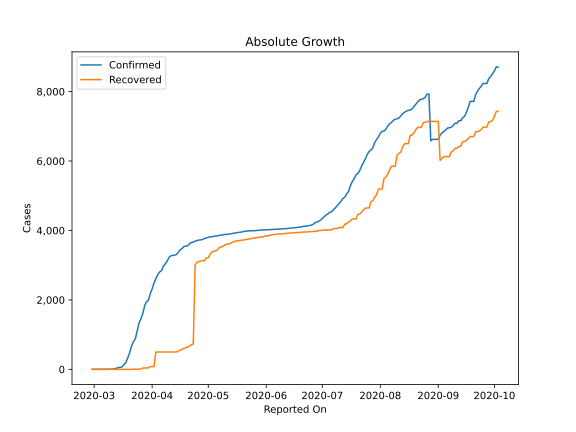
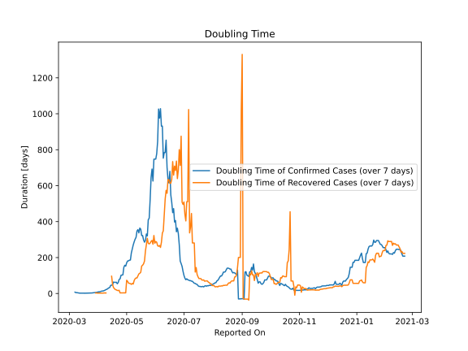

# Country Figures: Doubling Time of Infections for Luxembourg 

The doubling time below are calculated based on
* an exponential growth assumption
* for time difference of past seven (7) days.
The doubling time's unit is "days".

The first doubling time indicates the increase of confirmed (infected)
cases. There, the *higher* the number is, the better is to take control
of the disease.

The second doubling time indicates the increase of recovered (healed)
cases. There, the *lower* the number is, the better it is to take
control of the disease.

| Reported On | Confirmed | Doubling Time (Confirmed) | Recovered | Doubling Time (Recovered) |
|-------------|-----------|---------------------------|-----------|---------------------------|
| 2020-04-05 | 2804 |  13.7 days  | 500 |  2.2 days  | 
| 2020-04-04 | 2729 |  12.5 days  | 500 |  2.2 days  | 
| 2020-04-03 | 2612 |  10.3 days  | 500 |  2.2 days  | 
| 2020-04-02 | 2487 |  9.4 days  | 80 |  2.2 days  | 
| 2020-04-01 | 2319 |  9.1 days  | 80 |  2.2 days  | 
| 2020-03-31 | 2178 |  7.4 days  | 80 |  2.2 days  | 
| 2020-03-30 | 1988 |  6.3 days  | 40 |  2.9 days  | 
| 2020-03-29 | 1950 |  5.8 days  | 40 |  2.9 days  | 
| 2020-03-28 | 1831 |  5.2 days  | 40 |  None  | 
| 2020-03-27 | 1605 |  4.4 days  | 40 |  None  | 
| 2020-03-26 | 1453 |  3.6 days  | 6 |  None  | 
| 2020-03-25 | 1333 |  2.9 days  | 6 |  None  | 
| 2020-03-24 | 1099 |  2.7 days  | 6 |  None  | 
| 2020-03-23 | 875 |  2.3 days  | 6 |  None  | 
| 2020-03-22 | 798 |  2.2 days  | 6 |  None  | 
| 2020-03-21 | 670 |  2.2 days  | 0 |  None  | 
| 2020-03-20 | 484 |  2.2 days  | 0 |  None  | 
| 2020-03-19 | 335 |  2.0 days  | 0 |  None  | 
| 2020-03-18 | 203 |  1.8 days  | 0 |  None  | 
| 2020-03-17 | 140 |  1.8 days  | 0 |  None  | 
| 2020-03-16 | 77 |  1.8 days  | 0 |  None  | 
| 2020-03-15 | 59 |  2.0 days  | 0 |  None  | 
| 2020-03-14 | 51 |  1.8 days  | 0 |  None  | 
| 2020-03-13 | 34 |  2.0 days  | 0 |  None  | 
| 2020-03-12 | 19 |  2.0 days  | 0 |  None  | 
| 2020-03-11 | 7 |  2.8 days  | 0 |  None  | 
| 2020-03-10 | 5 |  3.3 days  | 0 |  None  | 
| 2020-03-09 | 3 |  4.8 days  | 0 |  None  | 
| 2020-03-08 | 3 |  4.8 days  | 0 |  None  | 
| 2020-03-07 | 2 |  7.3 days  | 0 |  None  | 
| 2020-03-06 | 2 |  None  | 0 |  None  | 
| 2020-03-05 | 1 |  None  | 0 |  None  | 
| 2020-03-04 | 1 |  None  | 0 |  None  | 
| 2020-03-03 | 1 |  None  | 0 |  None  | 
| 2020-03-02 | 1 |  None  | 0 |  None  | 
| 2020-03-01 | 1 |  None  | 0 |  None  | 
| 2020-02-29 | 1 |  None  | 0 |  None  | 

