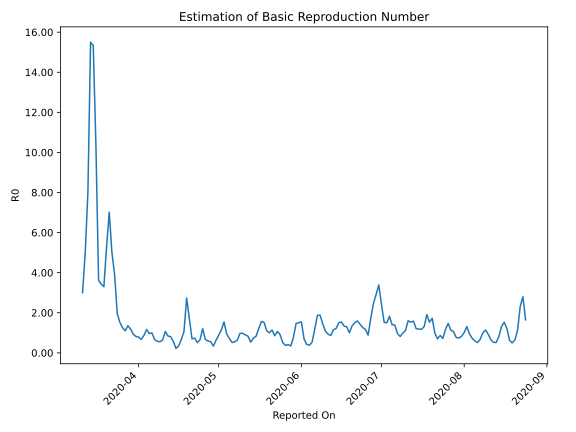

# Country Figures: Time Series for Basic Reproduction Number of Luxembourg 

| Reported On | &Delta; Confirmed | Total &Delta; Confirmed First Interval | Total &Delta; Confirmed Second Interval | Estimated Basic Reproduction Number R0 | 
|-------------|-------------------|----------------------------------------|-----------------------------------------|---------------------------------------------------|
| 2020-04-27 | 6 |  69  |  117  |  0.59  | 
| 2020-04-26 | 12 |  93  |  138  |  0.67  | 
| 2020-04-25 | 16 |  137  |  114  |  1.20  | 
| 2020-04-24 | 30 |  115  |  177  |  0.65  | 
| 2020-04-23 | 11 |  117  |  230  |  0.51  | 
| 2020-04-22 | 36 |  138  |  188  |  0.73  | 
| 2020-04-21 | 60 |  114  |  163  |  0.70  | 
| 2020-04-20 | 8 |  177  |  103  |  1.72  | 
| 2020-04-19 | 13 |  230  |  84  |  2.74  | 
| 2020-04-18 | 57 |  188  |  177  |  1.06  | 
| 2020-04-17 | 36 |  163  |  247  |  0.66  | 
| 2020-04-16 | 71 |  103  |  300  |  0.34  | 
| 2020-04-15 | 66 |  84  |  380  |  0.22  | 
| 2020-04-14 | 15 |  177  |  311  |  0.57  | 
| 2020-04-13 | 11 |  247  |  305  |  0.81  | 
| 2020-04-12 | 11 |  300  |  358  |  0.84  | 
| 2020-04-11 | 47 |  380  |  356  |  1.07  | 
| 2020-04-10 | 108 |  311  |  485  |  0.64  | 
| 2020-04-09 | 81 |  305  |  551  |  0.55  | 
| 2020-04-08 | 64 |  358  |  624  |  0.57  | 
| 2020-04-07 | 127 |  356  |  537  |  0.66  | 
| 2020-04-06 | 39 |  485  |  488  |  0.99  | 
| 2020-04-05 | 75 |  551  |  573  |  0.96  | 
| 2020-04-04 | 117 |  624  |  535  |  1.17  | 
| 2020-04-03 | 125 |  537  |  617  |  0.87  | 
| 2020-04-02 | 168 |  488  |  732  |  0.67  | 
| 2020-04-01 | 141 |  573  |  730  |  0.78  | 
| 2020-03-31 | 190 |  535  |  655  |  0.82  | 
| 2020-03-30 | 38 |  617  |  663  |  0.93  | 
| 2020-03-29 | 119 |  732  |  615  |  1.19  | 
| 2020-03-28 | 226 |  730  |  540  |  1.35  | 
| 2020-03-27 | 152 |  655  |  595  |  1.10  | 
| 2020-03-26 | 120 |  663  |  530  |  1.25  | 
| 2020-03-25 | 234 |  615  |  407  |  1.51  | 
| 2020-03-24 | 224 |  540  |  276  |  1.96  | 
| 2020-03-23 | 77 |  595  |  152  |  3.91  | 
| 2020-03-22 | 128 |  530  |  106  |  5.00  | 
| 2020-03-21 | 186 |  407  |  58  |  7.02  | 
| 2020-03-20 | 149 |  276  |  52  |  5.31  | 
| 2020-03-19 | 132 |  152  |  46  |  3.30  | 
| 2020-03-18 | 63 |  106  |  31  |  3.42  | 
| 2020-03-17 | 63 |  58  |  16  |  3.62  | 
| 2020-03-16 | 18 |  52  |  5  |  10.40  | 
| 2020-03-15 | 8 |  46  |  3  |  15.33  | 
| 2020-03-14 | 17 |  31  |  2  |  15.50  | 
| 2020-03-13 | 15 |  16  |  2  |  8.00  | 
| 2020-03-12 | 12 |  5  |  1  |  5.00  | 
| 2020-03-11 | 2 |  3  |  1  |  3.00  | 
| 2020-03-10 | 2 |  2  |  None  |  None  | 
| 2020-03-09 | 0 |  2  |  None  |  None  | 
| 2020-03-08 | 1 |  1  |  None  |  None  | 
| 2020-03-07 | 0 |  1  |  None  |  None  | 
| 2020-03-06 | 1 |  None  |  None  |  None  | 
| 2020-03-05 | 0 |  None  |  None  |  None  | 
| 2020-03-04 | 0 |  None  |  None  |  None  | 
| 2020-03-03 | 0 |  None  |  None  |  None  | 
| 2020-03-02 | 0 |  None  |  None  |  None  | 
| 2020-03-01 | 0 |  None  |  None  |  None  | 
| 2020-02-29 | None |  None  |  None  |  None  | 

