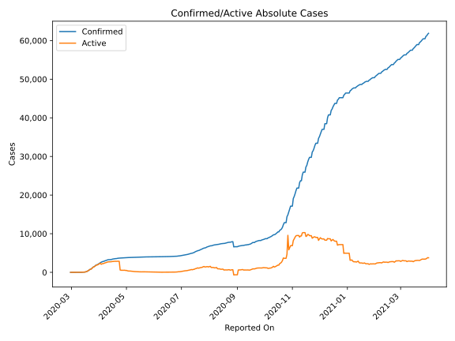
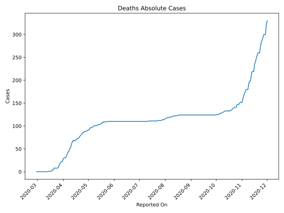
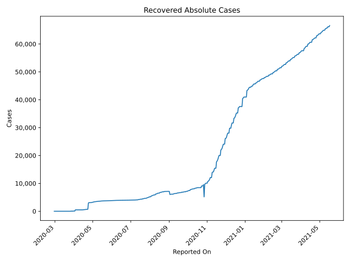
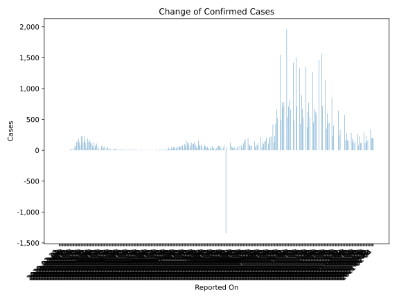
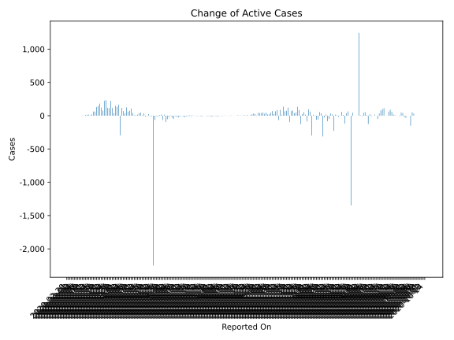
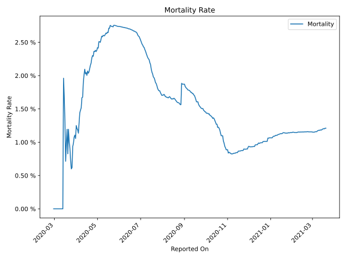

# Country Figures: Time Series for Luxembourg 

| Reported On | Confirmed | Deaths | Recovered | Active | Mortality | &Delta; Confirmed | &Delta; Deaths | &Delta; Recovered | &Delta; Active | % Active of Population |
|-------------|-----------|--------|-----------|--------|-----------|-------------------|----------------|-------------------|----------------|------------------------|
| 2020-04-18 | 3537 | 72 | 601 | 2864 |  2.04 %  | 57 | 0 | 22 | 35 |  0.471 %  | 
| 2020-04-17 | 3480 | 72 | 579 | 2829 |  2.07 %  | 36 | 3 | 27 | 6 |  0.466 %  | 
| 2020-04-16 | 3444 | 69 | 552 | 2823 |  2.00 %  | 71 | 0 | 26 | 45 |  0.465 %  | 
| 2020-04-15 | 3373 | 69 | 526 | 2778 |  2.05 %  | 66 | 2 | 26 | 38 |  0.457 %  | 
| 2020-04-14 | 3307 | 67 | 500 | 2740 |  2.03 %  | 15 | -2 | 0 | 17 |  0.451 %  | 
| 2020-04-13 | 3292 | 69 | 500 | 2723 |  2.10 %  | 11 | 3 | 0 | 8 |  0.448 %  | 
| 2020-04-12 | 3281 | 66 | 500 | 2715 |  2.01 %  | 11 | 4 | 0 | 7 |  0.447 %  | 
| 2020-04-11 | 3270 | 62 | 500 | 2708 |  1.90 %  | 47 | 8 | 0 | 39 |  0.446 %  | 
| 2020-04-10 | 3223 | 54 | 500 | 2669 |  1.68 %  | 108 | 2 | 0 | 106 |  0.439 %  | 
| 2020-04-09 | 3115 | 52 | 500 | 2563 |  1.67 %  | 81 | 6 | 0 | 75 |  0.422 %  | 
| 2020-04-08 | 3034 | 46 | 500 | 2488 |  1.52 %  | 64 | 2 | 0 | 62 |  0.409 %  | 
| 2020-04-07 | 2970 | 44 | 500 | 2426 |  1.48 %  | 127 | 3 | 0 | 124 |  0.399 %  | 
| 2020-04-06 | 2843 | 41 | 500 | 2302 |  1.44 %  | 39 | 5 | 0 | 34 |  0.379 %  | 
| 2020-04-05 | 2804 | 36 | 500 | 2268 |  1.28 %  | 75 | 5 | 0 | 70 |  0.373 %  | 
| 2020-04-04 | 2729 | 31 | 500 | 2198 |  1.14 %  | 117 | 0 | 0 | 117 |  0.362 %  | 
| 2020-04-03 | 2612 | 31 | 500 | 2081 |  1.19 %  | 125 | 1 | 420 | -296 |  0.342 %  | 
| 2020-04-02 | 2487 | 30 | 80 | 2377 |  1.21 %  | 168 | 1 | 0 | 167 |  0.391 %  | 
| 2020-04-01 | 2319 | 29 | 80 | 2210 |  1.25 %  | 141 | 6 | 0 | 135 |  0.364 %  | 
| 2020-03-31 | 2178 | 23 | 80 | 2075 |  1.06 %  | 190 | 1 | 40 | 149 |  0.341 %  | 
| 2020-03-30 | 1988 | 22 | 40 | 1926 |  1.11 %  | 38 | 1 | 0 | 37 |  0.317 %  | 
| 2020-03-29 | 1950 | 21 | 40 | 1889 |  1.08 %  | 119 | 3 | 0 | 116 |  0.311 %  | 
| 2020-03-28 | 1831 | 18 | 40 | 1773 |  0.98 %  | 226 | 3 | 0 | 223 |  0.292 %  | 
| 2020-03-27 | 1605 | 15 | 40 | 1550 |  0.93 %  | 152 | 6 | 34 | 112 |  0.255 %  | 
| 2020-03-26 | 1453 | 9 | 6 | 1438 |  0.62 %  | 120 | 1 | 0 | 119 |  0.237 %  | 
| 2020-03-25 | 1333 | 8 | 6 | 1319 |  0.60 %  | 234 | 0 | 0 | 234 |  0.217 %  | 
| 2020-03-24 | 1099 | 8 | 6 | 1085 |  0.73 %  | 224 | 0 | 0 | 224 |  0.179 %  | 
| 2020-03-23 | 875 | 8 | 6 | 861 |  0.91 %  | 77 | 0 | 0 | 77 |  0.142 %  | 
| 2020-03-22 | 798 | 8 | 6 | 784 |  1.00 %  | 128 | 0 | 6 | 122 |  0.129 %  | 
| 2020-03-21 | 670 | 8 | 0 | 662 |  1.19 %  | 186 | 4 | 0 | 182 |  0.109 %  | 
| 2020-03-20 | 484 | 4 | 0 | 480 |  0.83 %  | 149 | 0 | 0 | 149 |  0.079 %  | 
| 2020-03-19 | 335 | 4 | 0 | 331 |  1.19 %  | 132 | 2 | 0 | 130 |  0.054 %  | 
| 2020-03-18 | 203 | 2 | 0 | 201 |  0.99 %  | 63 | 1 | 0 | 62 |  0.033 %  | 
| 2020-03-17 | 140 | 1 | 0 | 139 |  0.71 %  | 63 | 0 | 0 | 63 |  0.023 %  | 
| 2020-03-16 | 77 | 1 | 0 | 76 |  1.30 %  | 18 | 0 | 0 | 18 |  0.013 %  | 
| 2020-03-15 | 59 | 1 | 0 | 58 |  1.69 %  | 8 | 0 | 0 | 8 |  0.010 %  | 
| 2020-03-14 | 51 | 1 | 0 | 50 |  1.96 %  | 17 | 1 | 0 | 16 |  0.008 %  | 
| 2020-03-13 | 34 | 0 | 0 | 34 |  None  | 15 | 0 | 0 | 15 |  0.006 %  | 
| 2020-03-12 | 19 | 0 | 0 | 19 |  None  | 12 | 0 | 0 | 12 |  0.003 %  | 
| 2020-03-11 | 7 | 0 | 0 | 7 |  None  | 2 | 0 | 0 | 2 |  0.001 %  | 
| 2020-03-10 | 5 | 0 | 0 | 5 |  None  | 2 | 0 | 0 | 2 |  0.001 %  | 
| 2020-03-09 | 3 | 0 | 0 | 3 |  None  | 0 | 0 | 0 | 0 |  0.000 %  | 
| 2020-03-08 | 3 | 0 | 0 | 3 |  None  | 1 | 0 | 0 | 1 |  0.000 %  | 
| 2020-03-07 | 2 | 0 | 0 | 2 |  None  | 0 | 0 | 0 | 0 |  0.000 %  | 
| 2020-03-06 | 2 | 0 | 0 | 2 |  None  | 1 | 0 | 0 | 1 |  0.000 %  | 
| 2020-03-05 | 1 | 0 | 0 | 1 |  None  | 0 | 0 | 0 | 0 |  0.000 %  | 
| 2020-03-04 | 1 | 0 | 0 | 1 |  None  | 0 | 0 | 0 | 0 |  0.000 %  | 
| 2020-03-03 | 1 | 0 | 0 | 1 |  None  | 0 | 0 | 0 | 0 |  0.000 %  | 
| 2020-03-02 | 1 | 0 | 0 | 1 |  None  | 0 | 0 | 0 | 0 |  0.000 %  | 
| 2020-03-01 | 1 | 0 | 0 | 1 |  None  | 0 | 0 | 0 | 0 |  0.000 %  | 
| 2020-02-29 | 1 | 0 | 0 | 1 |  None  | None | None | None | None |  0.000 %  | 

