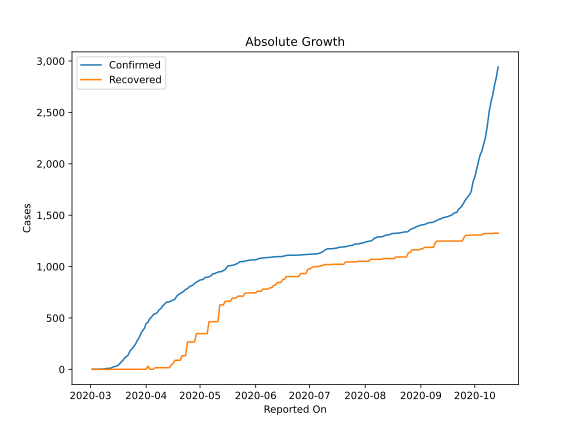
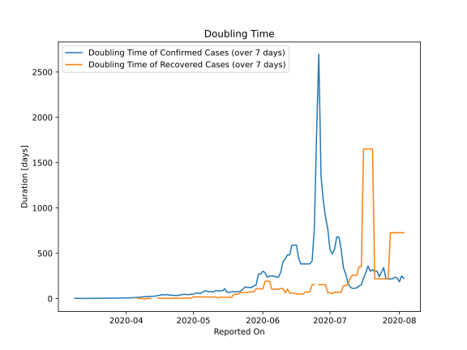

# Country Figures: Doubling Time of Infections for Latvia 

The doubling time below are calculated based on
* an exponential growth assumption
* for time difference of past seven (7) days.
The doubling time's unit is "days".

The first doubling time indicates the increase of confirmed (infected)
cases. There, the *higher* the number is, the better is to take control
of the disease.

The second doubling time indicates the increase of recovered (healed)
cases. There, the *lower* the number is, the better it is to take
control of the disease.

| Reported On | Confirmed | Doubling Time (Confirmed) | Recovered | Doubling Time (Recovered) |
|-------------|-----------|---------------------------|-----------|---------------------------|
| 2020-04-12 | 651 |  24.6 days  | 16 |  2.1 days  | 
| 2020-04-11 | 630 |  23.1 days  | 16 |  2.1 days  | 
| 2020-04-10 | 612 |  22.8 days  | 16 |  2.1 days  | 
| 2020-04-09 | 589 |  19.6 days  | 16 |  -7.0 days  | 
| 2020-04-08 | 577 |  19.2 days  | 16 |  2.1 days  | 
| 2020-04-07 | 548 |  15.5 days  | 16 |  2.1 days  | 
| 2020-04-06 | 542 |  13.6 days  | 16 |  2.1 days  | 
| 2020-04-05 | 533 |  11.6 days  | 1 |  None  | 
| 2020-04-04 | 509 |  9.8 days  | 1 |  None  | 
| 2020-04-03 | 493 |  8.9 days  | 1 |  None  | 
| 2020-04-02 | 458 |  8.0 days  | 31 |  1.7 days  | 
| 2020-04-01 | 446 |  7.3 days  | 1 |  None  | 
| 2020-03-31 | 398 |  7.2 days  | 1 |  None  | 
| 2020-03-30 | 376 |  6.9 days  | 1 |  None  | 
| 2020-03-29 | 347 |  5.6 days  | 1 |  None  | 
| 2020-03-28 | 305 |  5.7 days  | 1 |  None  | 
| 2020-03-27 | 280 |  5.6 days  | 1 |  None  | 
| 2020-03-26 | 244 |  5.0 days  | 1 |  None  | 
| 2020-03-25 | 221 |  4.6 days  | 1 |  None  | 
| 2020-03-24 | 197 |  3.8 days  | 1 |  None  | 
| 2020-03-23 | 180 |  3.2 days  | 1 |  None  | 
| 2020-03-22 | 139 |  3.5 days  | 1 |  None  | 
| 2020-03-21 | 124 |  3.4 days  | 1 |  None  | 
| 2020-03-20 | 111 |  2.9 days  | 1 |  None  | 
| 2020-03-19 | 86 |  2.6 days  | 1 |  None  | 
| 2020-03-18 | 71 |  2.8 days  | 1 |  None  | 
| 2020-03-17 | 49 |  3.0 days  | 1 |  None  | 
| 2020-03-16 | 34 |  3.1 days  | 1 |  None  | 
| 2020-03-15 | 30 |  2.1 days  | 1 |  None  | 
| 2020-03-14 | 26 |  1.8 days  | 1 |  None  | 
| 2020-03-13 | 17 |  2.0 days  | 1 |  None  | 
| 2020-03-12 | 10 |  2.4 days  | 1 |  None  | 
| 2020-03-11 | 10 |  2.4 days  | 1 |  None  | 
| 2020-03-10 | 8 |  2.7 days  | 1 |  None  | 
| 2020-03-09 | 6 |  3.0 days  | 0 |  None  | 
| 2020-03-08 | 2 |  None  | 0 |  None  | 
| 2020-03-07 | 1 |  None  | 0 |  None  | 
| 2020-03-06 | 1 |  None  | 0 |  None  | 
| 2020-03-05 | 1 |  None  | 0 |  None  | 
| 2020-03-04 | 1 |  None  | 0 |  None  | 
| 2020-03-03 | 1 |  None  | 0 |  None  | 
| 2020-03-02 | 1 |  None  | 0 |  None  | 

