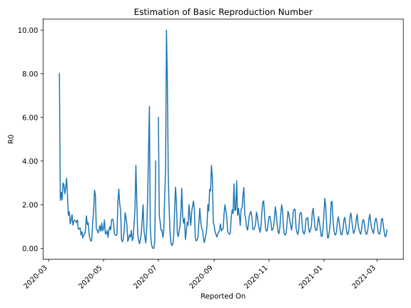

# Country Figures: Time Series for Basic Reproduction Number of Latvia 

| Reported On | &Delta; Confirmed | Total &Delta; Confirmed First Interval | Total &Delta; Confirmed Second Interval | Estimated Basic Reproduction Number R0 | 
|-------------|-------------------|----------------------------------------|-----------------------------------------|---------------------------------------------------|
| 2020-04-27 | 6 |  51  |  49  |  1.04  | 
| 2020-04-26 | 8 |  56  |  66  |  0.85  | 
| 2020-04-25 | 20 |  45  |  64  |  0.70  | 
| 2020-04-24 | 6 |  51  |  61  |  0.84  | 
| 2020-04-23 | 17 |  49  |  55  |  0.89  | 
| 2020-04-22 | 13 |  66  |  27  |  2.44  | 
| 2020-04-21 | 9 |  64  |  24  |  2.67  | 
| 2020-04-20 | 12 |  61  |  36  |  1.69  | 
| 2020-04-19 | 15 |  55  |  45  |  1.22  | 
| 2020-04-18 | 30 |  27  |  66  |  0.41  | 
| 2020-04-17 | 7 |  24  |  74  |  0.32  | 
| 2020-04-16 | 9 |  36  |  82  |  0.44  | 
| 2020-04-15 | 9 |  45  |  70  |  0.64  | 
| 2020-04-14 | 2 |  66  |  56  |  1.18  | 
| 2020-04-13 | 4 |  74  |  68  |  1.09  | 
| 2020-04-12 | 21 |  82  |  55  |  1.49  | 
| 2020-04-11 | 18 |  70  |  84  |  0.83  | 
| 2020-04-10 | 23 |  56  |  87  |  0.64  | 
| 2020-04-09 | 12 |  68  |  111  |  0.61  | 
| 2020-04-08 | 29 |  55  |  117  |  0.47  | 
| 2020-04-07 | 6 |  84  |  111  |  0.76  | 
| 2020-04-06 | 9 |  87  |  141  |  0.62  | 
| 2020-04-05 | 24 |  111  |  118  |  0.94  | 
| 2020-04-04 | 16 |  117  |  132  |  0.89  | 
| 2020-04-03 | 35 |  111  |  126  |  0.88  | 
| 2020-04-02 | 12 |  141  |  108  |  1.31  | 
| 2020-04-01 | 48 |  118  |  100  |  1.18  | 
| 2020-03-31 | 22 |  132  |  105  |  1.26  | 
| 2020-03-30 | 29 |  126  |  97  |  1.30  | 
| 2020-03-29 | 42 |  108  |  86  |  1.26  | 
| 2020-03-28 | 25 |  100  |  94  |  1.06  | 
| 2020-03-27 | 36 |  105  |  68  |  1.54  | 
| 2020-03-26 | 23 |  97  |  75  |  1.29  | 
| 2020-03-25 | 24 |  86  |  77  |  1.12  | 
| 2020-03-24 | 17 |  94  |  56  |  1.68  | 
| 2020-03-23 | 41 |  68  |  45  |  1.51  | 
| 2020-03-22 | 15 |  75  |  32  |  2.34  | 
| 2020-03-21 | 13 |  77  |  24  |  3.21  | 
| 2020-03-20 | 25 |  56  |  20  |  2.80  | 
| 2020-03-19 | 15 |  45  |  18  |  2.50  | 
| 2020-03-18 | 22 |  32  |  11  |  2.91  | 
| 2020-03-17 | 15 |  24  |  8  |  3.00  | 
| 2020-03-16 | 4 |  20  |  9  |  2.22  | 
| 2020-03-15 | 4 |  18  |  7  |  2.57  | 
| 2020-03-14 | 9 |  11  |  5  |  2.20  | 
| 2020-03-13 | 7 |  8  |  1  |  8.00  | 
| 2020-03-12 | 0 |  9  |  None  |  None  | 
| 2020-03-11 | 2 |  7  |  None  |  None  | 
| 2020-03-10 | 2 |  5  |  None  |  None  | 
| 2020-03-09 | 4 |  1  |  None  |  None  | 
| 2020-03-08 | 1 |  None  |  None  |  None  | 
| 2020-03-07 | 0 |  None  |  None  |  None  | 
| 2020-03-06 | 0 |  None  |  None  |  None  | 
| 2020-03-05 | 0 |  None  |  None  |  None  | 
| 2020-03-04 | 0 |  None  |  None  |  None  | 
| 2020-03-03 | 0 |  None  |  None  |  None  | 
| 2020-03-02 | None |  None  |  None  |  None  | 

