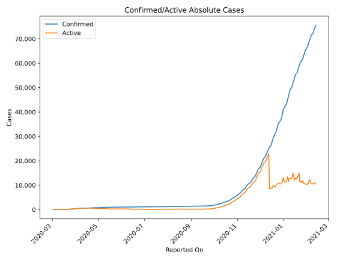
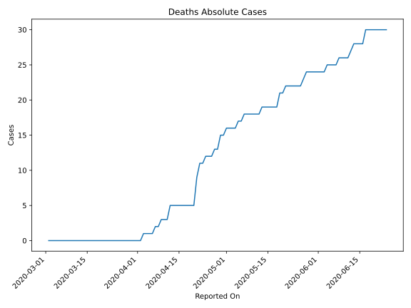
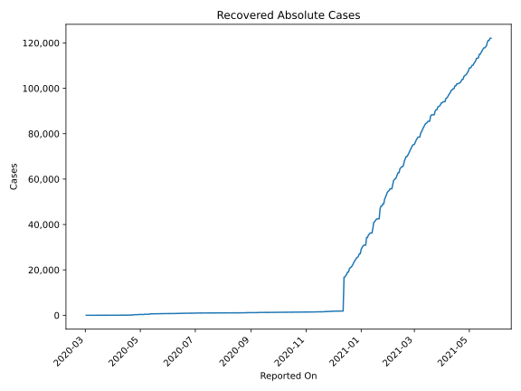
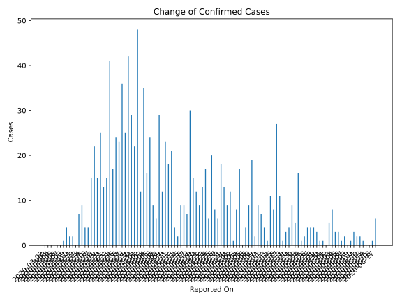
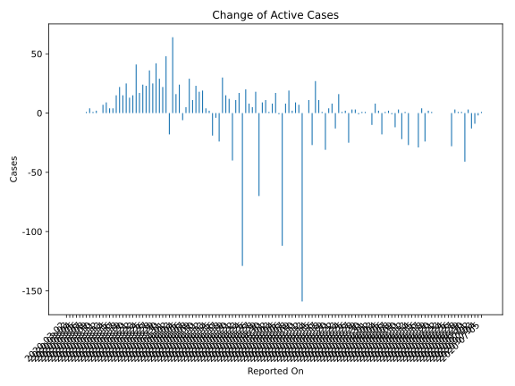
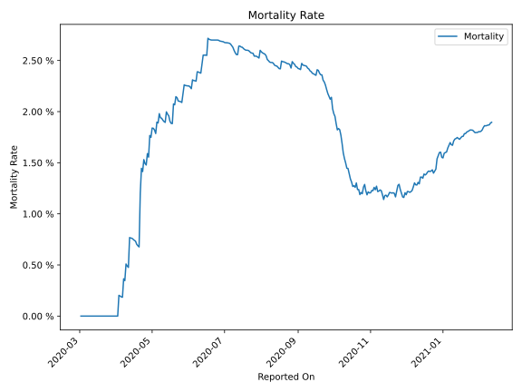

# Country Figures: Time Series for Latvia 

| Reported On | Confirmed | Deaths | Recovered | Active | Mortality | &Delta; Confirmed | &Delta; Deaths | &Delta; Recovered | &Delta; Active | % Active of Population |
|-------------|-----------|--------|-----------|--------|-----------|-------------------|----------------|-------------------|----------------|------------------------|
| 2020-04-21 | 748 | 9 | 133 | 606 |  1.20 %  | 9 | 4 | 45 | -40 |  0.031 %  | 
| 2020-04-20 | 739 | 5 | 88 | 646 |  0.68 %  | 12 | 0 | 0 | 12 |  0.034 %  | 
| 2020-04-19 | 727 | 5 | 88 | 634 |  0.69 %  | 15 | 0 | 0 | 15 |  0.033 %  | 
| 2020-04-18 | 712 | 5 | 88 | 619 |  0.70 %  | 30 | 0 | 0 | 30 |  0.032 %  | 
| 2020-04-17 | 682 | 5 | 88 | 589 |  0.73 %  | 7 | 0 | 31 | -24 |  0.031 %  | 
| 2020-04-16 | 675 | 5 | 57 | 613 |  0.74 %  | 9 | 0 | 13 | -4 |  0.032 %  | 
| 2020-04-15 | 666 | 5 | 44 | 617 |  0.75 %  | 9 | 0 | 28 | -19 |  0.032 %  | 
| 2020-04-14 | 657 | 5 | 16 | 636 |  0.76 %  | 2 | 0 | 0 | 2 |  0.033 %  | 
| 2020-04-13 | 655 | 5 | 16 | 634 |  0.76 %  | 4 | 0 | 0 | 4 |  0.033 %  | 
| 2020-04-12 | 651 | 5 | 16 | 630 |  0.77 %  | 21 | 2 | 0 | 19 |  0.033 %  | 
| 2020-04-11 | 630 | 3 | 16 | 611 |  0.48 %  | 18 | 0 | 0 | 18 |  0.032 %  | 
| 2020-04-10 | 612 | 3 | 16 | 593 |  0.49 %  | 23 | 0 | 0 | 23 |  0.031 %  | 
| 2020-04-09 | 589 | 3 | 16 | 570 |  0.51 %  | 12 | 1 | 0 | 11 |  0.030 %  | 
| 2020-04-08 | 577 | 2 | 16 | 559 |  0.35 %  | 29 | 0 | 0 | 29 |  0.029 %  | 
| 2020-04-07 | 548 | 2 | 16 | 530 |  0.36 %  | 6 | 1 | 0 | 5 |  0.028 %  | 
| 2020-04-06 | 542 | 1 | 16 | 525 |  0.18 %  | 9 | 0 | 15 | -6 |  0.027 %  | 
| 2020-04-05 | 533 | 1 | 1 | 531 |  0.19 %  | 24 | 0 | 0 | 24 |  0.028 %  | 
| 2020-04-04 | 509 | 1 | 1 | 507 |  0.20 %  | 16 | 0 | 0 | 16 |  0.026 %  | 
| 2020-04-03 | 493 | 1 | 1 | 491 |  0.20 %  | 35 | 1 | -30 | 64 |  0.025 %  | 
| 2020-04-02 | 458 | 0 | 31 | 427 |  None  | 12 | 0 | 30 | -18 |  0.022 %  | 
| 2020-04-01 | 446 | 0 | 1 | 445 |  None  | 48 | 0 | 0 | 48 |  0.023 %  | 
| 2020-03-31 | 398 | 0 | 1 | 397 |  None  | 22 | 0 | 0 | 22 |  0.021 %  | 
| 2020-03-30 | 376 | 0 | 1 | 375 |  None  | 29 | 0 | 0 | 29 |  0.019 %  | 
| 2020-03-29 | 347 | 0 | 1 | 346 |  None  | 42 | 0 | 0 | 42 |  0.018 %  | 
| 2020-03-28 | 305 | 0 | 1 | 304 |  None  | 25 | 0 | 0 | 25 |  0.016 %  | 
| 2020-03-27 | 280 | 0 | 1 | 279 |  None  | 36 | 0 | 0 | 36 |  0.014 %  | 
| 2020-03-26 | 244 | 0 | 1 | 243 |  None  | 23 | 0 | 0 | 23 |  0.013 %  | 
| 2020-03-25 | 221 | 0 | 1 | 220 |  None  | 24 | 0 | 0 | 24 |  0.011 %  | 
| 2020-03-24 | 197 | 0 | 1 | 196 |  None  | 17 | 0 | 0 | 17 |  0.010 %  | 
| 2020-03-23 | 180 | 0 | 1 | 179 |  None  | 41 | 0 | 0 | 41 |  0.009 %  | 
| 2020-03-22 | 139 | 0 | 1 | 138 |  None  | 15 | 0 | 0 | 15 |  0.007 %  | 
| 2020-03-21 | 124 | 0 | 1 | 123 |  None  | 13 | 0 | 0 | 13 |  0.006 %  | 
| 2020-03-20 | 111 | 0 | 1 | 110 |  None  | 25 | 0 | 0 | 25 |  0.006 %  | 
| 2020-03-19 | 86 | 0 | 1 | 85 |  None  | 15 | 0 | 0 | 15 |  0.004 %  | 
| 2020-03-18 | 71 | 0 | 1 | 70 |  None  | 22 | 0 | 0 | 22 |  0.004 %  | 
| 2020-03-17 | 49 | 0 | 1 | 48 |  None  | 15 | 0 | 0 | 15 |  0.002 %  | 
| 2020-03-16 | 34 | 0 | 1 | 33 |  None  | 4 | 0 | 0 | 4 |  0.002 %  | 
| 2020-03-15 | 30 | 0 | 1 | 29 |  None  | 4 | 0 | 0 | 4 |  0.002 %  | 
| 2020-03-14 | 26 | 0 | 1 | 25 |  None  | 9 | 0 | 0 | 9 |  0.001 %  | 
| 2020-03-13 | 17 | 0 | 1 | 16 |  None  | 7 | 0 | 0 | 7 |  0.001 %  | 
| 2020-03-12 | 10 | 0 | 1 | 9 |  None  | 0 | 0 | 0 | 0 |  0.000 %  | 
| 2020-03-11 | 10 | 0 | 1 | 9 |  None  | 2 | 0 | 0 | 2 |  0.000 %  | 
| 2020-03-10 | 8 | 0 | 1 | 7 |  None  | 2 | 0 | 1 | 1 |  0.000 %  | 
| 2020-03-09 | 6 | 0 | 0 | 6 |  None  | 4 | 0 | 0 | 4 |  0.000 %  | 
| 2020-03-08 | 2 | 0 | 0 | 2 |  None  | 1 | 0 | 0 | 1 |  0.000 %  | 
| 2020-03-07 | 1 | 0 | 0 | 1 |  None  | 0 | 0 | 0 | 0 |  0.000 %  | 
| 2020-03-06 | 1 | 0 | 0 | 1 |  None  | 0 | 0 | 0 | 0 |  0.000 %  | 
| 2020-03-05 | 1 | 0 | 0 | 1 |  None  | 0 | 0 | 0 | 0 |  0.000 %  | 
| 2020-03-04 | 1 | 0 | 0 | 1 |  None  | 0 | 0 | 0 | 0 |  0.000 %  | 
| 2020-03-03 | 1 | 0 | 0 | 1 |  None  | 0 | 0 | 0 | 0 |  0.000 %  | 
| 2020-03-02 | 1 | 0 | 0 | 1 |  None  | None | None | None | None |  0.000 %  | 

