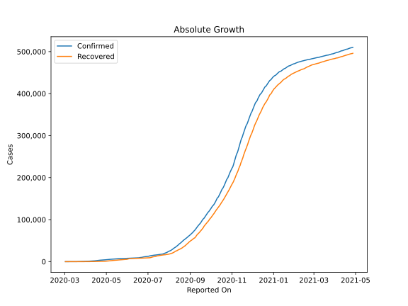
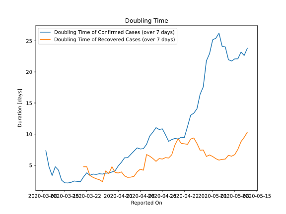

# Country Figures: Doubling Time of Infections for Morocco 

The doubling time below are calculated based on
* an exponential growth assumption
* for time difference of past seven (7) days.
The doubling time's unit is "days".

The first doubling time indicates the increase of confirmed (infected)
cases. There, the *higher* the number is, the better is to take control
of the disease.

The second doubling time indicates the increase of recovered (healed)
cases. There, the *lower* the number is, the better it is to take
control of the disease.

| Reported On | Confirmed | Doubling Time (Confirmed) | Recovered | Doubling Time (Recovered) |
|-------------|-----------|---------------------------|-----------|---------------------------|
| 2020-04-11 | 1545 |  9.7 days  | 146 |  6.5 days  | 
| 2020-04-10 | 1448 |  8.4 days  | 122 |  6.7 days  | 
| 2020-04-09 | 1374 |  7.7 days  | 109 |  4.2 days  | 
| 2020-04-08 | 1275 |  7.6 days  | 97 |  4.4 days  | 
| 2020-04-07 | 1184 |  7.8 days  | 93 |  3.9 days  | 
| 2020-04-06 | 1120 |  7.3 days  | 81 |  3.2 days  | 
| 2020-04-05 | 1021 |  6.8 days  | 76 |  3.1 days  | 
| 2020-04-04 | 919 |  6.2 days  | 66 |  3.0 days  | 
| 2020-04-03 | 791 |  6.2 days  | 57 |  3.3 days  | 
| 2020-04-02 | 708 |  5.5 days  | 31 |  3.9 days  | 
| 2020-04-01 | 654 |  4.9 days  | 29 |  3.7 days  | 
| 2020-03-31 | 617 |  4.1 days  | 24 |  3.8 days  | 
| 2020-03-30 | 556 |  3.9 days  | 15 |  4.8 days  | 
| 2020-03-29 | 479 |  3.7 days  | 13 |  3.6 days  | 
| 2020-03-28 | 402 |  3.7 days  | 11 |  4.1 days  | 
| 2020-03-27 | 345 |  3.6 days  | 11 |  2.4 days  | 
| 2020-03-26 | 275 |  3.6 days  | 8 |  2.7 days  | 
| 2020-03-25 | 225 |  3.5 days  | 7 |  2.8 days  | 
| 2020-03-24 | 170 |  3.6 days  | 6 |  3.0 days  | 
| 2020-03-23 | 143 |  3.4 days  | 5 |  3.3 days  | 
| 2020-03-22 | 115 |  3.8 days  | 3 |  4.8 days  | 
| 2020-03-21 | 96 |  3.1 days  | 3 |  4.8 days  | 
| 2020-03-20 | 77 |  2.4 days  | 1 |  None  | 
| 2020-03-19 | 63 |  2.4 days  | 1 |  None  | 
| 2020-03-18 | 49 |  2.5 days  | 1 |  None  | 
| 2020-03-17 | 38 |  2.2 days  | 1 |  None  | 
| 2020-03-16 | 29 |  2.1 days  | 1 |  None  | 
| 2020-03-15 | 28 |  2.2 days  | 1 |  None  | 
| 2020-03-14 | 17 |  2.6 days  | 1 |  None  | 
| 2020-03-13 | 7 |  4.2 days  | 1 |  None  | 
| 2020-03-12 | 6 |  4.8 days  | 0 |  None  | 
| 2020-03-11 | 5 |  3.3 days  | 0 |  None  | 
| 2020-03-10 | 3 |  4.8 days  | 0 |  None  | 
| 2020-03-09 | 2 |  7.3 days  | 0 |  None  | 
| 2020-03-08 | 2 |  None  | 0 |  None  | 
| 2020-03-07 | 2 |  None  | 0 |  None  | 
| 2020-03-06 | 2 |  None  | 0 |  None  | 
| 2020-03-05 | 2 |  None  | 0 |  None  | 
| 2020-03-04 | 1 |  None  | 0 |  None  | 
| 2020-03-03 | 1 |  None  | 0 |  None  | 
| 2020-03-02 | 1 |  None  | 0 |  None  | 

