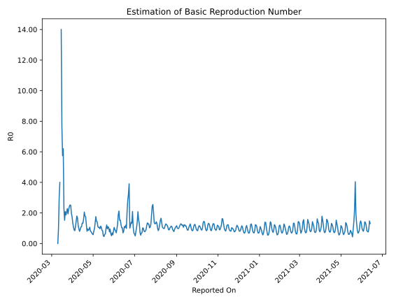

# Country Figures: Time Series for Basic Reproduction Number of Morocco 

| Reported On | &Delta; Confirmed | Total &Delta; Confirmed First Interval | Total &Delta; Confirmed Second Interval | Estimated Basic Reproduction Number R0 | 
|-------------|-------------------|----------------------------------------|-----------------------------------------|---------------------------------------------------|
| 2020-05-04 | 150 |  582  |  424  |  1.37  | 
| 2020-05-03 | 174 |  477  |  494  |  0.97  | 
| 2020-05-02 | 160 |  449  |  552  |  0.81  | 
| 2020-05-01 | 146 |  358  |  619  |  0.58  | 
| 2020-04-30 | 102 |  424  |  688  |  0.62  | 
| 2020-04-29 | 69 |  494  |  712  |  0.69  | 
| 2020-04-28 | 132 |  552  |  713  |  0.77  | 
| 2020-04-27 | 55 |  619  |  761  |  0.81  | 
| 2020-04-26 | 168 |  688  |  645  |  1.07  | 
| 2020-04-25 | 139 |  712  |  763  |  0.93  | 
| 2020-04-24 | 190 |  713  |  831  |  0.86  | 
| 2020-04-23 | 122 |  761  |  797  |  0.95  | 
| 2020-04-22 | 237 |  645  |  801  |  0.81  | 
| 2020-04-21 | 163 |  763  |  622  |  1.23  | 
| 2020-04-20 | 191 |  831  |  479  |  1.73  | 
| 2020-04-19 | 170 |  797  |  440  |  1.81  | 
| 2020-04-18 | 121 |  801  |  389  |  2.06  | 
| 2020-04-17 | 281 |  622  |  386  |  1.61  | 
| 2020-04-16 | 259 |  479  |  361  |  1.33  | 
| 2020-04-15 | 136 |  440  |  328  |  1.34  | 
| 2020-04-14 | 125 |  389  |  353  |  1.10  | 
| 2020-04-13 | 102 |  386  |  356  |  1.08  | 
| 2020-04-12 | 116 |  361  |  393  |  0.92  | 
| 2020-04-11 | 97 |  328  |  412  |  0.80  | 
| 2020-04-10 | 74 |  353  |  367  |  0.96  | 
| 2020-04-09 | 99 |  356  |  302  |  1.18  | 
| 2020-04-08 | 91 |  393  |  235  |  1.67  | 
| 2020-04-07 | 64 |  412  |  229  |  1.80  | 
| 2020-04-06 | 99 |  367  |  252  |  1.46  | 
| 2020-04-05 | 102 |  302  |  272  |  1.11  | 
| 2020-04-04 | 128 |  235  |  281  |  0.84  | 
| 2020-04-03 | 83 |  229  |  254  |  0.90  | 
| 2020-04-02 | 54 |  252  |  232  |  1.09  | 
| 2020-04-01 | 37 |  272  |  202  |  1.35  | 
| 2020-03-31 | 61 |  281  |  160  |  1.76  | 
| 2020-03-30 | 77 |  254  |  129  |  1.97  | 
| 2020-03-29 | 77 |  232  |  93  |  2.49  | 
| 2020-03-28 | 57 |  202  |  80  |  2.52  | 
| 2020-03-27 | 70 |  160  |  66  |  2.42  | 
| 2020-03-26 | 50 |  129  |  58  |  2.22  | 
| 2020-03-25 | 55 |  93  |  48  |  1.94  | 
| 2020-03-24 | 27 |  80  |  35  |  2.29  | 
| 2020-03-23 | 28 |  66  |  32  |  2.06  | 
| 2020-03-22 | 19 |  58  |  31  |  1.87  | 
| 2020-03-21 | 19 |  48  |  23  |  2.09  | 
| 2020-03-20 | 14 |  35  |  23  |  1.52  | 
| 2020-03-19 | 14 |  32  |  14  |  2.29  | 
| 2020-03-18 | 11 |  31  |  5  |  6.20  | 
| 2020-03-17 | 9 |  23  |  4  |  5.75  | 
| 2020-03-16 | 1 |  23  |  3  |  7.67  | 
| 2020-03-15 | 11 |  14  |  1  |  14.00  | 
| 2020-03-14 | 10 |  5  |  None  |  None  | 
| 2020-03-13 | 1 |  4  |  1  |  4.00  | 
| 2020-03-12 | 1 |  3  |  1  |  3.00  | 
| 2020-03-11 | 2 |  1  |  1  |  1.00  | 
| 2020-03-10 | 1 |  None  |  1  |  None  | 
| 2020-03-09 | 0 |  1  |  None  |  None  | 
| 2020-03-08 | 0 |  1  |  None  |  None  | 
| 2020-03-07 | 0 |  1  |  None  |  None  | 
| 2020-03-06 | 0 |  1  |  None  |  None  | 
| 2020-03-05 | 1 |  None  |  None  |  None  | 
| 2020-03-04 | 0 |  None  |  None  |  None  | 
| 2020-03-03 | 0 |  None  |  None  |  None  | 
| 2020-03-02 | None |  None  |  None  |  None  | 

