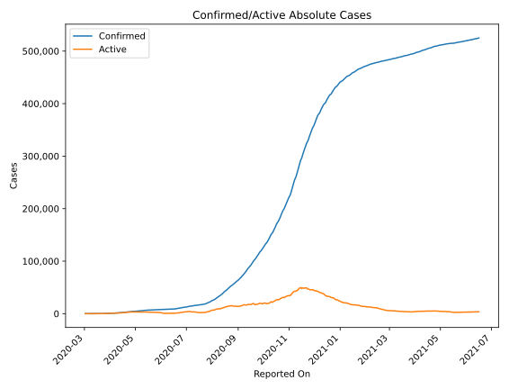
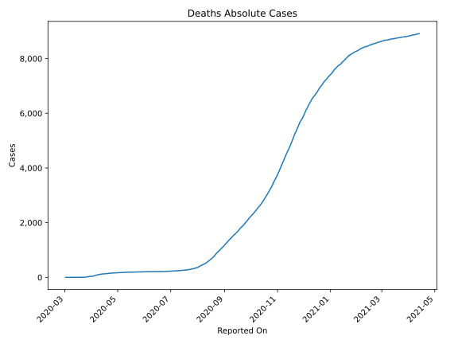
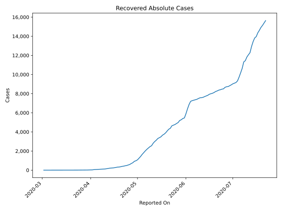
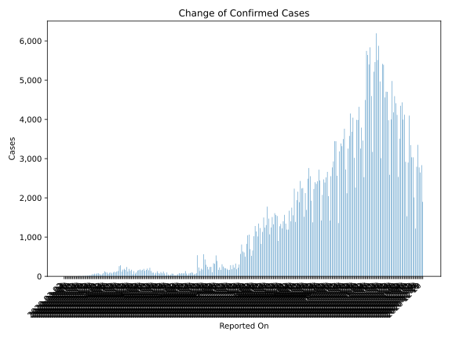
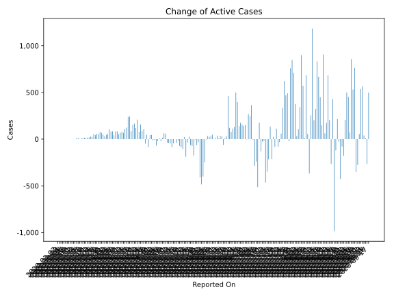
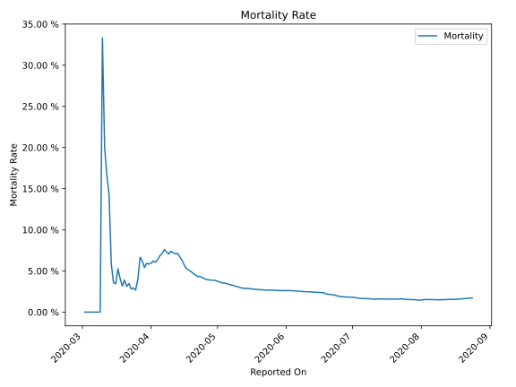

# Country Figures: Time Series for Morocco 

| Reported On | Confirmed | Deaths | Recovered | Active | Mortality | &Delta; Confirmed | &Delta; Deaths | &Delta; Active | % Active of Population |
|-------------|-----------|--------|-----------|--------|-----------|-------------------|----------------|----------------|------------------------|
| 2020-03-22 | 115 | 4 | 3 | 108 |  3.48 %  | 19 | 1 | 18 |  0.000 %  | 
| 2020-03-21 | 96 | 3 | 3 | 90 |  3.12 %  | 19 | 0 | 17 |  0.000 %  | 
| 2020-03-20 | 77 | 3 | 1 | 73 |  3.90 %  | 14 | 1 | 13 |  0.000 %  | 
| 2020-03-19 | 63 | 2 | 1 | 60 |  3.17 %  | 14 | 0 | 14 |  0.000 %  | 
| 2020-03-18 | 49 | 2 | 1 | 46 |  4.08 %  | 11 | 0 | 11 |  0.000 %  | 
| 2020-03-17 | 38 | 2 | 1 | 35 |  5.26 %  | 9 | 1 | 8 |  0.000 %  | 
| 2020-03-16 | 29 | 1 | 1 | 27 |  3.45 %  | 1 | 0 | 1 |  0.000 %  | 
| 2020-03-15 | 28 | 1 | 1 | 26 |  3.57 %  | 11 | 0 | 11 |  0.000 %  | 
| 2020-03-14 | 17 | 1 | 1 | 15 |  5.88 %  | 10 | 0 | 10 |  0.000 %  | 
| 2020-03-13 | 7 | 1 | 1 | 5 |  14.29 %  | 1 | 0 | 0 |  0.000 %  | 
| 2020-03-12 | 6 | 1 | 0 | 5 |  16.67 %  | 1 | 0 | 1 |  0.000 %  | 
| 2020-03-11 | 5 | 1 | 0 | 4 |  20.00 %  | 2 | 0 | 2 |  0.000 %  | 
| 2020-03-10 | 3 | 1 | 0 | 2 |  33.33 %  | 1 | 1 | 0 |  0.000 %  | 
| 2020-03-09 | 2 | 0 | 0 | 2 |  None  | 0 | 0 | 0 |  0.000 %  | 
| 2020-03-08 | 2 | 0 | 0 | 2 |  None  | 0 | 0 | 0 |  0.000 %  | 
| 2020-03-07 | 2 | 0 | 0 | 2 |  None  | 0 | 0 | 0 |  0.000 %  | 
| 2020-03-06 | 2 | 0 | 0 | 2 |  None  | 0 | 0 | 0 |  0.000 %  | 
| 2020-03-05 | 2 | 0 | 0 | 2 |  None  | 1 | 0 | 1 |  0.000 %  | 
| 2020-03-04 | 1 | 0 | 0 | 1 |  None  | 0 | 0 | 0 |  0.000 %  | 
| 2020-03-03 | 1 | 0 | 0 | 1 |  None  | 0 | 0 | 0 |  0.000 %  | 
| 2020-03-02 | 1 | 0 | 0 | 1 |  None  | None | None | None |  0.000 %  | 

