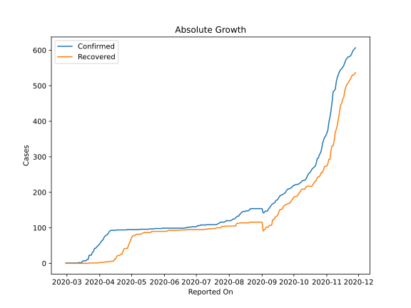
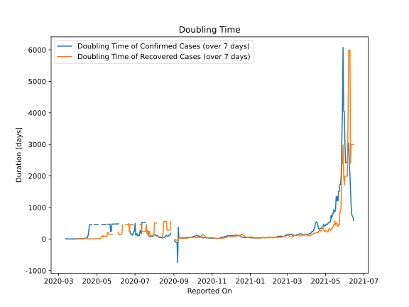

# Country Figures: Doubling Time of Infections for Monaco 

The doubling time below are calculated based on
* an exponential growth assumption
* for time difference of past seven (7) days.
The doubling time's unit is "days".

The first doubling time indicates the increase of confirmed (infected)
cases. There, the *higher* the number is, the better is to take control
of the disease.

The second doubling time indicates the increase of recovered (healed)
cases. There, the *lower* the number is, the better it is to take
control of the disease.

| Reported On | Confirmed | Doubling Time (Confirmed) | Recovered | Doubling Time (Recovered) |
|-------------|-----------|---------------------------|-----------|---------------------------|
| 2020-04-27 | 95 |  458.9 days  | 42 |  8.4 days  | 
| 2020-04-26 | 94 |  None  | 42 |  7.8 days  | 
| 2020-04-25 | 94 |  None  | 42 |  7.8 days  | 
| 2020-04-24 | 94 |  None  | 41 |  7.1 days  | 
| 2020-04-23 | 94 |  454.0 days  | 35 |  4.9 days  | 
| 2020-04-22 | 94 |  454.0 days  | 26 |  6.6 days  | 
| 2020-04-21 | 94 |  454.0 days  | 26 |  3.6 days  | 
| 2020-04-20 | 94 |  454.0 days  | 23 |  3.9 days  | 
| 2020-04-19 | 94 |  454.0 days  | 22 |  4.1 days  | 
| 2020-04-18 | 94 |  226.0 days  | 22 |  3.6 days  | 
| 2020-04-17 | 94 |  111.9 days  | 20 |  3.8 days  | 
| 2020-04-16 | 93 |  48.0 days  | 12 |  5.9 days  | 
| 2020-04-15 | 93 |  35.5 days  | 12 |  4.8 days  | 
| 2020-04-14 | 93 |  30.1 days  | 6 |  12.3 days  | 
| 2020-04-13 | 93 |  26.0 days  | 6 |  12.3 days  | 
| 2020-04-12 | 93 |  20.4 days  | 6 |  7.3 days  | 
| 2020-04-11 | 92 |  15.0 days  | 5 |  9.8 days  | 
| 2020-04-10 | 90 |  14.6 days  | 5 |  9.8 days  | 
| 2020-04-09 | 84 |  14.8 days  | 5 |  5.6 days  | 
| 2020-04-08 | 81 |  12.9 days  | 4 |  7.3 days  | 
| 2020-04-07 | 79 |  11.9 days  | 4 |  7.3 days  | 
| 2020-04-06 | 77 |  11.1 days  | 4 |  3.8 days  | 
| 2020-04-05 | 73 |  10.8 days  | 3 |  4.8 days  | 
| 2020-04-04 | 66 |  11.1 days  | 3 |  4.8 days  | 
| 2020-04-03 | 64 |  11.9 days  | 3 |  4.8 days  | 
| 2020-04-02 | 60 |  8.5 days  | 2 |  7.3 days  | 
| 2020-04-01 | 55 |  8.8 days  | 2 |  7.3 days  | 
| 2020-03-31 | 52 |  6.3 days  | 2 |  7.3 days  | 
| 2020-03-30 | 49 |  6.8 days  | 1 |  None  | 
| 2020-03-29 | 46 |  7.3 days  | 1 |  None  | 
| 2020-03-28 | 42 |  4.0 days  | 1 |  None  | 
| 2020-03-27 | 42 |  4.0 days  | 1 |  None  | 
| 2020-03-26 | 33 |  3.5 days  | 1 |  None  | 
| 2020-03-25 | 31 |  3.6 days  | 1 |  None  | 
| 2020-03-24 | 23 |  4.4 days  | 1 |  None  | 
| 2020-03-23 | 23 |  4.4 days  | 1 |  None  | 
| 2020-03-22 | 23 |  2.3 days  | 1 |  None  | 
| 2020-03-21 | 11 |  3.2 days  | 0 |  None  | 
| 2020-03-20 | 11 |  3.2 days  | 0 |  None  | 
| 2020-03-19 | 7 |  4.2 days  | 0 |  None  | 
| 2020-03-18 | 7 |  2.8 days  | 0 |  None  | 
| 2020-03-17 | 7 |  2.8 days  | 0 |  None  | 
| 2020-03-16 | 7 |  2.8 days  | 0 |  None  | 
| 2020-03-15 | 2 |  7.3 days  | 0 |  None  | 
| 2020-03-14 | 2 |  7.3 days  | 0 |  None  | 
| 2020-03-13 | 2 |  7.3 days  | 0 |  None  | 
| 2020-03-12 | 2 |  7.3 days  | 0 |  None  | 
| 2020-03-11 | 1 |  None  | 0 |  None  | 
| 2020-03-10 | 1 |  None  | 0 |  None  | 
| 2020-03-09 | 1 |  None  | 0 |  None  | 
| 2020-03-08 | 1 |  None  | 0 |  None  | 
| 2020-03-07 | 1 |  None  | 0 |  None  | 
| 2020-03-06 | 1 |  None  | 0 |  None  | 
| 2020-03-05 | 1 |  None  | 0 |  None  | 
| 2020-03-04 | 1 |  None  | 0 |  None  | 
| 2020-03-03 | 1 |  None  | 0 |  None  | 
| 2020-03-02 | 1 |  None  | 0 |  None  | 
| 2020-03-01 | 1 |  None  | 0 |  None  | 
| 2020-02-29 | 1 |  None  | 0 |  None  | 

