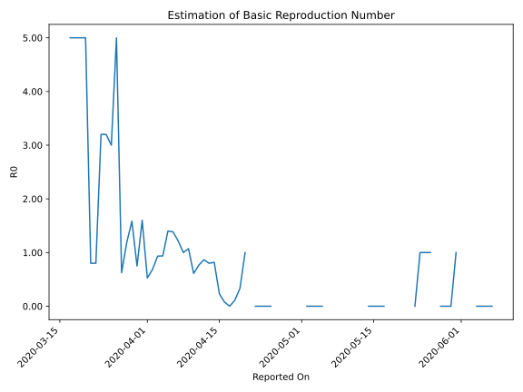

# Country Figures: Time Series for Basic Reproduction Number of Monaco 

| Reported On | &Delta; Confirmed | Total &Delta; Confirmed First Interval | Total &Delta; Confirmed Second Interval | Estimated Basic Reproduction Number R0 | 
|-------------|-------------------|----------------------------------------|-----------------------------------------|---------------------------------------------------|
| 2020-04-27 | 1 |  None  |  None  |  None  | 
| 2020-04-26 | 0 |  None  |  None  |  None  | 
| 2020-04-25 | 0 |  None  |  1  |  None  | 
| 2020-04-24 | 0 |  None  |  1  |  None  | 
| 2020-04-23 | 0 |  None  |  1  |  None  | 
| 2020-04-22 | 0 |  None  |  1  |  None  | 
| 2020-04-21 | 0 |  1  |  None  |  None  | 
| 2020-04-20 | 0 |  1  |  1  |  1.00  | 
| 2020-04-19 | 0 |  1  |  3  |  0.33  | 
| 2020-04-18 | 0 |  1  |  9  |  0.11  | 
| 2020-04-17 | 1 |  None  |  12  |  None  | 
| 2020-04-16 | 0 |  1  |  13  |  0.08  | 
| 2020-04-15 | 0 |  3  |  13  |  0.23  | 
| 2020-04-14 | 0 |  9  |  11  |  0.82  | 
| 2020-04-13 | 0 |  12  |  15  |  0.80  | 
| 2020-04-12 | 1 |  13  |  15  |  0.87  | 
| 2020-04-11 | 2 |  13  |  17  |  0.76  | 
| 2020-04-10 | 6 |  11  |  18  |  0.61  | 
| 2020-04-09 | 3 |  15  |  14  |  1.07  | 
| 2020-04-08 | 2 |  15  |  15  |  1.00  | 
| 2020-04-07 | 2 |  17  |  14  |  1.21  | 
| 2020-04-06 | 4 |  18  |  13  |  1.38  | 
| 2020-04-05 | 7 |  14  |  10  |  1.40  | 
| 2020-04-04 | 2 |  15  |  16  |  0.94  | 
| 2020-04-03 | 4 |  14  |  15  |  0.93  | 
| 2020-04-02 | 5 |  13  |  19  |  0.68  | 
| 2020-04-01 | 3 |  10  |  19  |  0.53  | 
| 2020-03-31 | 3 |  16  |  10  |  1.60  | 
| 2020-03-30 | 3 |  15  |  20  |  0.75  | 
| 2020-03-29 | 4 |  19  |  12  |  1.58  | 
| 2020-03-28 | 0 |  19  |  16  |  1.19  | 
| 2020-03-27 | 9 |  10  |  16  |  0.62  | 
| 2020-03-26 | 2 |  20  |  4  |  5.00  | 
| 2020-03-25 | 8 |  12  |  4  |  3.00  | 
| 2020-03-24 | 0 |  16  |  5  |  3.20  | 
| 2020-03-23 | 0 |  16  |  5  |  3.20  | 
| 2020-03-22 | 12 |  4  |  5  |  0.80  | 
| 2020-03-21 | 0 |  4  |  5  |  0.80  | 
| 2020-03-20 | 4 |  5  |  1  |  5.00  | 
| 2020-03-19 | 0 |  5  |  1  |  5.00  | 
| 2020-03-18 | 0 |  5  |  1  |  5.00  | 
| 2020-03-17 | 0 |  5  |  1  |  5.00  | 
| 2020-03-16 | 5 |  1  |  None  |  None  | 
| 2020-03-15 | 0 |  1  |  None  |  None  | 
| 2020-03-14 | 0 |  1  |  None  |  None  | 
| 2020-03-13 | 0 |  1  |  None  |  None  | 
| 2020-03-12 | 1 |  None  |  None  |  None  | 
| 2020-03-11 | 0 |  None  |  None  |  None  | 
| 2020-03-10 | 0 |  None  |  None  |  None  | 
| 2020-03-09 | 0 |  None  |  None  |  None  | 
| 2020-03-08 | 0 |  None  |  None  |  None  | 
| 2020-03-07 | 0 |  None  |  None  |  None  | 
| 2020-03-06 | 0 |  None  |  None  |  None  | 
| 2020-03-05 | 0 |  None  |  None  |  None  | 
| 2020-03-04 | 0 |  None  |  None  |  None  | 
| 2020-03-03 | 0 |  None  |  None  |  None  | 
| 2020-03-02 | 0 |  None  |  None  |  None  | 
| 2020-03-01 | 0 |  None  |  None  |  None  | 
| 2020-02-29 | None |  None  |  None  |  None  | 

