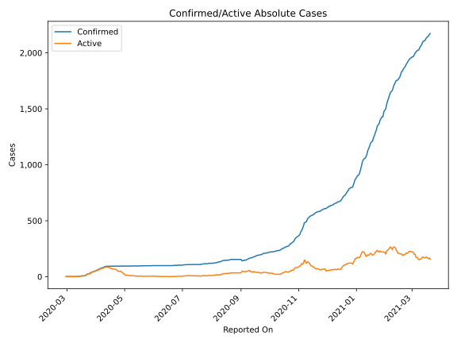
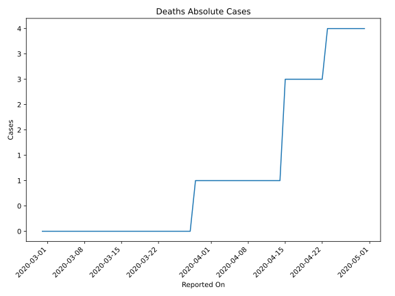
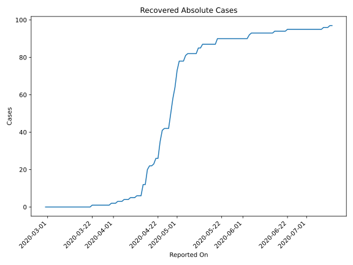
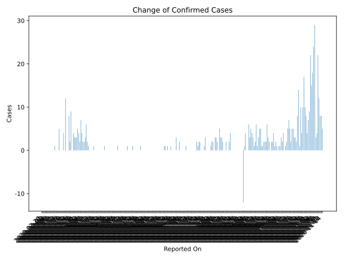
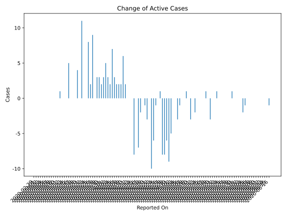
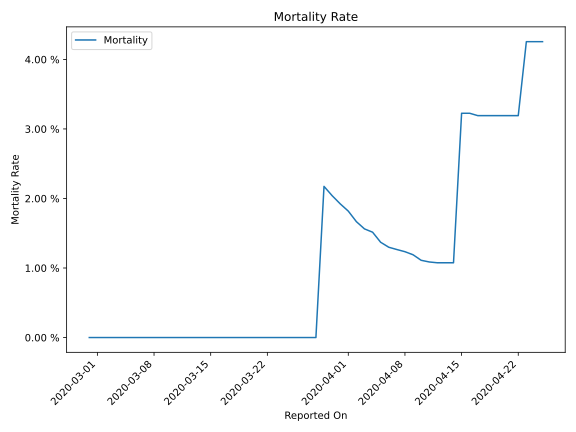

# Country Figures: Time Series for Monaco 

| Reported On | Confirmed | Deaths | Recovered | Active | Mortality | &Delta; Confirmed | &Delta; Deaths | &Delta; Recovered | &Delta; Active | % Active of Population |
|-------------|-----------|--------|-----------|--------|-----------|-------------------|----------------|-------------------|----------------|------------------------|
| 2020-04-21 | 94 | 3 | 26 | 65 |  3.19 %  | 0 | 0 | 3 | -3 |  0.168 %  | 
| 2020-04-20 | 94 | 3 | 23 | 68 |  3.19 %  | 0 | 0 | 1 | -1 |  0.176 %  | 
| 2020-04-19 | 94 | 3 | 22 | 69 |  3.19 %  | 0 | 0 | 0 | 0 |  0.178 %  | 
| 2020-04-18 | 94 | 3 | 22 | 69 |  3.19 %  | 0 | 0 | 2 | -2 |  0.178 %  | 
| 2020-04-17 | 94 | 3 | 20 | 71 |  3.19 %  | 1 | 0 | 8 | -7 |  0.184 %  | 
| 2020-04-16 | 93 | 3 | 12 | 78 |  3.23 %  | 0 | 0 | 0 | 0 |  0.202 %  | 
| 2020-04-15 | 93 | 3 | 12 | 78 |  3.23 %  | 0 | 2 | 6 | -8 |  0.202 %  | 
| 2020-04-14 | 93 | 1 | 6 | 86 |  1.08 %  | 0 | 0 | 0 | 0 |  0.222 %  | 
| 2020-04-13 | 93 | 1 | 6 | 86 |  1.08 %  | 0 | 0 | 0 | 0 |  0.222 %  | 
| 2020-04-12 | 93 | 1 | 6 | 86 |  1.08 %  | 1 | 0 | 1 | 0 |  0.222 %  | 
| 2020-04-11 | 92 | 1 | 5 | 86 |  1.09 %  | 2 | 0 | 0 | 2 |  0.222 %  | 
| 2020-04-10 | 90 | 1 | 5 | 84 |  1.11 %  | 6 | 0 | 0 | 6 |  0.217 %  | 
| 2020-04-09 | 84 | 1 | 5 | 78 |  1.19 %  | 3 | 0 | 1 | 2 |  0.202 %  | 
| 2020-04-08 | 81 | 1 | 4 | 76 |  1.23 %  | 2 | 0 | 0 | 2 |  0.196 %  | 
| 2020-04-07 | 79 | 1 | 4 | 74 |  1.27 %  | 2 | 0 | 0 | 2 |  0.191 %  | 
| 2020-04-06 | 77 | 1 | 4 | 72 |  1.30 %  | 4 | 0 | 1 | 3 |  0.186 %  | 
| 2020-04-05 | 73 | 1 | 3 | 69 |  1.37 %  | 7 | 0 | 0 | 7 |  0.178 %  | 
| 2020-04-04 | 66 | 1 | 3 | 62 |  1.52 %  | 2 | 0 | 0 | 2 |  0.160 %  | 
| 2020-04-03 | 64 | 1 | 3 | 60 |  1.56 %  | 4 | 0 | 1 | 3 |  0.155 %  | 
| 2020-04-02 | 60 | 1 | 2 | 57 |  1.67 %  | 5 | 0 | 0 | 5 |  0.147 %  | 
| 2020-04-01 | 55 | 1 | 2 | 52 |  1.82 %  | 3 | 0 | 0 | 3 |  0.134 %  | 
| 2020-03-31 | 52 | 1 | 2 | 49 |  1.92 %  | 3 | 0 | 1 | 2 |  0.127 %  | 
| 2020-03-30 | 49 | 1 | 1 | 47 |  2.04 %  | 3 | 0 | 0 | 3 |  0.122 %  | 
| 2020-03-29 | 46 | 1 | 1 | 44 |  2.17 %  | 4 | 1 | 0 | 3 |  0.114 %  | 
| 2020-03-28 | 42 | 0 | 1 | 41 |  None  | 0 | 0 | 0 | 0 |  0.106 %  | 
| 2020-03-27 | 42 | 0 | 1 | 41 |  None  | 9 | 0 | 0 | 9 |  0.106 %  | 
| 2020-03-26 | 33 | 0 | 1 | 32 |  None  | 2 | 0 | 0 | 2 |  0.083 %  | 
| 2020-03-25 | 31 | 0 | 1 | 30 |  None  | 8 | 0 | 0 | 8 |  0.078 %  | 
| 2020-03-24 | 23 | 0 | 1 | 22 |  None  | 0 | 0 | 0 | 0 |  0.057 %  | 
| 2020-03-23 | 23 | 0 | 1 | 22 |  None  | 0 | 0 | 0 | 0 |  0.057 %  | 
| 2020-03-22 | 23 | 0 | 1 | 22 |  None  | 12 | 0 | 1 | 11 |  0.057 %  | 
| 2020-03-21 | 11 | 0 | 0 | 11 |  None  | 0 | 0 | 0 | 0 |  0.028 %  | 
| 2020-03-20 | 11 | 0 | 0 | 11 |  None  | 4 | 0 | 0 | 4 |  0.028 %  | 
| 2020-03-19 | 7 | 0 | 0 | 7 |  None  | 0 | 0 | 0 | 0 |  0.018 %  | 
| 2020-03-18 | 7 | 0 | 0 | 7 |  None  | 0 | 0 | 0 | 0 |  0.018 %  | 
| 2020-03-17 | 7 | 0 | 0 | 7 |  None  | 0 | 0 | 0 | 0 |  0.018 %  | 
| 2020-03-16 | 7 | 0 | 0 | 7 |  None  | 5 | 0 | 0 | 5 |  0.018 %  | 
| 2020-03-15 | 2 | 0 | 0 | 2 |  None  | 0 | 0 | 0 | 0 |  0.005 %  | 
| 2020-03-14 | 2 | 0 | 0 | 2 |  None  | 0 | 0 | 0 | 0 |  0.005 %  | 
| 2020-03-13 | 2 | 0 | 0 | 2 |  None  | 0 | 0 | 0 | 0 |  0.005 %  | 
| 2020-03-12 | 2 | 0 | 0 | 2 |  None  | 1 | 0 | 0 | 1 |  0.005 %  | 
| 2020-03-11 | 1 | 0 | 0 | 1 |  None  | 0 | 0 | 0 | 0 |  0.003 %  | 
| 2020-03-10 | 1 | 0 | 0 | 1 |  None  | 0 | 0 | 0 | 0 |  0.003 %  | 
| 2020-03-09 | 1 | 0 | 0 | 1 |  None  | 0 | 0 | 0 | 0 |  0.003 %  | 
| 2020-03-08 | 1 | 0 | 0 | 1 |  None  | 0 | 0 | 0 | 0 |  0.003 %  | 
| 2020-03-07 | 1 | 0 | 0 | 1 |  None  | 0 | 0 | 0 | 0 |  0.003 %  | 
| 2020-03-06 | 1 | 0 | 0 | 1 |  None  | 0 | 0 | 0 | 0 |  0.003 %  | 
| 2020-03-05 | 1 | 0 | 0 | 1 |  None  | 0 | 0 | 0 | 0 |  0.003 %  | 
| 2020-03-04 | 1 | 0 | 0 | 1 |  None  | 0 | 0 | 0 | 0 |  0.003 %  | 
| 2020-03-03 | 1 | 0 | 0 | 1 |  None  | 0 | 0 | 0 | 0 |  0.003 %  | 
| 2020-03-02 | 1 | 0 | 0 | 1 |  None  | 0 | 0 | 0 | 0 |  0.003 %  | 
| 2020-03-01 | 1 | 0 | 0 | 1 |  None  | 0 | 0 | 0 | 0 |  0.003 %  | 
| 2020-02-29 | 1 | 0 | 0 | 1 |  None  | None | None | None | None |  0.003 %  | 

