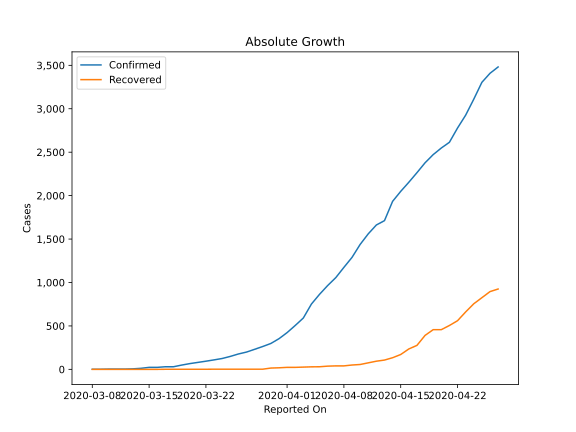
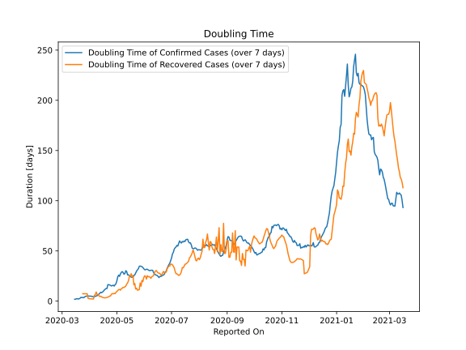

# Country Figures: Doubling Time of Infections for Moldova 

The doubling time below are calculated based on
* an exponential growth assumption
* for time difference of past seven (7) days.
The doubling time's unit is "days".

The first doubling time indicates the increase of confirmed (infected)
cases. There, the *higher* the number is, the better is to take control
of the disease.

The second doubling time indicates the increase of recovered (healed)
cases. There, the *lower* the number is, the better it is to take
control of the disease.

| Reported On | Confirmed | Doubling Time (Confirmed) | Recovered | Doubling Time (Recovered) |
|-------------|-----------|---------------------------|-----------|---------------------------|
| 2020-05-08 | 4728 |  28.5 days  | 1826 |  13.8 days  | 
| 2020-05-07 | 4605 |  29.4 days  | 1747 |  12.8 days  | 
| 2020-05-06 | 4476 |  28.7 days  | 1658 |  12.5 days  | 
| 2020-05-05 | 4363 |  27.0 days  | 1544 |  10.9 days  | 
| 2020-05-04 | 4248 |  24.7 days  | 1423 |  11.6 days  | 
| 2020-05-03 | 4121 |  25.9 days  | 1382 |  11.5 days  | 
| 2020-05-02 | 4052 |  24.1 days  | 1334 |  10.4 days  | 
| 2020-05-01 | 3980 |  20.0 days  | 1272 |  9.6 days  | 
| 2020-04-30 | 3897 |  17.3 days  | 1182 |  8.7 days  | 
| 2020-04-29 | 3771 |  16.2 days  | 1114 |  7.4 days  | 
| 2020-04-28 | 3638 |  15.0 days  | 975 |  7.7 days  | 
| 2020-04-27 | 3481 |  15.9 days  | 925 |  7.2 days  | 
| 2020-04-26 | 3408 |  15.5 days  | 895 |  7.6 days  | 
| 2020-04-25 | 3304 |  15.1 days  | 825 |  6.8 days  | 
| 2020-04-24 | 3110 |  15.6 days  | 755 |  5.2 days  | 
| 2020-04-23 | 2926 |  16.2 days  | 661 |  5.0 days  | 
| 2020-04-22 | 2778 |  16.3 days  | 560 |  4.4 days  | 
| 2020-04-21 | 2614 |  16.4 days  | 505 |  4.0 days  | 
| 2020-04-20 | 2548 |  12.5 days  | 457 |  3.7 days  | 
| 2020-04-19 | 2472 |  12.6 days  | 457 |  3.4 days  | 
| 2020-04-18 | 2378 |  11.9 days  | 391 |  3.3 days  | 
| 2020-04-17 | 2264 |  11.0 days  | 276 |  3.4 days  | 
| 2020-04-16 | 2154 |  9.8 days  | 235 |  3.5 days  | 
| 2020-04-15 | 2049 |  9.1 days  | 171 |  3.7 days  | 
| 2020-04-14 | 1934 |  8.4 days  | 134 |  4.4 days  | 
| 2020-04-13 | 1712 |  8.8 days  | 107 |  4.9 days  | 
| 2020-04-12 | 1662 |  7.8 days  | 94 |  4.6 days  | 
| 2020-04-11 | 1560 |  7.0 days  | 75 |  5.4 days  | 
| 2020-04-10 | 1438 |  5.8 days  | 56 |  6.7 days  | 
| 2020-04-09 | 1289 |  5.5 days  | 50 |  6.6 days  | 
| 2020-04-08 | 1174 |  5.1 days  | 40 |  9.1 days  | 
| 2020-04-07 | 1056 |  4.8 days  | 40 |  6.4 days  | 
| 2020-04-06 | 965 |  4.5 days  | 37 |  5.7 days  | 
| 2020-04-05 | 864 |  4.4 days  | 30 |  2.1 days  | 
| 2020-04-04 | 752 |  4.4 days  | 29 |  2.1 days  | 
| 2020-04-03 | 591 |  4.8 days  | 26 |  2.2 days  | 
| 2020-04-02 | 505 |  5.0 days  | 23 |  2.3 days  | 
| 2020-04-01 | 423 |  5.0 days  | 23 |  2.3 days  | 
| 2020-03-31 | 353 |  5.0 days  | 18 |  2.5 days  | 
| 2020-03-30 | 298 |  5.2 days  | 15 |  2.7 days  | 
| 2020-03-29 | 263 |  5.1 days  | 2 |  7.3 days  | 
| 2020-03-28 | 231 |  4.9 days  | 2 |  7.3 days  | 
| 2020-03-27 | 199 |  4.7 days  | 2 |  7.3 days  | 
| 2020-03-26 | 177 |  4.1 days  | 2 |  7.3 days  | 
| 2020-03-25 | 149 |  3.4 days  | 2 |  7.3 days  | 
| 2020-03-24 | 125 |  3.7 days  | 2 |  7.3 days  | 
| 2020-03-23 | 109 |  3.5 days  | 2 |  None  | 
| 2020-03-22 | 94 |  3.8 days  | 1 |  None  | 
| 2020-03-21 | 80 |  2.9 days  | 1 |  None  | 
| 2020-03-20 | 66 |  2.4 days  | 1 |  None  | 
| 2020-03-19 | 49 |  2.1 days  | 1 |  None  | 
| 2020-03-18 | 30 |  2.4 days  | 1 |  None  | 
| 2020-03-17 | 30 |  2.4 days  | 1 |  None  | 
| 2020-03-16 | 23 |  1.9 days  | 0 |  None  | 
| 2020-03-15 | 23 |  1.9 days  | 0 |  None  | 
| 2020-03-14 | 12 |  None  | 0 |  None  | 
| 2020-03-13 | 6 |  None  | 0 |  None  | 
| 2020-03-12 | 3 |  None  | 0 |  None  | 
| 2020-03-11 | 3 |  None  | 0 |  None  | 
| 2020-03-10 | 3 |  None  | 0 |  None  | 
| 2020-03-09 | 1 |  None  | 0 |  None  | 
| 2020-03-08 | 1 |  None  | 0 |  None  | 

