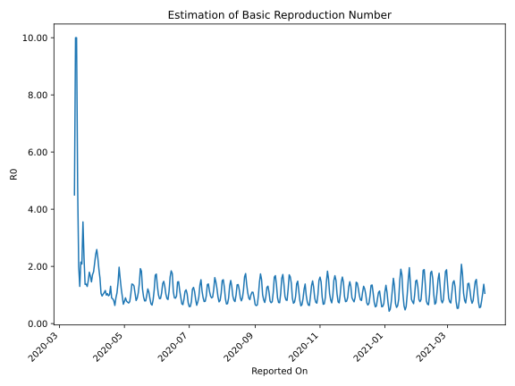

# Country Figures: Time Series for Basic Reproduction Number of Moldova 

| Reported On | &Delta; Confirmed | Total &Delta; Confirmed First Interval | Total &Delta; Confirmed Second Interval | Estimated Basic Reproduction Number R0 | 
|-------------|-------------------|----------------------------------------|-----------------------------------------|---------------------------------------------------|
| 2020-04-30 | 126 |  467  |  690  |  0.68  | 
| 2020-04-29 | 133 |  528  |  562  |  0.94  | 
| 2020-04-28 | 157 |  555  |  454  |  1.22  | 
| 2020-04-27 | 73 |  630  |  400  |  1.57  | 
| 2020-04-26 | 104 |  690  |  350  |  1.97  | 
| 2020-04-25 | 194 |  562  |  394  |  1.43  | 
| 2020-04-24 | 184 |  454  |  423  |  1.07  | 
| 2020-04-23 | 148 |  400  |  444  |  0.90  | 
| 2020-04-22 | 164 |  350  |  552  |  0.63  | 
| 2020-04-21 | 66 |  394  |  492  |  0.80  | 
| 2020-04-20 | 76 |  423  |  489  |  0.87  | 
| 2020-04-19 | 94 |  444  |  496  |  0.90  | 
| 2020-04-18 | 114 |  552  |  423  |  1.30  | 
| 2020-04-17 | 110 |  492  |  488  |  1.01  | 
| 2020-04-16 | 105 |  489  |  504  |  0.97  | 
| 2020-04-15 | 115 |  496  |  473  |  1.05  | 
| 2020-04-14 | 222 |  423  |  425  |  1.00  | 
| 2020-04-13 | 50 |  488  |  422  |  1.16  | 
| 2020-04-12 | 102 |  504  |  465  |  1.08  | 
| 2020-04-11 | 122 |  473  |  460  |  1.03  | 
| 2020-04-10 | 149 |  425  |  441  |  0.96  | 
| 2020-04-09 | 115 |  422  |  399  |  1.06  | 
| 2020-04-08 | 118 |  465  |  293  |  1.59  | 
| 2020-04-07 | 91 |  460  |  242  |  1.90  | 
| 2020-04-06 | 101 |  441  |  192  |  2.30  | 
| 2020-04-05 | 112 |  399  |  154  |  2.59  | 
| 2020-04-04 | 161 |  293  |  121  |  2.42  | 
| 2020-04-03 | 86 |  242  |  114  |  2.12  | 
| 2020-04-02 | 82 |  192  |  106  |  1.81  | 
| 2020-04-01 | 70 |  154  |  90  |  1.71  | 
| 2020-03-31 | 55 |  121  |  83  |  1.46  | 
| 2020-03-30 | 35 |  114  |  69  |  1.65  | 
| 2020-03-29 | 32 |  106  |  59  |  1.80  | 
| 2020-03-28 | 32 |  90  |  60  |  1.50  | 
| 2020-03-27 | 22 |  83  |  64  |  1.30  | 
| 2020-03-26 | 28 |  69  |  50  |  1.38  | 
| 2020-03-25 | 24 |  59  |  43  |  1.37  | 
| 2020-03-24 | 16 |  60  |  26  |  2.31  | 
| 2020-03-23 | 15 |  64  |  18  |  3.56  | 
| 2020-03-22 | 14 |  50  |  24  |  2.08  | 
| 2020-03-21 | 14 |  43  |  20  |  2.15  | 
| 2020-03-20 | 17 |  26  |  20  |  1.30  | 
| 2020-03-19 | 19 |  18  |  9  |  2.00  | 
| 2020-03-18 | 0 |  24  |  5  |  4.80  | 
| 2020-03-17 | 7 |  20  |  2  |  10.00  | 
| 2020-03-16 | 0 |  20  |  2  |  10.00  | 
| 2020-03-15 | 11 |  9  |  2  |  4.50  | 
| 2020-03-14 | 6 |  5  |  None  |  None  | 
| 2020-03-13 | 3 |  2  |  None  |  None  | 
| 2020-03-12 | 0 |  2  |  None  |  None  | 
| 2020-03-11 | 0 |  2  |  None  |  None  | 
| 2020-03-10 | 2 |  None  |  None  |  None  | 
| 2020-03-09 | 0 |  None  |  None  |  None  | 
| 2020-03-08 | None |  None  |  None  |  None  | 

