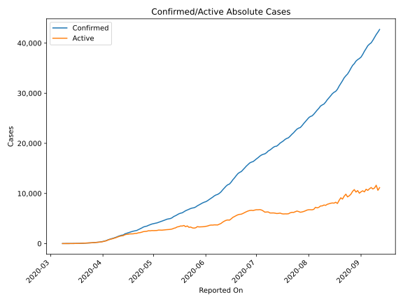
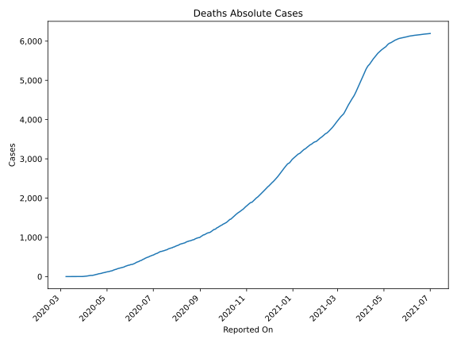
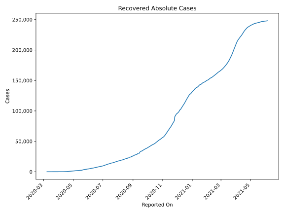
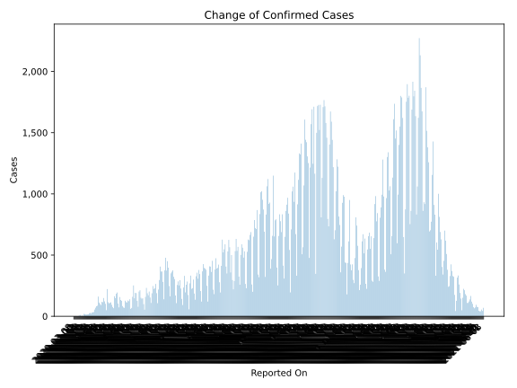
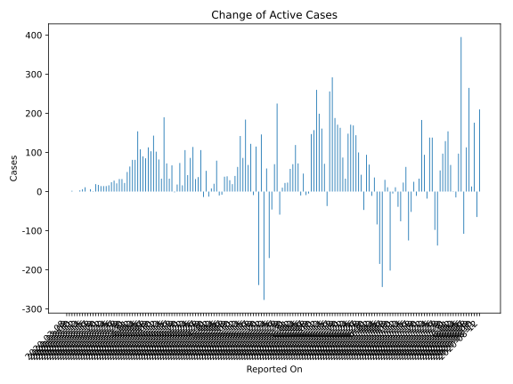
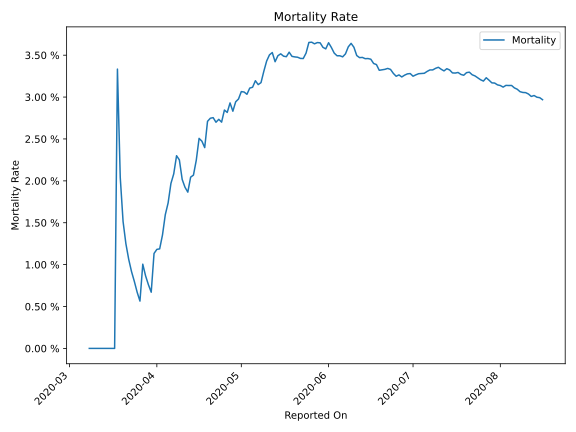

# Country Figures: Time Series for Moldova 

| Reported On | Confirmed | Deaths | Recovered | Active | Mortality | &Delta; Confirmed | &Delta; Deaths | &Delta; Active | % Active of Population |
|-------------|-----------|--------|-----------|--------|-----------|-------------------|----------------|----------------|------------------------|
| 2020-04-02 | 505 | 6 | 23 | 476 |  1.19 %  | 82 | 1 | 81 |  0.013 %  | 
| 2020-04-01 | 423 | 5 | 23 | 395 |  1.18 %  | 70 | 1 | 64 |  0.011 %  | 
| 2020-03-31 | 353 | 4 | 18 | 331 |  1.13 %  | 55 | 2 | 50 |  0.009 %  | 
| 2020-03-30 | 298 | 2 | 15 | 281 |  0.67 %  | 35 | 0 | 22 |  0.008 %  | 
| 2020-03-29 | 263 | 2 | 2 | 259 |  0.76 %  | 32 | 0 | 32 |  0.007 %  | 
| 2020-03-28 | 231 | 2 | 2 | 227 |  0.87 %  | 32 | 0 | 32 |  0.006 %  | 
| 2020-03-27 | 199 | 2 | 2 | 195 |  1.01 %  | 22 | 1 | 21 |  0.005 %  | 
| 2020-03-26 | 177 | 1 | 2 | 174 |  0.56 %  | 28 | 0 | 28 |  0.005 %  | 
| 2020-03-25 | 149 | 1 | 2 | 146 |  0.67 %  | 24 | 0 | 24 |  0.004 %  | 
| 2020-03-24 | 125 | 1 | 2 | 122 |  0.80 %  | 16 | 0 | 16 |  0.003 %  | 
| 2020-03-23 | 109 | 1 | 2 | 106 |  0.92 %  | 15 | 0 | 14 |  0.003 %  | 
| 2020-03-22 | 94 | 1 | 1 | 92 |  1.06 %  | 14 | 0 | 14 |  0.003 %  | 
| 2020-03-21 | 80 | 1 | 1 | 78 |  1.25 %  | 14 | 0 | 14 |  0.002 %  | 
| 2020-03-20 | 66 | 1 | 1 | 64 |  1.52 %  | 17 | 0 | 17 |  0.002 %  | 
| 2020-03-19 | 49 | 1 | 1 | 47 |  2.04 %  | 19 | 0 | 19 |  0.001 %  | 
| 2020-03-18 | 30 | 1 | 1 | 28 |  3.33 %  | 0 | 1 | -1 |  0.001 %  | 
| 2020-03-17 | 30 | 0 | 1 | 29 |  None  | 7 | 0 | 6 |  0.001 %  | 
| 2020-03-16 | 23 | 0 | 0 | 23 |  None  | 0 | 0 | 0 |  0.001 %  | 
| 2020-03-15 | 23 | 0 | 0 | 23 |  None  | 11 | 0 | 11 |  0.001 %  | 
| 2020-03-14 | 12 | 0 | 0 | 12 |  None  | 6 | 0 | 6 |  0.000 %  | 
| 2020-03-13 | 6 | 0 | 0 | 6 |  None  | 3 | 0 | 3 |  0.000 %  | 
| 2020-03-12 | 3 | 0 | 0 | 3 |  None  | 0 | 0 | 0 |  0.000 %  | 
| 2020-03-11 | 3 | 0 | 0 | 3 |  None  | 0 | 0 | 0 |  0.000 %  | 
| 2020-03-10 | 3 | 0 | 0 | 3 |  None  | 2 | 0 | 2 |  0.000 %  | 
| 2020-03-09 | 1 | 0 | 0 | 1 |  None  | 0 | 0 | 0 |  0.000 %  | 
| 2020-03-08 | 1 | 0 | 0 | 1 |  None  | None | None | None |  0.000 %  | 

