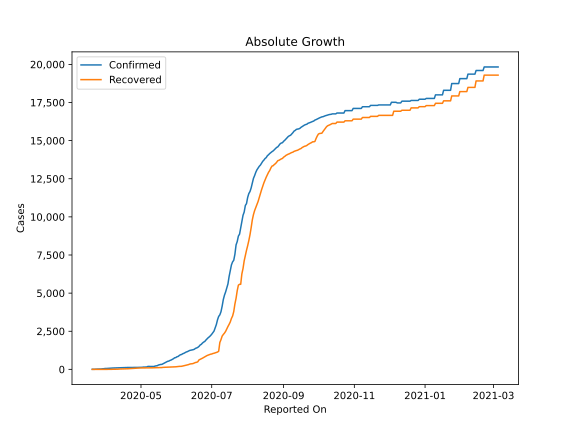
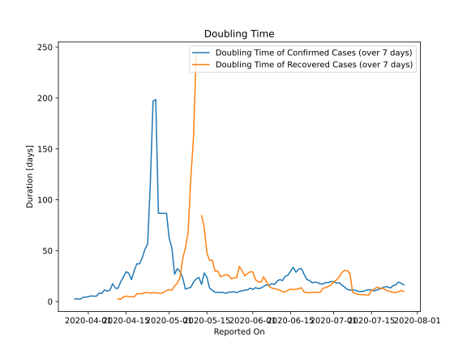

# Country Figures: Doubling Time of Infections for Madagascar 

The doubling time below are calculated based on
* an exponential growth assumption
* for time difference of past seven (7) days.
The doubling time's unit is "days".

The first doubling time indicates the increase of confirmed (infected)
cases. There, the *higher* the number is, the better is to take control
of the disease.

The second doubling time indicates the increase of recovered (healed)
cases. There, the *lower* the number is, the better it is to take
control of the disease.

| Reported On | Confirmed | Doubling Time (Confirmed) | Recovered | Doubling Time (Recovered) |
|-------------|-----------|---------------------------|-----------|---------------------------|
| 2020-04-26 | 124 |  198.5 days  | 71 |  8.4 days  | 
| 2020-04-25 | 123 |  196.8 days  | 62 |  8.8 days  | 
| 2020-04-24 | 122 |  116.3 days  | 61 |  8.2 days  | 
| 2020-04-23 | 121 |  56.6 days  | 58 |  8.9 days  | 
| 2020-04-22 | 121 |  51.3 days  | 52 |  8.7 days  | 
| 2020-04-21 | 121 |  43.0 days  | 44 |  7.8 days  | 
| 2020-04-20 | 121 |  37.0 days  | 41 |  7.6 days  | 
| 2020-04-19 | 121 |  37.0 days  | 39 |  7.6 days  | 
| 2020-04-18 | 120 |  30.2 days  | 35 |  4.5 days  | 
| 2020-04-17 | 117 |  21.5 days  | 33 |  4.8 days  | 
| 2020-04-16 | 111 |  27.8 days  | 33 |  4.8 days  | 
| 2020-04-15 | 110 |  29.2 days  | 29 |  5.3 days  | 
| 2020-04-14 | 108 |  24.0 days  | 23 |  4.4 days  | 
| 2020-04-13 | 106 |  19.2 days  | 21 |  2.4 days  | 
| 2020-04-12 | 106 |  12.9 days  | 20 |  2.4 days  | 
| 2020-04-11 | 102 |  13.2 days  | 11 |  None  | 
| 2020-04-10 | 93 |  17.4 days  | 11 |  None  | 
| 2020-04-09 | 93 |  11.0 days  | 11 |  None  | 
| 2020-04-08 | 93 |  10.3 days  | 11 |  None  | 
| 2020-04-07 | 88 |  11.5 days  | 7 |  None  | 
| 2020-04-06 | 82 |  7.9 days  | 2 |  None  | 
| 2020-04-05 | 72 |  8.3 days  | 2 |  None  | 
| 2020-04-04 | 70 |  5.2 days  | 0 |  None  | 
| 2020-04-03 | 70 |  5.2 days  | 0 |  None  | 
| 2020-04-02 | 59 |  5.5 days  | 0 |  None  | 
| 2020-04-01 | 57 |  4.8 days  | 0 |  None  | 
| 2020-03-31 | 57 |  4.3 days  | 0 |  None  | 
| 2020-03-30 | 43 |  4.1 days  | 0 |  None  | 
| 2020-03-29 | 39 |  2.2 days  | 0 |  None  | 
| 2020-03-28 | 26 |  2.6 days  | 0 |  None  | 
| 2020-03-27 | 26 |  2.6 days  | 0 |  None  | 
| 2020-03-26 | 23 |  None  | 0 |  None  | 
| 2020-03-25 | 19 |  None  | 0 |  None  | 
| 2020-03-24 | 17 |  None  | 0 |  None  | 
| 2020-03-23 | 12 |  None  | 0 |  None  | 
| 2020-03-22 | 3 |  None  | 0 |  None  | 
| 2020-03-21 | 3 |  None  | 0 |  None  | 
| 2020-03-20 | 3 |  None  | 0 |  None  | 

