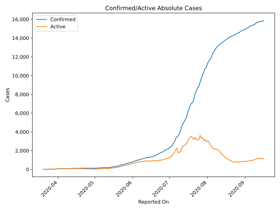
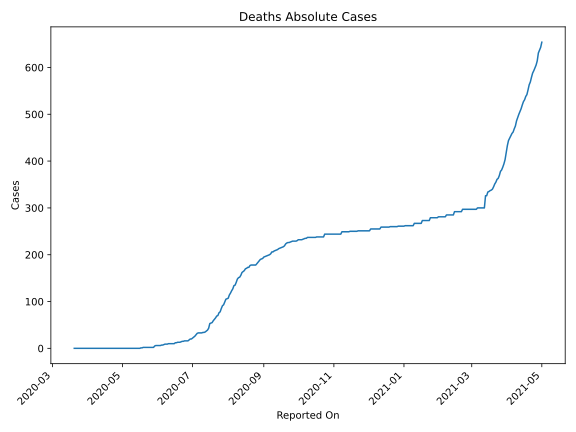
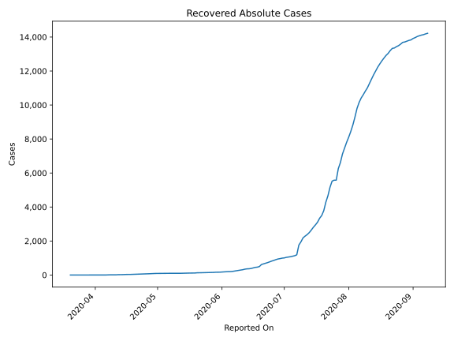
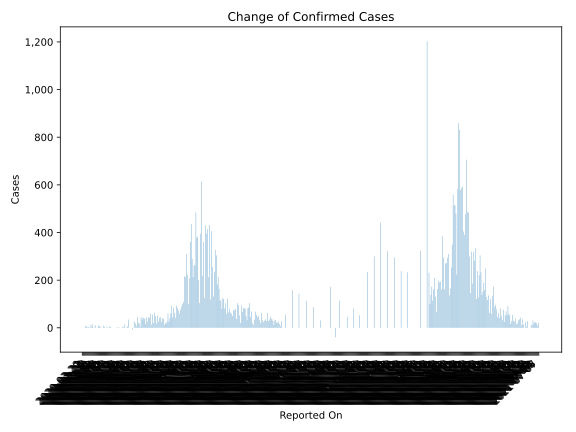
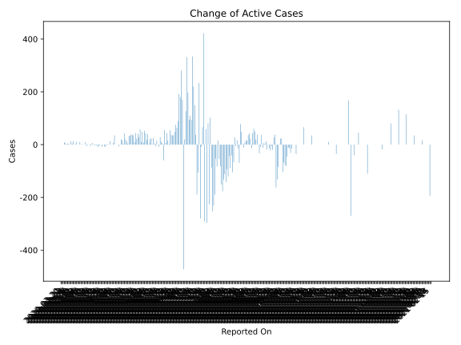
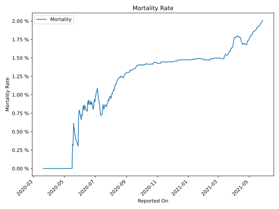

# Country Figures: Time Series for Madagascar 

| Reported On | Confirmed | Deaths | Recovered | Active | Mortality | &Delta; Confirmed | &Delta; Deaths | &Delta; Recovered | &Delta; Active | % Active of Population |
|-------------|-----------|--------|-----------|--------|-----------|-------------------|----------------|-------------------|----------------|------------------------|
| 2020-04-30 | 128 | 0 | 92 | 36 |  None  | 0 | 0 | 2 | -2 |  0.000 %  | 
| 2020-04-29 | 128 | 0 | 90 | 38 |  None  | 0 | 0 | 8 | -8 |  0.000 %  | 
| 2020-04-28 | 128 | 0 | 82 | 46 |  None  | 0 | 0 | 7 | -7 |  0.000 %  | 
| 2020-04-27 | 128 | 0 | 75 | 53 |  None  | 4 | 0 | 4 | 0 |  0.000 %  | 
| 2020-04-26 | 124 | 0 | 71 | 53 |  None  | 1 | 0 | 9 | -8 |  0.000 %  | 
| 2020-04-25 | 123 | 0 | 62 | 61 |  None  | 1 | 0 | 1 | 0 |  0.000 %  | 
| 2020-04-24 | 122 | 0 | 61 | 61 |  None  | 1 | 0 | 3 | -2 |  0.000 %  | 
| 2020-04-23 | 121 | 0 | 58 | 63 |  None  | 0 | 0 | 6 | -6 |  0.000 %  | 
| 2020-04-22 | 121 | 0 | 52 | 69 |  None  | 0 | 0 | 8 | -8 |  0.000 %  | 
| 2020-04-21 | 121 | 0 | 44 | 77 |  None  | 0 | 0 | 3 | -3 |  0.000 %  | 
| 2020-04-20 | 121 | 0 | 41 | 80 |  None  | 0 | 0 | 2 | -2 |  0.000 %  | 
| 2020-04-19 | 121 | 0 | 39 | 82 |  None  | 1 | 0 | 4 | -3 |  0.000 %  | 
| 2020-04-18 | 120 | 0 | 35 | 85 |  None  | 3 | 0 | 2 | 1 |  0.000 %  | 
| 2020-04-17 | 117 | 0 | 33 | 84 |  None  | 6 | 0 | 0 | 6 |  0.000 %  | 
| 2020-04-16 | 111 | 0 | 33 | 78 |  None  | 1 | 0 | 4 | -3 |  0.000 %  | 
| 2020-04-15 | 110 | 0 | 29 | 81 |  None  | 2 | 0 | 6 | -4 |  0.000 %  | 
| 2020-04-14 | 108 | 0 | 23 | 85 |  None  | 2 | 0 | 2 | 0 |  0.000 %  | 
| 2020-04-13 | 106 | 0 | 21 | 85 |  None  | 0 | 0 | 1 | -1 |  0.000 %  | 
| 2020-04-12 | 106 | 0 | 20 | 86 |  None  | 4 | 0 | 9 | -5 |  0.000 %  | 
| 2020-04-11 | 102 | 0 | 11 | 91 |  None  | 9 | 0 | 0 | 9 |  0.000 %  | 
| 2020-04-10 | 93 | 0 | 11 | 82 |  None  | 0 | 0 | 0 | 0 |  0.000 %  | 
| 2020-04-09 | 93 | 0 | 11 | 82 |  None  | 0 | 0 | 0 | 0 |  0.000 %  | 
| 2020-04-08 | 93 | 0 | 11 | 82 |  None  | 5 | 0 | 4 | 1 |  0.000 %  | 
| 2020-04-07 | 88 | 0 | 7 | 81 |  None  | 6 | 0 | 5 | 1 |  0.000 %  | 
| 2020-04-06 | 82 | 0 | 2 | 80 |  None  | 10 | 0 | 0 | 10 |  0.000 %  | 
| 2020-04-05 | 72 | 0 | 2 | 70 |  None  | 2 | 0 | 2 | 0 |  0.000 %  | 
| 2020-04-04 | 70 | 0 | 0 | 70 |  None  | 0 | 0 | 0 | 0 |  0.000 %  | 
| 2020-04-03 | 70 | 0 | 0 | 70 |  None  | 11 | 0 | 0 | 11 |  0.000 %  | 
| 2020-04-02 | 59 | 0 | 0 | 59 |  None  | 2 | 0 | 0 | 2 |  0.000 %  | 
| 2020-04-01 | 57 | 0 | 0 | 57 |  None  | 0 | 0 | 0 | 0 |  0.000 %  | 
| 2020-03-31 | 57 | 0 | 0 | 57 |  None  | 14 | 0 | 0 | 14 |  0.000 %  | 
| 2020-03-30 | 43 | 0 | 0 | 43 |  None  | 4 | 0 | 0 | 4 |  0.000 %  | 
| 2020-03-29 | 39 | 0 | 0 | 39 |  None  | 13 | 0 | 0 | 13 |  0.000 %  | 
| 2020-03-28 | 26 | 0 | 0 | 26 |  None  | 0 | 0 | 0 | 0 |  0.000 %  | 
| 2020-03-27 | 26 | 0 | 0 | 26 |  None  | 3 | 0 | 0 | 3 |  0.000 %  | 
| 2020-03-26 | 23 | 0 | 0 | 23 |  None  | 4 | 0 | 0 | 4 |  0.000 %  | 
| 2020-03-25 | 19 | 0 | 0 | 19 |  None  | 2 | 0 | 0 | 2 |  0.000 %  | 
| 2020-03-24 | 17 | 0 | 0 | 17 |  None  | 5 | 0 | 0 | 5 |  0.000 %  | 
| 2020-03-23 | 12 | 0 | 0 | 12 |  None  | 9 | 0 | 0 | 9 |  0.000 %  | 
| 2020-03-22 | 3 | 0 | 0 | 3 |  None  | 0 | 0 | 0 | 0 |  0.000 %  | 
| 2020-03-21 | 3 | 0 | 0 | 3 |  None  | 0 | 0 | 0 | 0 |  0.000 %  | 
| 2020-03-20 | 3 | 0 | 0 | 3 |  None  | None | None | None | None |  0.000 %  | 

