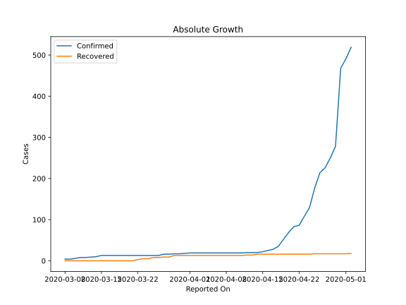
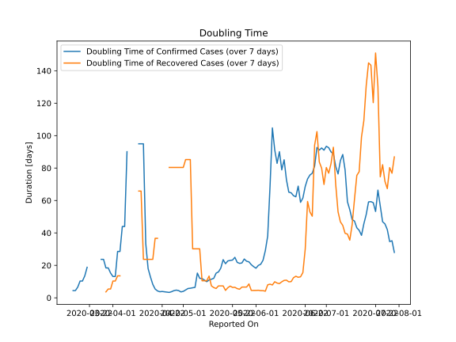

# Country Figures: Doubling Time of Infections for Maldives 

The doubling time below are calculated based on
* an exponential growth assumption
* for time difference of past seven (7) days.
The doubling time's unit is "days".

The first doubling time indicates the increase of confirmed (infected)
cases. There, the *higher* the number is, the better is to take control
of the disease.

The second doubling time indicates the increase of recovered (healed)
cases. There, the *lower* the number is, the better it is to take
control of the disease.

| Reported On | Confirmed | Doubling Time (Confirmed) | Recovered | Doubling Time (Recovered) |
|-------------|-----------|---------------------------|-----------|---------------------------|
| 2020-04-12 | 20 |  94.9 days  | 14 |  65.8 days  | 
| 2020-04-11 | 19 |  None  | 13 |  None  | 
| 2020-04-10 | 19 |  None  | 13 |  None  | 
| 2020-04-09 | 19 |  None  | 13 |  None  | 
| 2020-04-08 | 19 |  None  | 13 |  None  | 
| 2020-04-07 | 19 |  90.1 days  | 13 |  None  | 
| 2020-04-06 | 19 |  44.0 days  | 13 |  None  | 
| 2020-04-05 | 19 |  44.0 days  | 13 |  None  | 
| 2020-04-04 | 19 |  28.6 days  | 13 |  13.5 days  | 
| 2020-04-03 | 19 |  28.6 days  | 13 |  13.5 days  | 
| 2020-04-02 | 19 |  13.1 days  | 13 |  10.3 days  | 
| 2020-04-01 | 19 |  13.1 days  | 13 |  10.3 days  | 
| 2020-03-31 | 18 |  15.3 days  | 13 |  5.4 days  | 
| 2020-03-30 | 17 |  18.4 days  | 13 |  5.4 days  | 
| 2020-03-29 | 17 |  18.4 days  | 13 |  3.6 days  | 
| 2020-03-28 | 16 |  23.7 days  | 9 |  None  | 
| 2020-03-27 | 16 |  23.7 days  | 9 |  None  | 
| 2020-03-26 | 13 |  None  | 8 |  None  | 
| 2020-03-25 | 13 |  None  | 8 |  None  | 
| 2020-03-24 | 13 |  None  | 5 |  None  | 
| 2020-03-23 | 13 |  None  | 5 |  None  | 
| 2020-03-22 | 13 |  None  | 3 |  None  | 
| 2020-03-21 | 13 |  18.8 days  | 0 |  None  | 
| 2020-03-20 | 13 |  13.5 days  | 0 |  None  | 
| 2020-03-19 | 13 |  10.3 days  | 0 |  None  | 
| 2020-03-18 | 13 |  10.3 days  | 0 |  None  | 
| 2020-03-17 | 13 |  6.6 days  | 0 |  None  | 
| 2020-03-16 | 13 |  4.5 days  | 0 |  None  | 
| 2020-03-15 | 13 |  4.5 days  | 0 |  None  | 
| 2020-03-14 | 10 |  None  | 0 |  None  | 
| 2020-03-13 | 9 |  None  | 0 |  None  | 
| 2020-03-12 | 8 |  None  | 0 |  None  | 
| 2020-03-11 | 8 |  None  | 0 |  None  | 
| 2020-03-10 | 6 |  None  | 0 |  None  | 
| 2020-03-09 | 4 |  None  | 0 |  None  | 
| 2020-03-08 | 4 |  None  | 0 |  None  | 

