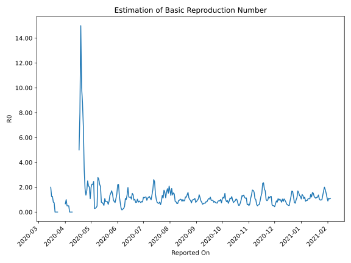

# Country Figures: Time Series for Basic Reproduction Number of Maldives 

| Reported On | &Delta; Confirmed | Total &Delta; Confirmed First Interval | Total &Delta; Confirmed Second Interval | Estimated Basic Reproduction Number R0 | 
|-------------|-------------------|----------------------------------------|-----------------------------------------|---------------------------------------------------|
| 2020-05-07 | 31 |  98  |  269  |  0.36  | 
| 2020-05-06 | 44 |  82  |  265  |  0.31  | 
| 2020-05-05 | 32 |  73  |  254  |  0.29  | 
| 2020-05-04 | 14 |  249  |  101  |  2.47  | 
| 2020-05-03 | 8 |  269  |  121  |  2.22  | 
| 2020-05-02 | 28 |  265  |  118  |  2.25  | 
| 2020-05-01 | 23 |  254  |  128  |  1.98  | 
| 2020-04-30 | 190 |  101  |  94  |  1.07  | 
| 2020-04-29 | 28 |  121  |  60  |  2.02  | 
| 2020-04-28 | 24 |  118  |  56  |  2.11  | 
| 2020-04-27 | 12 |  128  |  51  |  2.51  | 
| 2020-04-26 | 37 |  94  |  55  |  1.71  | 
| 2020-04-25 | 48 |  60  |  44  |  1.36  | 
| 2020-04-24 | 21 |  56  |  30  |  1.87  | 
| 2020-04-23 | 22 |  51  |  15  |  3.40  | 
| 2020-04-22 | 3 |  55  |  8  |  6.88  | 
| 2020-04-21 | 14 |  44  |  5  |  8.80  | 
| 2020-04-20 | 17 |  30  |  3  |  10.00  | 
| 2020-04-19 | 17 |  15  |  1  |  15.00  | 
| 2020-04-18 | 7 |  8  |  1  |  8.00  | 
| 2020-04-17 | 3 |  5  |  1  |  5.00  | 
| 2020-04-16 | 3 |  3  |  None  |  None  | 
| 2020-04-15 | 2 |  1  |  None  |  None  | 
| 2020-04-14 | 0 |  1  |  None  |  None  | 
| 2020-04-13 | 0 |  1  |  None  |  None  | 
| 2020-04-12 | 1 |  None  |  None  |  None  | 
| 2020-04-11 | 0 |  None  |  None  |  None  | 
| 2020-04-10 | 0 |  None  |  None  |  None  | 
| 2020-04-09 | 0 |  None  |  1  |  None  | 
| 2020-04-08 | 0 |  None  |  2  |  None  | 
| 2020-04-07 | 0 |  None  |  2  |  None  | 
| 2020-04-06 | 0 |  None  |  3  |  None  | 
| 2020-04-05 | 0 |  1  |  2  |  0.50  | 
| 2020-04-04 | 0 |  2  |  4  |  0.50  | 
| 2020-04-03 | 0 |  2  |  4  |  0.50  | 
| 2020-04-02 | 0 |  3  |  3  |  1.00  | 
| 2020-04-01 | 1 |  2  |  3  |  0.67  | 
| 2020-03-31 | 1 |  4  |  None  |  None  | 
| 2020-03-30 | 0 |  4  |  None  |  None  | 
| 2020-03-29 | 1 |  3  |  None  |  None  | 
| 2020-03-28 | 0 |  3  |  None  |  None  | 
| 2020-03-27 | 3 |  None  |  None  |  None  | 
| 2020-03-26 | 0 |  None  |  None  |  None  | 
| 2020-03-25 | 0 |  None  |  None  |  None  | 
| 2020-03-24 | 0 |  None  |  None  |  None  | 
| 2020-03-23 | 0 |  None  |  3  |  None  | 
| 2020-03-22 | 0 |  None  |  4  |  None  | 
| 2020-03-21 | 0 |  None  |  5  |  None  | 
| 2020-03-20 | 0 |  None  |  5  |  None  | 
| 2020-03-19 | 0 |  3  |  4  |  0.75  | 
| 2020-03-18 | 0 |  4  |  5  |  0.80  | 
| 2020-03-17 | 0 |  5  |  4  |  1.25  | 
| 2020-03-16 | 0 |  5  |  4  |  1.25  | 
| 2020-03-15 | 3 |  4  |  2  |  2.00  | 
| 2020-03-14 | 1 |  5  |  None  |  None  | 
| 2020-03-13 | 1 |  4  |  None  |  None  | 
| 2020-03-12 | 0 |  4  |  None  |  None  | 
| 2020-03-11 | 2 |  2  |  None  |  None  | 
| 2020-03-10 | 2 |  None  |  None  |  None  | 
| 2020-03-09 | 0 |  None  |  None  |  None  | 
| 2020-03-08 | None |  None  |  None  |  None  | 

