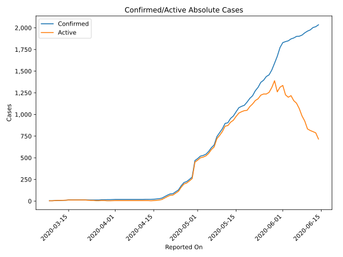
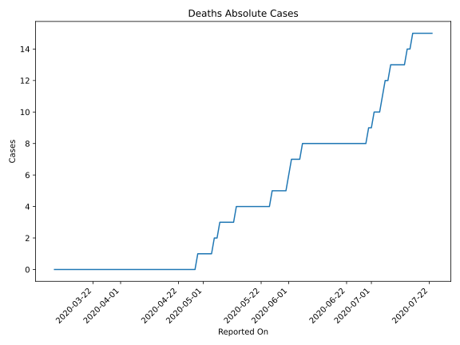
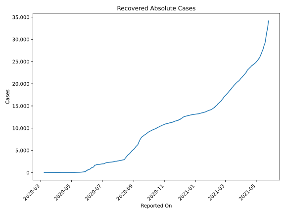
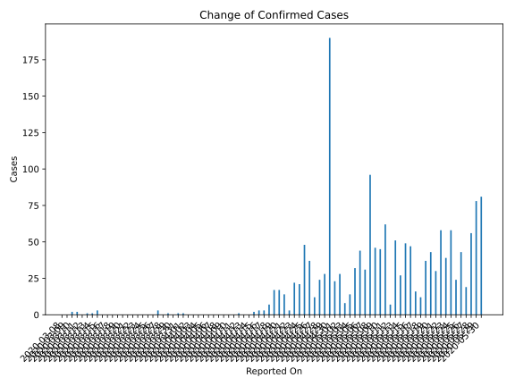
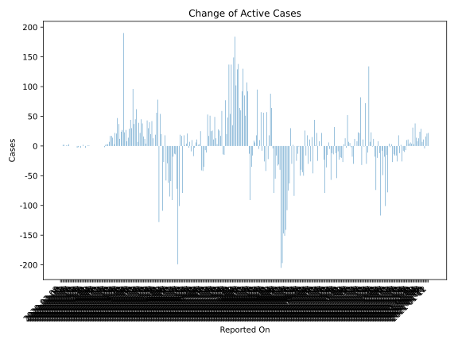
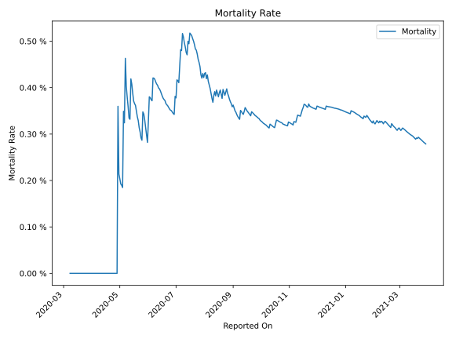

# Country Figures: Time Series for Maldives 

| Reported On | Confirmed | Deaths | Recovered | Active | Mortality | &Delta; Confirmed | &Delta; Deaths | &Delta; Recovered | &Delta; Active | % Active of Population |
|-------------|-----------|--------|-----------|--------|-----------|-------------------|----------------|-------------------|----------------|------------------------|
| 2020-05-03 | 527 | 1 | 18 | 508 |  0.19 %  | 8 | 0 | 0 | 8 |  0.099 %  | 
| 2020-05-02 | 519 | 1 | 18 | 500 |  0.19 %  | 28 | 0 | 1 | 27 |  0.097 %  | 
| 2020-05-01 | 491 | 1 | 17 | 473 |  0.20 %  | 23 | 0 | 0 | 23 |  0.092 %  | 
| 2020-04-30 | 468 | 1 | 17 | 450 |  0.21 %  | 190 | 0 | 0 | 190 |  0.087 %  | 
| 2020-04-29 | 278 | 1 | 17 | 260 |  0.36 %  | 28 | 1 | 0 | 27 |  0.050 %  | 
| 2020-04-28 | 250 | 0 | 17 | 233 |  None  | 24 | 0 | 0 | 24 |  0.045 %  | 
| 2020-04-27 | 226 | 0 | 17 | 209 |  None  | 12 | 0 | 0 | 12 |  0.041 %  | 
| 2020-04-26 | 214 | 0 | 17 | 197 |  None  | 37 | 0 | 0 | 37 |  0.038 %  | 
| 2020-04-25 | 177 | 0 | 17 | 160 |  None  | 48 | 0 | 1 | 47 |  0.031 %  | 
| 2020-04-24 | 129 | 0 | 16 | 113 |  None  | 21 | 0 | 0 | 21 |  0.022 %  | 
| 2020-04-23 | 108 | 0 | 16 | 92 |  None  | 22 | 0 | 0 | 22 |  0.018 %  | 
| 2020-04-22 | 86 | 0 | 16 | 70 |  None  | 3 | 0 | 0 | 3 |  0.014 %  | 
| 2020-04-21 | 83 | 0 | 16 | 67 |  None  | 14 | 0 | 0 | 14 |  0.013 %  | 
| 2020-04-20 | 69 | 0 | 16 | 53 |  None  | 17 | 0 | 0 | 17 |  0.010 %  | 
| 2020-04-19 | 52 | 0 | 16 | 36 |  None  | 17 | 0 | 0 | 17 |  0.007 %  | 
| 2020-04-18 | 35 | 0 | 16 | 19 |  None  | 7 | 0 | 0 | 7 |  0.004 %  | 
| 2020-04-17 | 28 | 0 | 16 | 12 |  None  | 3 | 0 | 0 | 3 |  0.002 %  | 
| 2020-04-16 | 25 | 0 | 16 | 9 |  None  | 3 | 0 | 0 | 3 |  0.002 %  | 
| 2020-04-15 | 22 | 0 | 16 | 6 |  None  | 2 | 0 | 0 | 2 |  0.001 %  | 
| 2020-04-14 | 20 | 0 | 16 | 4 |  None  | 0 | 0 | 2 | -2 |  0.001 %  | 
| 2020-04-13 | 20 | 0 | 14 | 6 |  None  | 0 | 0 | 0 | 0 |  0.001 %  | 
| 2020-04-12 | 20 | 0 | 14 | 6 |  None  | 1 | 0 | 1 | 0 |  0.001 %  | 
| 2020-04-11 | 19 | 0 | 13 | 6 |  None  | 0 | 0 | 0 | 0 |  0.001 %  | 
| 2020-04-10 | 19 | 0 | 13 | 6 |  None  | 0 | 0 | 0 | 0 |  0.001 %  | 
| 2020-04-09 | 19 | 0 | 13 | 6 |  None  | 0 | 0 | 0 | 0 |  0.001 %  | 
| 2020-04-08 | 19 | 0 | 13 | 6 |  None  | 0 | 0 | 0 | 0 |  0.001 %  | 
| 2020-04-07 | 19 | 0 | 13 | 6 |  None  | 0 | 0 | 0 | 0 |  0.001 %  | 
| 2020-04-06 | 19 | 0 | 13 | 6 |  None  | 0 | 0 | 0 | 0 |  0.001 %  | 
| 2020-04-05 | 19 | 0 | 13 | 6 |  None  | 0 | 0 | 0 | 0 |  0.001 %  | 
| 2020-04-04 | 19 | 0 | 13 | 6 |  None  | 0 | 0 | 0 | 0 |  0.001 %  | 
| 2020-04-03 | 19 | 0 | 13 | 6 |  None  | 0 | 0 | 0 | 0 |  0.001 %  | 
| 2020-04-02 | 19 | 0 | 13 | 6 |  None  | 0 | 0 | 0 | 0 |  0.001 %  | 
| 2020-04-01 | 19 | 0 | 13 | 6 |  None  | 1 | 0 | 0 | 1 |  0.001 %  | 
| 2020-03-31 | 18 | 0 | 13 | 5 |  None  | 1 | 0 | 0 | 1 |  0.001 %  | 
| 2020-03-30 | 17 | 0 | 13 | 4 |  None  | 0 | 0 | 0 | 0 |  0.001 %  | 
| 2020-03-29 | 17 | 0 | 13 | 4 |  None  | 1 | 0 | 4 | -3 |  0.001 %  | 
| 2020-03-28 | 16 | 0 | 9 | 7 |  None  | 0 | 0 | 0 | 0 |  0.001 %  | 
| 2020-03-27 | 16 | 0 | 9 | 7 |  None  | 3 | 0 | 1 | 2 |  0.001 %  | 
| 2020-03-26 | 13 | 0 | 8 | 5 |  None  | 0 | 0 | 0 | 0 |  0.001 %  | 
| 2020-03-25 | 13 | 0 | 8 | 5 |  None  | 0 | 0 | 3 | -3 |  0.001 %  | 
| 2020-03-24 | 13 | 0 | 5 | 8 |  None  | 0 | 0 | 0 | 0 |  0.002 %  | 
| 2020-03-23 | 13 | 0 | 5 | 8 |  None  | 0 | 0 | 2 | -2 |  0.002 %  | 
| 2020-03-22 | 13 | 0 | 3 | 10 |  None  | 0 | 0 | 3 | -3 |  0.002 %  | 
| 2020-03-21 | 13 | 0 | 0 | 13 |  None  | 0 | 0 | 0 | 0 |  0.003 %  | 
| 2020-03-20 | 13 | 0 | 0 | 13 |  None  | 0 | 0 | 0 | 0 |  0.003 %  | 
| 2020-03-19 | 13 | 0 | 0 | 13 |  None  | 0 | 0 | 0 | 0 |  0.003 %  | 
| 2020-03-18 | 13 | 0 | 0 | 13 |  None  | 0 | 0 | 0 | 0 |  0.003 %  | 
| 2020-03-17 | 13 | 0 | 0 | 13 |  None  | 0 | 0 | 0 | 0 |  0.003 %  | 
| 2020-03-16 | 13 | 0 | 0 | 13 |  None  | 0 | 0 | 0 | 0 |  0.003 %  | 
| 2020-03-15 | 13 | 0 | 0 | 13 |  None  | 3 | 0 | 0 | 3 |  0.003 %  | 
| 2020-03-14 | 10 | 0 | 0 | 10 |  None  | 1 | 0 | 0 | 1 |  0.002 %  | 
| 2020-03-13 | 9 | 0 | 0 | 9 |  None  | 1 | 0 | 0 | 1 |  0.002 %  | 
| 2020-03-12 | 8 | 0 | 0 | 8 |  None  | 0 | 0 | 0 | 0 |  0.002 %  | 
| 2020-03-11 | 8 | 0 | 0 | 8 |  None  | 2 | 0 | 0 | 2 |  0.002 %  | 
| 2020-03-10 | 6 | 0 | 0 | 6 |  None  | 2 | 0 | 0 | 2 |  0.001 %  | 
| 2020-03-09 | 4 | 0 | 0 | 4 |  None  | 0 | 0 | 0 | 0 |  0.001 %  | 
| 2020-03-08 | 4 | 0 | 0 | 4 |  None  | None | None | None | None |  0.001 %  | 

