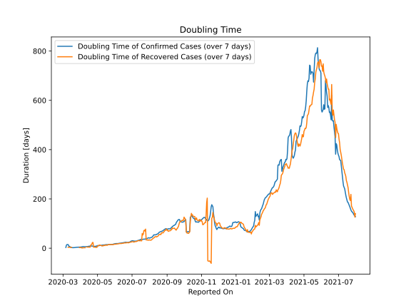

# Country Figures: New Infections in Previous 7 Days per 100,000 Population for Mexico 

<!--  --> 

| Reported On | &Delta; Confirmed (on the day) | &Delta; Confirmed (last 7 days) | New Cases in Previous 7 Days per 100,000 Population |
|-------------|--------------------------------|---------------------------------|-----------------------------------------------------|
| 2020-05-08 |  1906  |  10783  |  8.545  |
| 2020-05-07 |  1982  |  10392  |  8.235  |
| 2020-05-06 |  1609  |  9835  |  7.794  |
| 2020-05-05 |  1120  |  9273  |  7.348  |
| 2020-05-04 |  1434  |  9376  |  7.430  |
| 2020-05-03 |  1383  |  8794  |  6.969  |
| 2020-05-02 |  1349  |  8246  |  6.535  |
| 2020-05-01 |  1515  |  7867  |  6.234  |
| 2020-04-30 |  1425  |  7591  |  6.015  |
| 2020-04-29 |  1047  |  8298  |  6.576  |
| 2020-04-28 |  1223  |  7980  |  6.324  |
| 2020-04-27 |  852  |  7268  |  5.760  |
| 2020-04-26 |  835  |  7180  |  5.690  |
| 2020-04-25 |  970  |  6967  |  5.521  |
| 2020-04-24 |  1239  |  6575  |  5.210  |
| 2020-04-23 |  2132  |  5786  |  4.585  |
| 2020-04-22 |  729  |  4102  |  3.251  |
| 2020-04-21 |  511  |  3758  |  2.978  |
| 2020-04-20 |  764  |  3600  |  2.853  |
| 2020-04-19 |  622  |  3278  |  2.598  |
| 2020-04-18 |  578  |  3031  |  2.402  |
| 2020-04-17 |  450  |  2856  |  2.263  |
| 2020-04-16 |  448  |  2666  |  2.113  |
| 2020-04-15 |  385  |  2614  |  2.071  |
| 2020-04-14 |  353  |  2575  |  2.041  |
| 2020-04-13 |  442  |  2518  |  1.995  |
| 2020-04-12 |  375  |  2329  |  1.846  |
| 2020-04-11 |  403  |  2156  |  1.709  |
| 2020-04-10 |  260  |  1931  |  1.530  |
| 2020-04-09 |  396  |  1803  |  1.429  |
| 2020-04-08 |  346  |  1570  |  1.244  |
| 2020-04-07 |  296  |  1345  |  1.066  |
| 2020-04-06 |  253  |  1150  |  0.911  |
| 2020-04-05 |  202  |  1042  |  0.826  |
| 2020-04-04 |  178  |  971  |  0.769  |
| 2020-04-03 |  132  |  925  |  0.733  |
| 2020-04-02 |  163  |  903  |  0.716  |
| 2020-04-01 |  121  |  810  |  0.642  |
| 2020-03-31 |  101  |  727  |  0.576  |
| 2020-03-30 |  145  |  677  |  0.536  |
| 2020-03-29 |  131  |  597  |  0.473  |
| 2020-03-28 |  132  |  514  |  0.407  |
| 2020-03-27 |  110  |  421  |  0.334  |
| 2020-03-26 |  70  |  357  |  0.283  |
| 2020-03-25 |  38  |  312  |  0.247  |
| 2020-03-24 |  51  |  285  |  0.226  |
| 2020-03-23 |  65  |  263  |  0.208  |
| 2020-03-22 |  48  |  210  |  0.166  |
| 2020-03-21 |  39  |  177  |  0.140  |
| 2020-03-20 |  46  |  152  |  0.120  |
| 2020-03-19 |  25  |  106  |  0.084  |
| 2020-03-18 |  11  |  85  |  0.067  |
| 2020-03-17 |  29  |  75  |  0.059  |
| 2020-03-16 |  12  |  46  |  0.036  |
| 2020-03-15 |  15  |  34  |  0.027  |
| 2020-03-14 |  14  |  20  |  0.016  |
| 2020-03-13 |  None  |  6  |  0.005  |
| 2020-03-12 |  4  |  7  |  0.006  |
| 2020-03-11 |  1  |  3  |  0.002  |
| 2020-03-10 |  None  |  2  |  0.002  |
| 2020-03-09 |  None  |  2  |  0.002  |
| 2020-03-08 |  1  |  2  |  0.002  |
| 2020-03-07 |  None  |  2  |  0.002  |
| 2020-03-06 |  1  |  5  |  0.004  |
| 2020-03-05 |  None  |  4  |  0.003  |
| 2020-03-04 |  None  |  4  |  0.003  |
| 2020-03-03 |  None  |  4  |  0.003  |
| 2020-03-02 |  None  |  4  |  0.003  |
| 2020-03-01 |  1  |  4  |  0.003  |
| 2020-02-29 |  3  |  3  |  0.002  |
| 2020-02-28 |  None  |  None  |  None  |
| 2020-01-23 |  None  |  None  |  None  |

