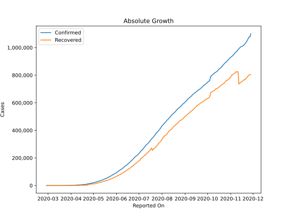

# Country Figures: Doubling Time of Infections for Mexico 

The doubling time below are calculated based on
* an exponential growth assumption
* for time difference of past seven (7) days.
The doubling time's unit is "days".

The first doubling time indicates the increase of confirmed (infected)
cases. There, the *higher* the number is, the better is to take control
of the disease.

The second doubling time indicates the increase of recovered (healed)
cases. There, the *lower* the number is, the better it is to take
control of the disease.

| Reported On | Confirmed | Doubling Time (Confirmed) | Recovered | Doubling Time (Recovered) |
|-------------|-----------|---------------------------|-----------|---------------------------|
| 2020-04-25 | 13842 |  7.3 days  | 7149 |  4.3 days  | 
| 2020-04-24 | 12872 |  7.1 days  | 7149 |  4.3 days  | 
| 2020-04-23 | 11633 |  7.4 days  | 2627 |  23.2 days  | 
| 2020-04-22 | 9501 |  8.9 days  | 2627 |  23.2 days  | 
| 2020-04-21 | 8772 |  9.0 days  | 2627 |  17.0 days  | 
| 2020-04-20 | 8261 |  8.8 days  | 2627 |  14.0 days  | 
| 2020-04-19 | 7497 |  8.8 days  | 2627 |  12.7 days  | 
| 2020-04-18 | 6875 |  8.7 days  | 2125 |  4.3 days  | 
| 2020-04-17 | 6297 |  8.4 days  | 2125 |  4.3 days  | 
| 2020-04-16 | 5847 |  8.3 days  | 2125 |  4.3 days  | 
| 2020-04-15 | 5399 |  7.7 days  | 2125 |  4.3 days  | 
| 2020-04-14 | 5014 |  7.1 days  | 1964 |  4.6 days  | 
| 2020-04-13 | 4661 |  6.6 days  | 1843 |  4.9 days  | 
| 2020-04-12 | 4219 |  6.4 days  | 1772 |  5.1 days  | 
| 2020-04-11 | 3844 |  6.2 days  | 633 |  None  | 
| 2020-04-10 | 3441 |  6.2 days  | 633 |  None  | 
| 2020-04-09 | 3181 |  6.1 days  | 633 |  2.0 days  | 
| 2020-04-08 | 2785 |  6.2 days  | 633 |  2.0 days  | 
| 2020-04-07 | 2439 |  6.4 days  | 633 |  2.0 days  | 
| 2020-04-06 | 2143 |  6.6 days  | 633 |  2.0 days  | 
| 2020-04-05 | 1890 |  6.4 days  | 633 |  1.3 days  | 
| 2020-04-04 | 1688 |  6.0 days  | 633 |  1.3 days  | 
| 2020-04-03 | 1510 |  5.5 days  | 633 |  1.3 days  | 
| 2020-04-02 | 1378 |  4.9 days  | 35 |  2.6 days  | 
| 2020-04-01 | 1215 |  4.8 days  | 35 |  2.6 days  | 
| 2020-03-31 | 1094 |  4.8 days  | 35 |  2.6 days  | 
| 2020-03-30 | 993 |  4.6 days  | 35 |  2.6 days  | 
| 2020-03-29 | 848 |  4.3 days  | 4 |  None  | 
| 2020-03-28 | 717 |  4.2 days  | 4 |  None  | 
| 2020-03-27 | 585 |  4.2 days  | 4 |  None  | 
| 2020-03-26 | 475 |  3.8 days  | 4 |  None  | 
| 2020-03-25 | 405 |  3.6 days  | 4 |  None  | 
| 2020-03-24 | 367 |  3.6 days  | 4 |  None  | 
| 2020-03-23 | 316 |  3.1 days  | 4 |  None  | 
| 2020-03-22 | 251 |  3.0 days  | 4 |  None  | 
| 2020-03-21 | 203 |  2.7 days  | 4 |  None  | 
| 2020-03-20 | 164 |  2.2 days  | 4 |  None  | 
| 2020-03-19 | 118 |  2.5 days  | 4 |  None  | 
| 2020-03-18 | 93 |  2.3 days  | 4 |  None  | 
| 2020-03-17 | 82 |  2.3 days  | 4 |  None  | 
| 2020-03-16 | 53 |  2.7 days  | 4 |  3.8 days  | 
| 2020-03-15 | 41 |  3.1 days  | 4 |  3.8 days  | 
| 2020-03-14 | 26 |  3.6 days  | 4 |  3.8 days  | 
| 2020-03-13 | 12 |  7.3 days  | 4 |  3.8 days  | 
| 2020-03-12 | 12 |  5.9 days  | 4 |  3.8 days  | 
| 2020-03-11 | 8 |  10.7 days  | 4 |  3.8 days  | 
| 2020-03-10 | 7 |  14.8 days  | 4 |  3.8 days  | 
| 2020-03-09 | 7 |  14.8 days  | 1 |  None  | 
| 2020-03-08 | 7 |  14.8 days  | 1 |  None  | 
| 2020-03-07 | 6 |  12.3 days  | 1 |  None  | 
| 2020-03-06 | 6 |  3.0 days  | 1 |  None  | 
| 2020-03-05 | 5 |  None  | 1 |  None  | 
| 2020-03-04 | 5 |  None  | 1 |  None  | 
| 2020-03-03 | 5 |  None  | 1 |  None  | 
| 2020-03-02 | 5 |  None  | 0 |  None  | 
| 2020-03-01 | 5 |  None  | 0 |  None  | 
| 2020-02-29 | 4 |  None  | 0 |  None  | 
| 2020-02-28 | 1 |  None  | 0 |  None  | 

