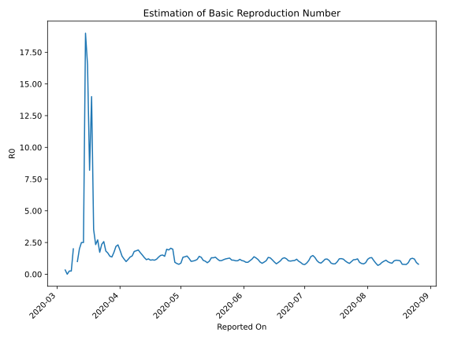

# Country Figures: Time Series for Basic Reproduction Number of Mexico 

| Reported On | &Delta; Confirmed | Total &Delta; Confirmed First Interval | Total &Delta; Confirmed Second Interval | Estimated Basic Reproduction Number R0 | 
|-------------|-------------------|----------------------------------------|-----------------------------------------|---------------------------------------------------|
| 2020-05-07 | 1982 |  5546  |  5336  |  1.04  | 
| 2020-05-06 | 1609 |  5286  |  5210  |  1.01  | 
| 2020-05-05 | 1120 |  5681  |  4547  |  1.25  | 
| 2020-05-04 | 1434 |  5672  |  3957  |  1.43  | 
| 2020-05-03 | 1383 |  5336  |  3880  |  1.38  | 
| 2020-05-02 | 1349 |  5210  |  3896  |  1.34  | 
| 2020-05-01 | 1515 |  4547  |  5176  |  0.88  | 
| 2020-04-30 | 1425 |  3957  |  5070  |  0.78  | 
| 2020-04-29 | 1047 |  3880  |  4611  |  0.84  | 
| 2020-04-28 | 1223 |  3896  |  4136  |  0.94  | 
| 2020-04-27 | 852 |  5176  |  2626  |  1.97  | 
| 2020-04-26 | 835 |  5070  |  2475  |  2.05  | 
| 2020-04-25 | 970 |  4611  |  2414  |  1.91  | 
| 2020-04-24 | 1239 |  4136  |  2098  |  1.97  | 
| 2020-04-23 | 2132 |  2626  |  1861  |  1.41  | 
| 2020-04-22 | 729 |  2475  |  1636  |  1.51  | 
| 2020-04-21 | 511 |  2414  |  1628  |  1.48  | 
| 2020-04-20 | 764 |  2098  |  1555  |  1.35  | 
| 2020-04-19 | 622 |  1861  |  1573  |  1.18  | 
| 2020-04-18 | 578 |  1636  |  1480  |  1.11  | 
| 2020-04-17 | 450 |  1628  |  1434  |  1.14  | 
| 2020-04-16 | 448 |  1555  |  1405  |  1.11  | 
| 2020-04-15 | 385 |  1573  |  1298  |  1.21  | 
| 2020-04-14 | 353 |  1480  |  1291  |  1.15  | 
| 2020-04-13 | 442 |  1434  |  1097  |  1.31  | 
| 2020-04-12 | 375 |  1405  |  929  |  1.51  | 
| 2020-04-11 | 403 |  1298  |  765  |  1.70  | 
| 2020-04-10 | 260 |  1291  |  675  |  1.91  | 
| 2020-04-09 | 396 |  1097  |  594  |  1.85  | 
| 2020-04-08 | 346 |  929  |  517  |  1.80  | 
| 2020-04-07 | 296 |  765  |  530  |  1.44  | 
| 2020-04-06 | 253 |  675  |  498  |  1.36  | 
| 2020-04-05 | 202 |  594  |  509  |  1.17  | 
| 2020-04-04 | 178 |  517  |  518  |  1.00  | 
| 2020-04-03 | 132 |  530  |  443  |  1.20  | 
| 2020-04-02 | 163 |  498  |  350  |  1.42  | 
| 2020-04-01 | 121 |  509  |  269  |  1.89  | 
| 2020-03-31 | 101 |  518  |  224  |  2.31  | 
| 2020-03-30 | 145 |  443  |  202  |  2.19  | 
| 2020-03-29 | 131 |  350  |  203  |  1.72  | 
| 2020-03-28 | 132 |  269  |  198  |  1.36  | 
| 2020-03-27 | 110 |  224  |  158  |  1.42  | 
| 2020-03-26 | 70 |  202  |  121  |  1.67  | 
| 2020-03-25 | 38 |  203  |  111  |  1.83  | 
| 2020-03-24 | 51 |  198  |  77  |  2.57  | 
| 2020-03-23 | 65 |  158  |  67  |  2.36  | 
| 2020-03-22 | 48 |  121  |  70  |  1.73  | 
| 2020-03-21 | 39 |  111  |  41  |  2.71  | 
| 2020-03-20 | 46 |  77  |  33  |  2.33  | 
| 2020-03-19 | 25 |  67  |  19  |  3.53  | 
| 2020-03-18 | 11 |  70  |  5  |  14.00  | 
| 2020-03-17 | 29 |  41  |  5  |  8.20  | 
| 2020-03-16 | 12 |  33  |  2  |  16.50  | 
| 2020-03-15 | 15 |  19  |  1  |  19.00  | 
| 2020-03-14 | 14 |  5  |  2  |  2.50  | 
| 2020-03-13 | 0 |  5  |  2  |  2.50  | 
| 2020-03-12 | 4 |  2  |  1  |  2.00  | 
| 2020-03-11 | 1 |  1  |  1  |  1.00  | 
| 2020-03-10 | 0 |  2  |  None  |  None  | 
| 2020-03-09 | 0 |  2  |  1  |  2.00  | 
| 2020-03-08 | 1 |  1  |  4  |  0.25  | 
| 2020-03-07 | 0 |  1  |  4  |  0.25  | 
| 2020-03-06 | 1 |  None  |  4  |  None  | 
| 2020-03-05 | 0 |  1  |  3  |  0.33  | 
| 2020-03-04 | 0 |  4  |  None  |  None  | 
| 2020-03-03 | 0 |  4  |  None  |  None  | 
| 2020-03-02 | 0 |  4  |  None  |  None  | 
| 2020-03-01 | 1 |  3  |  None  |  None  | 
| 2020-02-29 | 3 |  None  |  None  |  None  | 
| 2020-02-28 | None |  None  |  None  |  None  | 
| 2020-01-23 | None |  None  |  None  |  None  | 

