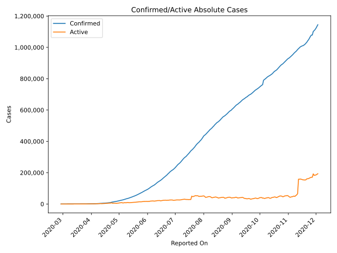
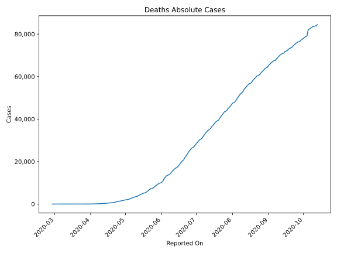
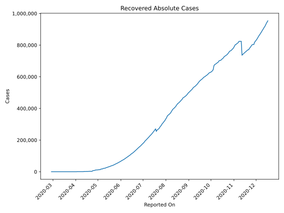
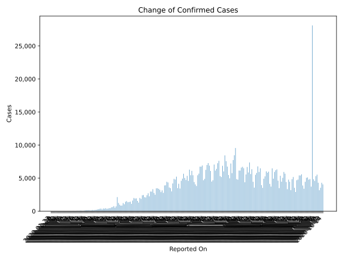
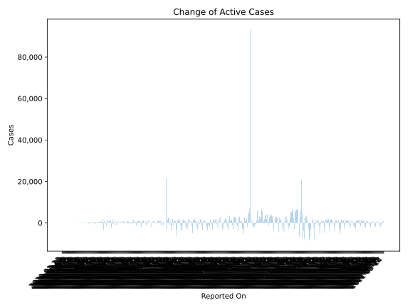
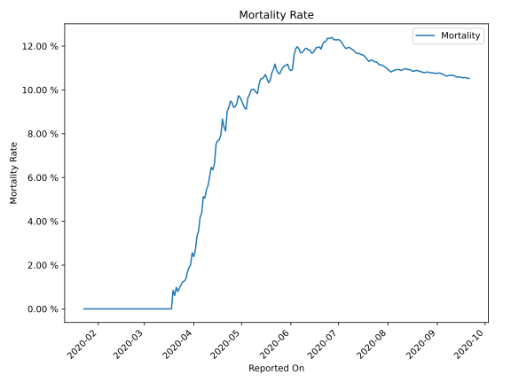

# Country Figures: Time Series for Mexico 

| Reported On | Confirmed | Deaths | Recovered | Active | Mortality | &Delta; Confirmed | &Delta; Deaths | &Delta; Recovered | &Delta; Active | % Active of Population |
|-------------|-----------|--------|-----------|--------|-----------|-------------------|----------------|-------------------|----------------|------------------------|
| 2020-04-24 | 12872 | 1221 | 7149 | 4502 |  9.49 %  | 1239 | 152 | 4522 | -3435 |  0.004 %  | 
| 2020-04-23 | 11633 | 1069 | 2627 | 7937 |  9.19 %  | 2132 | 212 | 0 | 1920 |  0.006 %  | 
| 2020-04-22 | 9501 | 857 | 2627 | 6017 |  9.02 %  | 729 | 145 | 0 | 584 |  0.005 %  | 
| 2020-04-21 | 8772 | 712 | 2627 | 5433 |  8.12 %  | 511 | 26 | 0 | 485 |  0.004 %  | 
| 2020-04-20 | 8261 | 686 | 2627 | 4948 |  8.30 %  | 764 | 36 | 0 | 728 |  0.004 %  | 
| 2020-04-19 | 7497 | 650 | 2627 | 4220 |  8.67 %  | 622 | 104 | 502 | 16 |  0.003 %  | 
| 2020-04-18 | 6875 | 546 | 2125 | 4204 |  7.94 %  | 578 | 60 | 0 | 518 |  0.003 %  | 
| 2020-04-17 | 6297 | 486 | 2125 | 3686 |  7.72 %  | 450 | 37 | 0 | 413 |  0.003 %  | 
| 2020-04-16 | 5847 | 449 | 2125 | 3273 |  7.68 %  | 448 | 43 | 0 | 405 |  0.003 %  | 
| 2020-04-15 | 5399 | 406 | 2125 | 2868 |  7.52 %  | 385 | 74 | 161 | 150 |  0.002 %  | 
| 2020-04-14 | 5014 | 332 | 1964 | 2718 |  6.62 %  | 353 | 36 | 121 | 196 |  0.002 %  | 
| 2020-04-13 | 4661 | 296 | 1843 | 2522 |  6.35 %  | 442 | 23 | 71 | 348 |  0.002 %  | 
| 2020-04-12 | 4219 | 273 | 1772 | 2174 |  6.47 %  | 375 | 40 | 1139 | -804 |  0.002 %  | 
| 2020-04-11 | 3844 | 233 | 633 | 2978 |  6.06 %  | 403 | 39 | 0 | 364 |  0.002 %  | 
| 2020-04-10 | 3441 | 194 | 633 | 2614 |  5.64 %  | 260 | 20 | 0 | 240 |  0.002 %  | 
| 2020-04-09 | 3181 | 174 | 633 | 2374 |  5.47 %  | 396 | 33 | 0 | 363 |  0.002 %  | 
| 2020-04-08 | 2785 | 141 | 633 | 2011 |  5.06 %  | 346 | 16 | 0 | 330 |  0.002 %  | 
| 2020-04-07 | 2439 | 125 | 633 | 1681 |  5.13 %  | 296 | 31 | 0 | 265 |  0.001 %  | 
| 2020-04-06 | 2143 | 94 | 633 | 1416 |  4.39 %  | 253 | 15 | 0 | 238 |  0.001 %  | 
| 2020-04-05 | 1890 | 79 | 633 | 1178 |  4.18 %  | 202 | 19 | 0 | 183 |  0.001 %  | 
| 2020-04-04 | 1688 | 60 | 633 | 995 |  3.55 %  | 178 | 10 | 0 | 168 |  0.001 %  | 
| 2020-04-03 | 1510 | 50 | 633 | 827 |  3.31 %  | 132 | 13 | 598 | -479 |  0.001 %  | 
| 2020-04-02 | 1378 | 37 | 35 | 1306 |  2.69 %  | 163 | 8 | 0 | 155 |  0.001 %  | 
| 2020-04-01 | 1215 | 29 | 35 | 1151 |  2.39 %  | 121 | 1 | 0 | 120 |  0.001 %  | 
| 2020-03-31 | 1094 | 28 | 35 | 1031 |  2.56 %  | 101 | 8 | 0 | 93 |  0.001 %  | 
| 2020-03-30 | 993 | 20 | 35 | 938 |  2.01 %  | 145 | 4 | 31 | 110 |  0.001 %  | 
| 2020-03-29 | 848 | 16 | 4 | 828 |  1.89 %  | 131 | 4 | 0 | 127 |  0.001 %  | 
| 2020-03-28 | 717 | 12 | 4 | 701 |  1.67 %  | 132 | 4 | 0 | 128 |  0.001 %  | 
| 2020-03-27 | 585 | 8 | 4 | 573 |  1.37 %  | 110 | 2 | 0 | 108 |  0.000 %  | 
| 2020-03-26 | 475 | 6 | 4 | 465 |  1.26 %  | 70 | 1 | 0 | 69 |  0.000 %  | 
| 2020-03-25 | 405 | 5 | 4 | 396 |  1.23 %  | 38 | 1 | 0 | 37 |  0.000 %  | 
| 2020-03-24 | 367 | 4 | 4 | 359 |  1.09 %  | 51 | 1 | 0 | 50 |  0.000 %  | 
| 2020-03-23 | 316 | 3 | 4 | 309 |  0.95 %  | 65 | 1 | 0 | 64 |  0.000 %  | 
| 2020-03-22 | 251 | 2 | 4 | 245 |  0.80 %  | 48 | 0 | 0 | 48 |  0.000 %  | 
| 2020-03-21 | 203 | 2 | 4 | 197 |  0.99 %  | 39 | 1 | 0 | 38 |  0.000 %  | 
| 2020-03-20 | 164 | 1 | 4 | 159 |  0.61 %  | 46 | 0 | 0 | 46 |  0.000 %  | 
| 2020-03-19 | 118 | 1 | 4 | 113 |  0.85 %  | 25 | 1 | 0 | 24 |  0.000 %  | 
| 2020-03-18 | 93 | 0 | 4 | 89 |  None  | 11 | 0 | 0 | 11 |  0.000 %  | 
| 2020-03-17 | 82 | 0 | 4 | 78 |  None  | 29 | 0 | 0 | 29 |  0.000 %  | 
| 2020-03-16 | 53 | 0 | 4 | 49 |  None  | 12 | 0 | 0 | 12 |  0.000 %  | 
| 2020-03-15 | 41 | 0 | 4 | 37 |  None  | 15 | 0 | 0 | 15 |  0.000 %  | 
| 2020-03-14 | 26 | 0 | 4 | 22 |  None  | 14 | 0 | 0 | 14 |  0.000 %  | 
| 2020-03-13 | 12 | 0 | 4 | 8 |  None  | 0 | 0 | 0 | 0 |  0.000 %  | 
| 2020-03-12 | 12 | 0 | 4 | 8 |  None  | 4 | 0 | 0 | 4 |  0.000 %  | 
| 2020-03-11 | 8 | 0 | 4 | 4 |  None  | 1 | 0 | 0 | 1 |  0.000 %  | 
| 2020-03-10 | 7 | 0 | 4 | 3 |  None  | 0 | 0 | 3 | -3 |  0.000 %  | 
| 2020-03-09 | 7 | 0 | 1 | 6 |  None  | 0 | 0 | 0 | 0 |  0.000 %  | 
| 2020-03-08 | 7 | 0 | 1 | 6 |  None  | 1 | 0 | 0 | 1 |  0.000 %  | 
| 2020-03-07 | 6 | 0 | 1 | 5 |  None  | 0 | 0 | 0 | 0 |  0.000 %  | 
| 2020-03-06 | 6 | 0 | 1 | 5 |  None  | 1 | 0 | 0 | 1 |  0.000 %  | 
| 2020-03-05 | 5 | 0 | 1 | 4 |  None  | 0 | 0 | 0 | 0 |  0.000 %  | 
| 2020-03-04 | 5 | 0 | 1 | 4 |  None  | 0 | 0 | 0 | 0 |  0.000 %  | 
| 2020-03-03 | 5 | 0 | 1 | 4 |  None  | 0 | 0 | 1 | -1 |  0.000 %  | 
| 2020-03-02 | 5 | 0 | 0 | 5 |  None  | 0 | 0 | 0 | 0 |  0.000 %  | 
| 2020-03-01 | 5 | 0 | 0 | 5 |  None  | 1 | 0 | 0 | 1 |  0.000 %  | 
| 2020-02-29 | 4 | 0 | 0 | 4 |  None  | 3 | 0 | 0 | 3 |  0.000 %  | 
| 2020-02-28 | 1 | 0 | 0 | 1 |  None  | None | None | None | None |  0.000 %  | 
| 2020-01-23 | None | None | None | None |  None  | None | None | None | None |  n/a  | 

