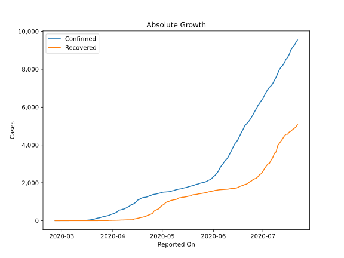
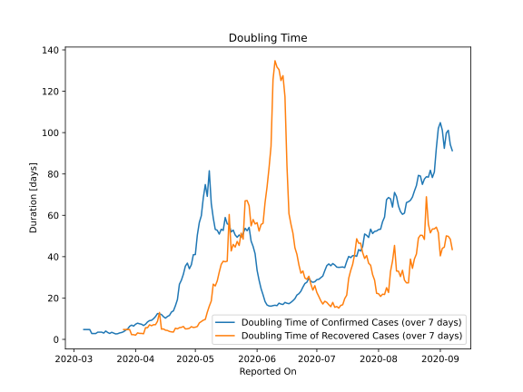

# Country Figures: Doubling Time of Infections for NorthMacedonia 

The doubling time below are calculated based on
* an exponential growth assumption
* for time difference of past seven (7) days.
The doubling time's unit is "days".

The first doubling time indicates the increase of confirmed (infected)
cases. There, the *higher* the number is, the better is to take control
of the disease.

The second doubling time indicates the increase of recovered (healed)
cases. There, the *lower* the number is, the better it is to take
control of the disease.

| Reported On | Confirmed | Doubling Time (Confirmed) | Recovered | Doubling Time (Recovered) |
|-------------|-----------|---------------------------|-----------|---------------------------|
| 2020-04-19 | 1207 |  13.2 days  | 179 |  3.6 days  | 
| 2020-04-18 | 1170 |  11.6 days  | 164 |  3.8 days  | 
| 2020-04-17 | 1117 |  11.1 days  | 139 |  4.3 days  | 
| 2020-04-16 | 1081 |  10.3 days  | 121 |  4.4 days  | 
| 2020-04-15 | 974 |  11.0 days  | 98 |  5.1 days  | 
| 2020-04-14 | 908 |  12.0 days  | 86 |  4.9 days  | 
| 2020-04-13 | 854 |  12.3 days  | 44 |  13.0 days  | 
| 2020-04-12 | 828 |  12.5 days  | 41 |  8.7 days  | 
| 2020-04-11 | 760 |  11.0 days  | 41 |  7.1 days  | 
| 2020-04-10 | 711 |  10.0 days  | 41 |  7.1 days  | 
| 2020-04-09 | 663 |  9.2 days  | 37 |  6.6 days  | 
| 2020-04-08 | 617 |  9.1 days  | 35 |  7.1 days  | 
| 2020-04-07 | 599 |  8.4 days  | 30 |  5.6 days  | 
| 2020-04-06 | 570 |  7.3 days  | 30 |  5.6 days  | 
| 2020-04-05 | 555 |  6.7 days  | 23 |  2.7 days  | 
| 2020-04-04 | 483 |  7.3 days  | 20 |  2.9 days  | 
| 2020-04-03 | 430 |  7.5 days  | 20 |  2.9 days  | 
| 2020-04-02 | 384 |  7.8 days  | 17 |  3.1 days  | 
| 2020-04-01 | 354 |  7.3 days  | 17 |  2.0 days  | 
| 2020-03-31 | 329 |  6.4 days  | 12 |  2.3 days  | 
| 2020-03-30 | 285 |  6.9 days  | 12 |  2.3 days  | 
| 2020-03-29 | 259 |  6.3 days  | 3 |  4.8 days  | 
| 2020-03-28 | 241 |  5.0 days  | 3 |  4.8 days  | 
| 2020-03-27 | 219 |  4.4 days  | 3 |  4.8 days  | 
| 2020-03-26 | 201 |  3.7 days  | 3 |  4.8 days  | 
| 2020-03-25 | 177 |  3.3 days  | 1 |  None  | 
| 2020-03-24 | 148 |  3.1 days  | 1 |  None  | 
| 2020-03-23 | 136 |  2.7 days  | 1 |  None  | 
| 2020-03-22 | 115 |  2.6 days  | 1 |  None  | 
| 2020-03-21 | 85 |  3.0 days  | 1 |  None  | 
| 2020-03-20 | 67 |  3.4 days  | 1 |  None  | 
| 2020-03-19 | 48 |  2.9 days  | 1 |  None  | 
| 2020-03-18 | 35 |  3.3 days  | 1 |  None  | 
| 2020-03-17 | 26 |  4.0 days  | 1 |  None  | 
| 2020-03-16 | 18 |  3.0 days  | 1 |  None  | 
| 2020-03-15 | 14 |  3.5 days  | 1 |  None  | 
| 2020-03-14 | 14 |  3.5 days  | 1 |  None  | 
| 2020-03-13 | 14 |  3.5 days  | 1 |  None  | 
| 2020-03-12 | 7 |  2.8 days  | 0 |  None  | 
| 2020-03-11 | 7 |  2.8 days  | 0 |  None  | 
| 2020-03-10 | 7 |  2.8 days  | 0 |  None  | 
| 2020-03-09 | 3 |  4.8 days  | 0 |  None  | 
| 2020-03-08 | 3 |  4.8 days  | 0 |  None  | 
| 2020-03-07 | 3 |  4.8 days  | 0 |  None  | 
| 2020-03-06 | 3 |  4.8 days  | 0 |  None  | 
| 2020-03-05 | 1 |  None  | 0 |  None  | 
| 2020-03-04 | 1 |  None  | 0 |  None  | 
| 2020-03-03 | 1 |  None  | 0 |  None  | 
| 2020-03-02 | 1 |  None  | 0 |  None  | 
| 2020-03-01 | 1 |  None  | 0 |  None  | 
| 2020-02-29 | 1 |  None  | 0 |  None  | 
| 2020-02-28 | 1 |  None  | 0 |  None  | 
| 2020-02-27 | 1 |  None  | 0 |  None  | 
| 2020-02-26 | 1 |  None  | 0 |  None  | 

