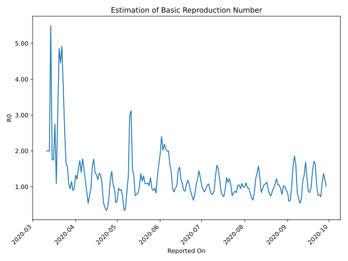

# Country Figures: Time Series for Basic Reproduction Number of NorthMacedonia 

| Reported On | &Delta; Confirmed | Total &Delta; Confirmed First Interval | Total &Delta; Confirmed Second Interval | Estimated Basic Reproduction Number R0 | 
|-------------|-------------------|----------------------------------------|-----------------------------------------|---------------------------------------------------|
| 2020-04-27 | 13 |  127  |  89  |  1.43  | 
| 2020-04-26 | 19 |  136  |  114  |  1.19  | 
| 2020-04-25 | 41 |  101  |  144  |  0.70  | 
| 2020-04-24 | 26 |  93  |  233  |  0.40  | 
| 2020-04-23 | 41 |  89  |  262  |  0.34  | 
| 2020-04-22 | 28 |  114  |  263  |  0.43  | 
| 2020-04-21 | 6 |  144  |  253  |  0.57  | 
| 2020-04-20 | 18 |  233  |  214  |  1.09  | 
| 2020-04-19 | 37 |  262  |  197  |  1.33  | 
| 2020-04-18 | 53 |  263  |  191  |  1.38  | 
| 2020-04-17 | 36 |  253  |  211  |  1.20  | 
| 2020-04-16 | 107 |  214  |  161  |  1.33  | 
| 2020-04-15 | 66 |  197  |  141  |  1.40  | 
| 2020-04-14 | 54 |  191  |  108  |  1.77  | 
| 2020-04-13 | 26 |  211  |  134  |  1.57  | 
| 2020-04-12 | 68 |  161  |  169  |  0.95  | 
| 2020-04-11 | 49 |  141  |  186  |  0.76  | 
| 2020-04-10 | 48 |  108  |  201  |  0.54  | 
| 2020-04-09 | 46 |  134  |  154  |  0.87  | 
| 2020-04-08 | 18 |  169  |  145  |  1.17  | 
| 2020-04-07 | 29 |  186  |  125  |  1.49  | 
| 2020-04-06 | 15 |  201  |  113  |  1.78  | 
| 2020-04-05 | 72 |  154  |  110  |  1.40  | 
| 2020-04-04 | 53 |  145  |  84  |  1.73  | 
| 2020-04-03 | 46 |  125  |  82  |  1.52  | 
| 2020-04-02 | 30 |  113  |  93  |  1.22  | 
| 2020-04-01 | 25 |  110  |  83  |  1.33  | 
| 2020-03-31 | 44 |  84  |  86  |  0.98  | 
| 2020-03-30 | 26 |  82  |  92  |  0.89  | 
| 2020-03-29 | 18 |  93  |  81  |  1.15  | 
| 2020-03-28 | 22 |  83  |  88  |  0.94  | 
| 2020-03-27 | 18 |  86  |  80  |  1.07  | 
| 2020-03-26 | 24 |  92  |  59  |  1.56  | 
| 2020-03-25 | 29 |  81  |  49  |  1.65  | 
| 2020-03-24 | 12 |  88  |  34  |  2.59  | 
| 2020-03-23 | 21 |  80  |  21  |  3.81  | 
| 2020-03-22 | 30 |  59  |  12  |  4.92  | 
| 2020-03-21 | 18 |  49  |  11  |  4.45  | 
| 2020-03-20 | 19 |  34  |  7  |  4.86  | 
| 2020-03-19 | 13 |  21  |  7  |  3.00  | 
| 2020-03-18 | 9 |  12  |  11  |  1.09  | 
| 2020-03-17 | 8 |  11  |  4  |  2.75  | 
| 2020-03-16 | 4 |  7  |  4  |  1.75  | 
| 2020-03-15 | 0 |  7  |  4  |  1.75  | 
| 2020-03-14 | 0 |  11  |  2  |  5.50  | 
| 2020-03-13 | 7 |  4  |  2  |  2.00  | 
| 2020-03-12 | 0 |  4  |  2  |  2.00  | 
| 2020-03-11 | 0 |  4  |  2  |  2.00  | 
| 2020-03-10 | 4 |  2  |  None  |  None  | 
| 2020-03-09 | 0 |  2  |  None  |  None  | 
| 2020-03-08 | 0 |  2  |  None  |  None  | 
| 2020-03-07 | 0 |  2  |  None  |  None  | 
| 2020-03-06 | 2 |  None  |  None  |  None  | 
| 2020-03-05 | 0 |  None  |  None  |  None  | 
| 2020-03-04 | 0 |  None  |  None  |  None  | 
| 2020-03-03 | 0 |  None  |  None  |  None  | 
| 2020-03-02 | 0 |  None  |  None  |  None  | 
| 2020-03-01 | 0 |  None  |  None  |  None  | 
| 2020-02-29 | 0 |  None  |  None  |  None  | 
| 2020-02-28 | 0 |  None  |  None  |  None  | 
| 2020-02-27 | 0 |  None  |  None  |  None  | 
| 2020-02-26 | None |  None  |  None  |  None  | 

