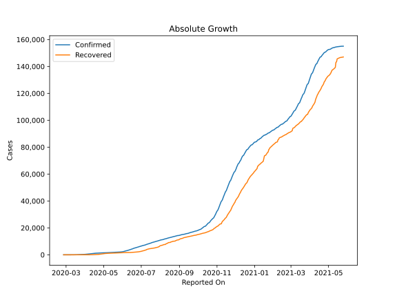
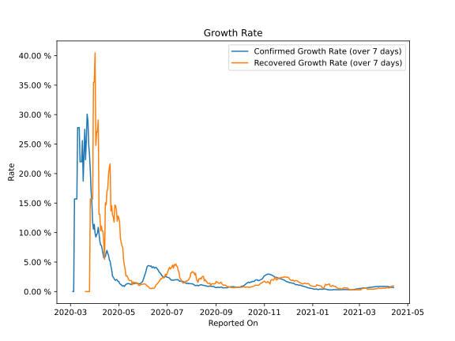

# Country Figures: Growth Rate for NorthMacedonia 

The growth rates below are calculated based on
* an exponential growth assumption
* for time difference of past seven (7) days.
The growth rate is to be understood as on "growth per day".

The first growth rate indicates the increase of confirmed (infected) cases.

The second growth rate indicates the increase of recovered (healed) cases.

| Reported On | Confirmed | Growth Rate (Confirmed) | Recovered | Growth Rate (Recovered) |
|-------------|-----------|-------------------------|-----------|-------------------------|
| 2020-05-09 | 1622 |  1.06 %  | 1112 |  3.805 %  | 
| 2020-05-08 | 1586 |  0.85 %  | 1099 |  4.412 %  | 
| 2020-05-07 | 1572 |  1.01 %  | 1079 |  5.426 %  | 
| 2020-05-06 | 1539 |  0.93 %  | 1057 |  7.461 %  | 
| 2020-05-05 | 1526 |  1.02 %  | 1013 |  7.746 %  | 
| 2020-05-04 | 1518 |  1.17 %  | 992 |  8.348 %  | 
| 2020-05-03 | 1511 |  1.23 %  | 945 |  9.094 %  | 
| 2020-05-02 | 1506 |  1.38 %  | 852 |  11.762 %  | 
| 2020-05-01 | 1494 |  1.70 %  | 807 |  12.475 %  | 
| 2020-04-30 | 1465 |  1.71 %  | 738 |  12.812 %  | 
| 2020-04-29 | 1442 |  1.94 %  | 627 |  11.931 %  | 
| 2020-04-28 | 1421 |  2.05 %  | 589 |  13.811 %  | 
| 2020-04-27 | 1399 |  1.90 %  | 553 |  14.529 %  | 
| 2020-04-26 | 1386 |  1.98 %  | 500 |  14.675 %  | 
| 2020-04-25 | 1367 |  2.22 %  | 374 |  11.777 %  | 
| 2020-04-24 | 1326 |  2.45 %  | 337 |  12.652 %  | 
| 2020-04-23 | 1300 |  2.64 %  | 301 |  13.019 %  | 
| 2020-04-22 | 1259 |  3.67 %  | 272 |  14.583 %  | 
| 2020-04-21 | 1231 |  4.35 %  | 224 |  13.676 %  | 
| 2020-04-20 | 1225 |  5.15 %  | 200 |  21.630 %  | 
| 2020-04-19 | 1207 |  5.38 %  | 179 |  21.054 %  | 
| 2020-04-18 | 1170 |  6.16 %  | 164 |  19.804 %  | 
| 2020-04-17 | 1117 |  6.45 %  | 139 |  17.441 %  | 
| 2020-04-16 | 1081 |  6.98 %  | 121 |  16.927 %  | 
| 2020-04-15 | 974 |  6.52 %  | 98 |  14.709 %  | 
| 2020-04-14 | 908 |  5.94 %  | 86 |  15.045 %  | 
| 2020-04-13 | 854 |  5.78 %  | 44 |  5.471 %  | 
| 2020-04-12 | 828 |  5.71 %  | 41 |  8.258 %  | 
| 2020-04-11 | 760 |  6.48 %  | 41 |  10.255 %  | 
| 2020-04-10 | 711 |  7.18 %  | 41 |  10.255 %  | 
| 2020-04-09 | 663 |  7.80 %  | 37 |  11.110 %  | 
| 2020-04-08 | 617 |  7.94 %  | 35 |  10.316 %  | 
| 2020-04-07 | 599 |  8.56 %  | 30 |  13.090 %  | 
| 2020-04-06 | 570 |  9.90 %  | 30 |  13.090 %  | 
| 2020-04-05 | 555 |  10.89 %  | 23 |  29.098 %  | 
| 2020-04-04 | 483 |  9.93 %  | 20 |  27.102 %  | 
| 2020-04-03 | 430 |  9.64 %  | 20 |  27.102 %  | 
| 2020-04-02 | 384 |  9.25 %  | 17 |  24.780 %  | 
| 2020-04-01 | 354 |  9.90 %  | 17 |  40.474 %  | 
| 2020-03-31 | 329 |  11.41 %  | 12 |  35.499 %  | 
| 2020-03-30 | 285 |  10.57 %  | 12 |  35.499 %  | 
| 2020-03-29 | 259 |  11.60 %  | 3 |  15.694 %  | 
| 2020-03-28 | 241 |  14.89 %  | 3 |  15.694 %  | 
| 2020-03-27 | 219 |  16.92 %  | 3 |  15.694 %  | 
| 2020-03-26 | 201 |  20.46 %  | 3 |  15.694 %  | 
| 2020-03-25 | 177 |  23.15 %  | 1 |  None  | 
| 2020-03-24 | 148 |  24.84 %  | 1 |  None  | 
| 2020-03-23 | 136 |  28.89 %  | 1 |  None  | 
| 2020-03-22 | 115 |  30.08 %  | 1 |  None  | 
| 2020-03-21 | 85 |  25.77 %  | 1 |  None  | 
| 2020-03-20 | 67 |  22.37 %  | 1 |  None  | 
| 2020-03-19 | 48 |  27.50 %  | 1 |  None  | 
| 2020-03-18 | 35 |  22.99 %  | 1 |  None  | 
| 2020-03-17 | 26 |  18.75 %  | 1 |  None  | 
| 2020-03-16 | 18 |  25.60 %  | 1 |  None  | 
| 2020-03-15 | 14 |  22.01 %  | 1 |  None  | 
| 2020-03-14 | 14 |  22.01 %  | 1 |  None  | 
| 2020-03-13 | 14 |  22.01 %  | 1 |  None  | 
| 2020-03-12 | 7 |  27.80 %  | 0 |  None  | 
| 2020-03-11 | 7 |  27.80 %  | 0 |  None  | 
| 2020-03-10 | 7 |  27.80 %  | 0 |  None  | 
| 2020-03-09 | 3 |  15.69 %  | 0 |  None  | 
| 2020-03-08 | 3 |  15.69 %  | 0 |  None  | 
| 2020-03-07 | 3 |  15.69 %  | 0 |  None  | 
| 2020-03-06 | 3 |  15.69 %  | 0 |  None  | 
| 2020-03-05 | 1 |  None  | 0 |  None  | 
| 2020-03-04 | 1 |  None  | 0 |  None  | 
| 2020-03-03 | 1 |  None  | 0 |  None  | 
| 2020-03-02 | 1 |  None  | 0 |  None  | 
| 2020-03-01 | 1 |  None  | 0 |  None  | 
| 2020-02-29 | 1 |  None  | 0 |  None  | 
| 2020-02-28 | 1 |  None  | 0 |  None  | 
| 2020-02-27 | 1 |  None  | 0 |  None  | 
| 2020-02-26 | 1 |  None  | 0 |  None  | 

