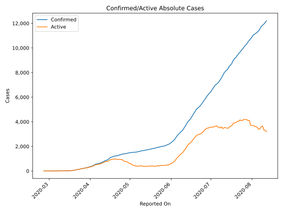
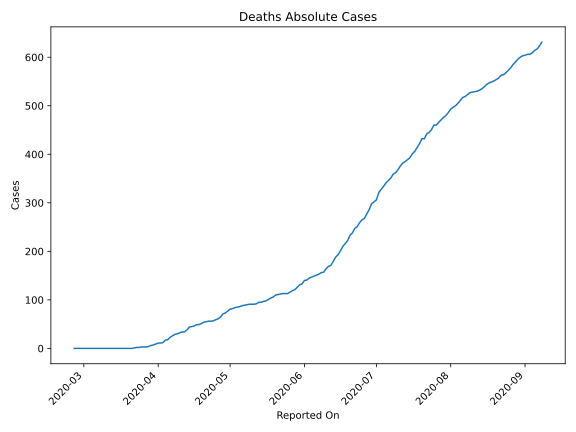
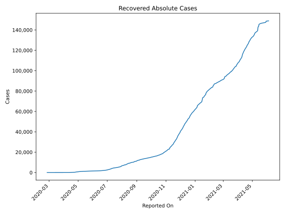
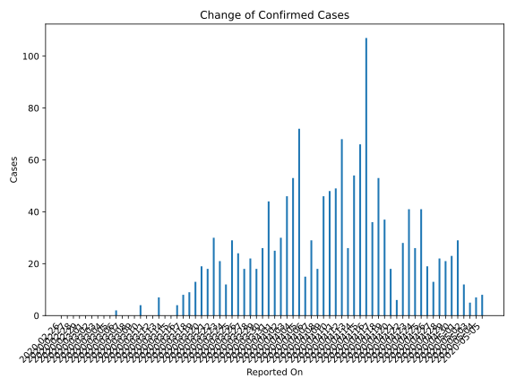
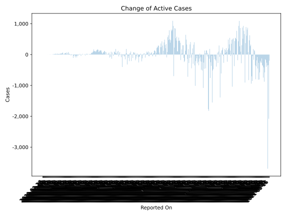
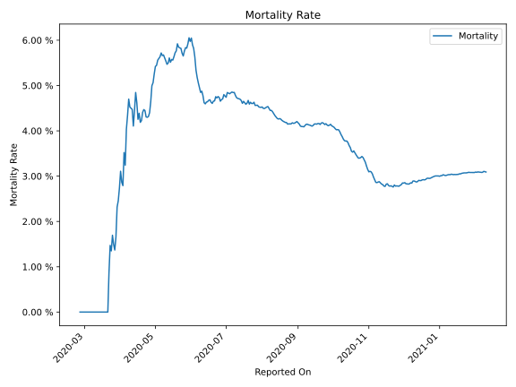

# Country Figures: Time Series for NorthMacedonia 

| Reported On | Confirmed | Deaths | Recovered | Active | Mortality | &Delta; Confirmed | &Delta; Deaths | &Delta; Active | % Active of Population |
|-------------|-----------|--------|-----------|--------|-----------|-------------------|----------------|----------------|------------------------|
| 2020-03-23 | 136 | 2 | 1 | 133 |  1.47 %  | 22 | 1 | 21 |  0.006 %  | 
| 2020-03-22 | 114 | 1 | 1 | 112 |  0.88 %  | 29 | 1 | 28 |  0.005 %  | 
| 2020-03-21 | 85 | 0 | 1 | 84 |  None  | 18 | 0 | 18 |  0.004 %  | 
| 2020-03-20 | 67 | 0 | 1 | 66 |  None  | 19 | 0 | 19 |  0.003 %  | 
| 2020-03-19 | 48 | 0 | 1 | 47 |  None  | 13 | 0 | 13 |  0.002 %  | 
| 2020-03-18 | 35 | 0 | 1 | 34 |  None  | 9 | 0 | 9 |  0.002 %  | 
| 2020-03-17 | 26 | 0 | 1 | 25 |  None  | 8 | 0 | 8 |  0.001 %  | 
| 2020-03-16 | 18 | 0 | 1 | 17 |  None  | 4 | 0 | 4 |  0.001 %  | 
| 2020-03-15 | 14 | 0 | 1 | 13 |  None  | 0 | 0 | 0 |  0.001 %  | 
| 2020-03-14 | 14 | 0 | 1 | 13 |  None  | 0 | 0 | 0 |  0.001 %  | 
| 2020-03-13 | 14 | 0 | 1 | 13 |  None  | 7 | 0 | 6 |  0.001 %  | 
| 2020-03-12 | 7 | 0 | 0 | 7 |  None  | 0 | 0 | 0 |  0.000 %  | 
| 2020-03-11 | 7 | 0 | 0 | 7 |  None  | 0 | 0 | 0 |  0.000 %  | 
| 2020-03-10 | 7 | 0 | 0 | 7 |  None  | 4 | 0 | 4 |  0.000 %  | 
| 2020-03-09 | 3 | 0 | 0 | 3 |  None  | 0 | 0 | 0 |  0.000 %  | 
| 2020-03-08 | 3 | 0 | 0 | 3 |  None  | 0 | 0 | 0 |  0.000 %  | 
| 2020-03-07 | 3 | 0 | 0 | 3 |  None  | 0 | 0 | 0 |  0.000 %  | 
| 2020-03-06 | 3 | 0 | 0 | 3 |  None  | 2 | 0 | 2 |  0.000 %  | 
| 2020-03-05 | 1 | 0 | 0 | 1 |  None  | 0 | 0 | 0 |  0.000 %  | 
| 2020-03-04 | 1 | 0 | 0 | 1 |  None  | 0 | 0 | 0 |  0.000 %  | 
| 2020-03-03 | 1 | 0 | 0 | 1 |  None  | 0 | 0 | 0 |  0.000 %  | 
| 2020-03-02 | 1 | 0 | 0 | 1 |  None  | 0 | 0 | 0 |  0.000 %  | 
| 2020-03-01 | 1 | 0 | 0 | 1 |  None  | 0 | 0 | 0 |  0.000 %  | 
| 2020-02-29 | 1 | 0 | 0 | 1 |  None  | 0 | 0 | 0 |  0.000 %  | 
| 2020-02-28 | 1 | 0 | 0 | 1 |  None  | 0 | 0 | 0 |  0.000 %  | 
| 2020-02-27 | 1 | 0 | 0 | 1 |  None  | 0 | 0 | 0 |  0.000 %  | 
| 2020-02-26 | 1 | 0 | 0 | 1 |  None  | None | None | None |  0.000 %  | 

