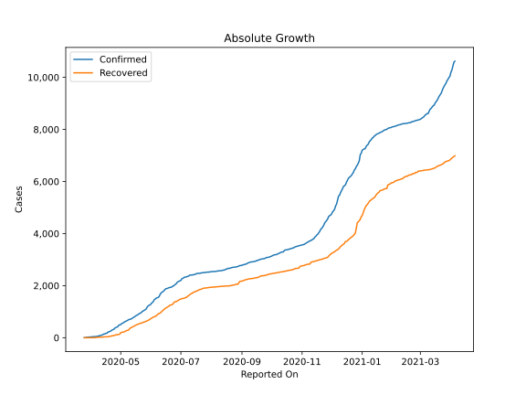
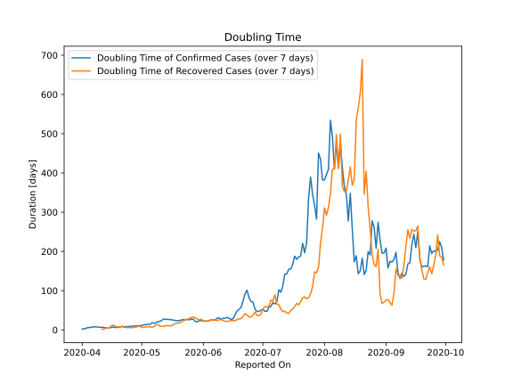

# Country Figures: Doubling Time of Infections for Mali 

The doubling time below are calculated based on
* an exponential growth assumption
* for time difference of past seven (7) days.
The doubling time's unit is "days".

The first doubling time indicates the increase of confirmed (infected)
cases. There, the *higher* the number is, the better is to take control
of the disease.

The second doubling time indicates the increase of recovered (healed)
cases. There, the *lower* the number is, the better it is to take
control of the disease.

| Reported On | Confirmed | Doubling Time (Confirmed) | Recovered | Doubling Time (Recovered) |
|-------------|-----------|---------------------------|-----------|---------------------------|
| 2020-05-03 | 563 |  13.5 days  | 213 |  7.9 days  | 
| 2020-05-02 | 544 |  12.9 days  | 206 |  6.3 days  | 
| 2020-05-01 | 508 |  11.2 days  | 196 |  6.3 days  | 
| 2020-04-30 | 490 |  10.9 days  | 135 |  9.0 days  | 
| 2020-04-29 | 482 |  10.1 days  | 129 |  8.9 days  | 
| 2020-04-28 | 424 |  10.1 days  | 122 |  6.7 days  | 
| 2020-04-27 | 408 |  9.9 days  | 113 |  7.3 days  | 
| 2020-04-26 | 389 |  9.1 days  | 112 |  5.3 days  | 
| 2020-04-25 | 370 |  9.4 days  | 91 |  6.4 days  | 
| 2020-04-24 | 325 |  7.9 days  | 87 |  5.5 days  | 
| 2020-04-23 | 309 |  8.5 days  | 77 |  6.3 days  | 
| 2020-04-22 | 293 |  7.4 days  | 73 |  6.7 days  | 
| 2020-04-21 | 258 |  8.7 days  | 57 |  9.7 days  | 
| 2020-04-20 | 246 |  7.3 days  | 56 |  6.7 days  | 
| 2020-04-19 | 224 |  6.7 days  | 42 |  7.8 days  | 
| 2020-04-18 | 216 |  5.7 days  | 41 |  8.1 days  | 
| 2020-04-17 | 171 |  7.5 days  | 34 |  11.5 days  | 
| 2020-04-16 | 171 |  6.1 days  | 34 |  11.5 days  | 
| 2020-04-15 | 148 |  5.6 days  | 34 |  6.8 days  | 
| 2020-04-14 | 144 |  5.5 days  | 34 |  5.0 days  | 
| 2020-04-13 | 123 |  5.4 days  | 26 |  4.9 days  | 
| 2020-04-12 | 105 |  6.1 days  | 22 |  1.9 days  | 
| 2020-04-11 | 87 |  6.8 days  | 22 |  1.9 days  | 
| 2020-04-10 | 87 |  6.4 days  | 22 |  None  | 
| 2020-04-09 | 74 |  7.1 days  | 22 |  None  | 
| 2020-04-08 | 59 |  7.9 days  | 16 |  None  | 
| 2020-04-07 | 56 |  7.3 days  | 12 |  None  | 
| 2020-04-06 | 47 |  8.0 days  | 9 |  None  | 
| 2020-04-05 | 45 |  5.6 days  | 1 |  None  | 
| 2020-04-04 | 41 |  6.2 days  | 1 |  None  | 
| 2020-04-03 | 39 |  4.2 days  | 0 |  None  | 
| 2020-04-02 | 36 |  2.5 days  | 0 |  None  | 
| 2020-04-01 | 31 |  2.1 days  | 0 |  None  | 
| 2020-03-31 | 28 |  None  | 0 |  None  | 
| 2020-03-30 | 25 |  None  | 0 |  None  | 
| 2020-03-29 | 18 |  None  | 0 |  None  | 
| 2020-03-28 | 18 |  None  | 0 |  None  | 
| 2020-03-27 | 11 |  None  | 0 |  None  | 
| 2020-03-26 | 4 |  None  | 0 |  None  | 
| 2020-03-25 | 2 |  None  | 0 |  None  | 

