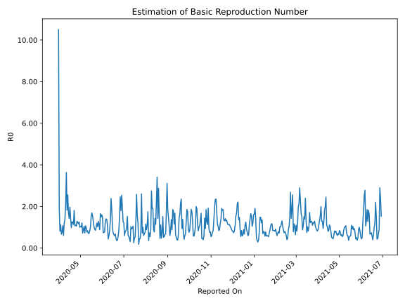

# Country Figures: Time Series for Basic Reproduction Number of Mali 

| Reported On | &Delta; Confirmed | Total &Delta; Confirmed First Interval | Total &Delta; Confirmed Second Interval | Estimated Basic Reproduction Number R0 | 
|-------------|-------------------|----------------------------------------|-----------------------------------------|---------------------------------------------------|
| 2020-05-07 | 19 |  87  |  120  |  0.72  | 
| 2020-05-06 | 19 |  104  |  100  |  1.04  | 
| 2020-05-05 | 32 |  90  |  101  |  0.89  | 
| 2020-05-04 | 17 |  81  |  112  |  0.72  | 
| 2020-05-03 | 19 |  120  |  99  |  1.21  | 
| 2020-05-02 | 36 |  100  |  99  |  1.01  | 
| 2020-05-01 | 18 |  101  |  96  |  1.05  | 
| 2020-04-30 | 8 |  112  |  112  |  1.00  | 
| 2020-04-29 | 58 |  99  |  79  |  1.25  | 
| 2020-04-28 | 16 |  99  |  85  |  1.16  | 
| 2020-04-27 | 19 |  96  |  77  |  1.25  | 
| 2020-04-26 | 19 |  112  |  87  |  1.29  | 
| 2020-04-25 | 45 |  79  |  75  |  1.05  | 
| 2020-04-24 | 16 |  85  |  76  |  1.12  | 
| 2020-04-23 | 16 |  77  |  72  |  1.07  | 
| 2020-04-22 | 35 |  87  |  48  |  1.81  | 
| 2020-04-21 | 12 |  75  |  66  |  1.14  | 
| 2020-04-20 | 22 |  76  |  61  |  1.25  | 
| 2020-04-19 | 8 |  72  |  57  |  1.26  | 
| 2020-04-18 | 45 |  48  |  49  |  0.98  | 
| 2020-04-17 | 0 |  66  |  46  |  1.43  | 
| 2020-04-16 | 23 |  61  |  31  |  1.97  | 
| 2020-04-15 | 4 |  57  |  40  |  1.43  | 
| 2020-04-14 | 21 |  49  |  29  |  1.69  | 
| 2020-04-13 | 18 |  46  |  18  |  2.56  | 
| 2020-04-12 | 18 |  31  |  17  |  1.82  | 
| 2020-04-11 | 0 |  40  |  11  |  3.64  | 
| 2020-04-10 | 13 |  29  |  14  |  2.07  | 
| 2020-04-09 | 15 |  18  |  13  |  1.38  | 
| 2020-04-08 | 3 |  17  |  14  |  1.21  | 
| 2020-04-07 | 9 |  11  |  18  |  0.61  | 
| 2020-04-06 | 2 |  14  |  13  |  1.08  | 
| 2020-04-05 | 4 |  13  |  17  |  0.76  | 
| 2020-04-04 | 2 |  14  |  21  |  0.67  | 
| 2020-04-03 | 3 |  18  |  16  |  1.12  | 
| 2020-04-02 | 5 |  13  |  16  |  0.81  | 
| 2020-04-01 | 3 |  17  |  9  |  1.89  | 
| 2020-03-31 | 3 |  21  |  2  |  10.50  | 
| 2020-03-30 | 7 |  16  |  None  |  None  | 
| 2020-03-29 | 0 |  16  |  None  |  None  | 
| 2020-03-28 | 7 |  9  |  None  |  None  | 
| 2020-03-27 | 7 |  2  |  None  |  None  | 
| 2020-03-26 | 2 |  None  |  None  |  None  | 
| 2020-03-25 | None |  None  |  None  |  None  | 

