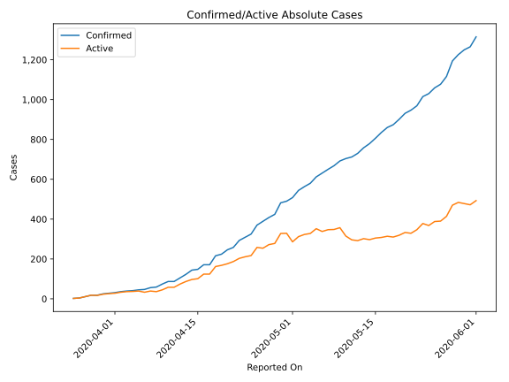
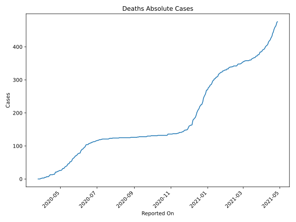
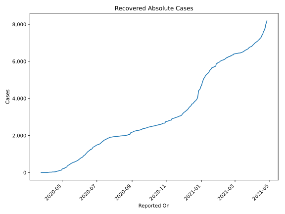
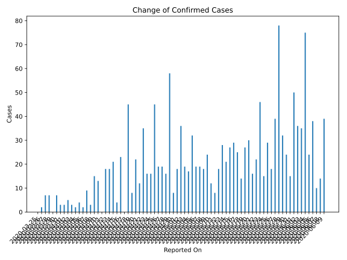
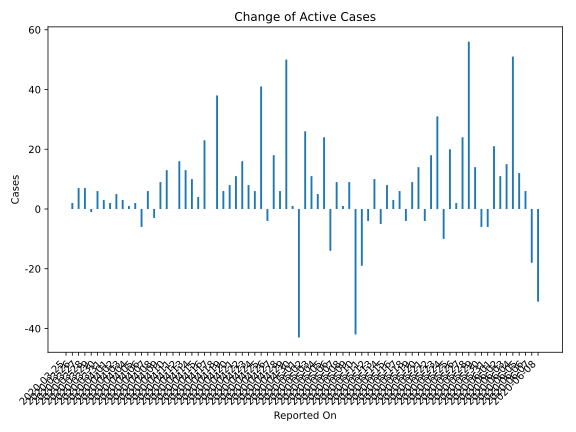
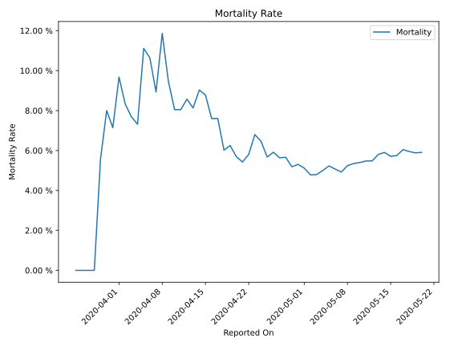

# Country Figures: Time Series for Mali 

| Reported On | Confirmed | Deaths | Recovered | Active | Mortality | &Delta; Confirmed | &Delta; Deaths | &Delta; Recovered | &Delta; Active | % Active of Population |
|-------------|-----------|--------|-----------|--------|-----------|-------------------|----------------|-------------------|----------------|------------------------|
| 2020-05-05 | 612 | 32 | 228 | 352 |  5.23 %  | 32 | 3 | 5 | 24 |  0.002 %  | 
| 2020-05-04 | 580 | 29 | 223 | 328 |  5.00 %  | 17 | 2 | 10 | 5 |  0.002 %  | 
| 2020-05-03 | 563 | 27 | 213 | 323 |  4.80 %  | 19 | 1 | 7 | 11 |  0.002 %  | 
| 2020-05-02 | 544 | 26 | 206 | 312 |  4.78 %  | 36 | 0 | 10 | 26 |  0.002 %  | 
| 2020-05-01 | 508 | 26 | 196 | 286 |  5.12 %  | 18 | 0 | 61 | -43 |  0.001 %  | 
| 2020-04-30 | 490 | 26 | 135 | 329 |  5.31 %  | 8 | 1 | 6 | 1 |  0.002 %  | 
| 2020-04-29 | 482 | 25 | 129 | 328 |  5.19 %  | 58 | 1 | 7 | 50 |  0.002 %  | 
| 2020-04-28 | 424 | 24 | 122 | 278 |  5.66 %  | 16 | 1 | 9 | 6 |  0.001 %  | 
| 2020-04-27 | 408 | 23 | 113 | 272 |  5.64 %  | 19 | 0 | 1 | 18 |  0.001 %  | 
| 2020-04-26 | 389 | 23 | 112 | 254 |  5.91 %  | 19 | 2 | 21 | -4 |  0.001 %  | 
| 2020-04-25 | 370 | 21 | 91 | 258 |  5.68 %  | 45 | 0 | 4 | 41 |  0.001 %  | 
| 2020-04-24 | 325 | 21 | 87 | 217 |  6.46 %  | 16 | 0 | 10 | 6 |  0.001 %  | 
| 2020-04-23 | 309 | 21 | 77 | 211 |  6.80 %  | 16 | 4 | 4 | 8 |  0.001 %  | 
| 2020-04-22 | 293 | 17 | 73 | 203 |  5.80 %  | 35 | 3 | 16 | 16 |  0.001 %  | 
| 2020-04-21 | 258 | 14 | 57 | 187 |  5.43 %  | 12 | 0 | 1 | 11 |  0.001 %  | 
| 2020-04-20 | 246 | 14 | 56 | 176 |  5.69 %  | 22 | 0 | 14 | 8 |  0.001 %  | 
| 2020-04-19 | 224 | 14 | 42 | 168 |  6.25 %  | 8 | 1 | 1 | 6 |  0.001 %  | 
| 2020-04-18 | 216 | 13 | 41 | 162 |  6.02 %  | 45 | 0 | 7 | 38 |  0.001 %  | 
| 2020-04-17 | 171 | 13 | 34 | 124 |  7.60 %  | 0 | 0 | 0 | 0 |  0.001 %  | 
| 2020-04-16 | 171 | 13 | 34 | 124 |  7.60 %  | 23 | 0 | 0 | 23 |  0.001 %  | 
| 2020-04-15 | 148 | 13 | 34 | 101 |  8.78 %  | 4 | 0 | 0 | 4 |  0.001 %  | 
| 2020-04-14 | 144 | 13 | 34 | 97 |  9.03 %  | 21 | 3 | 8 | 10 |  0.001 %  | 
| 2020-04-13 | 123 | 10 | 26 | 87 |  8.13 %  | 18 | 1 | 4 | 13 |  0.000 %  | 
| 2020-04-12 | 105 | 9 | 22 | 74 |  8.57 %  | 18 | 2 | 0 | 16 |  0.000 %  | 
| 2020-04-11 | 87 | 7 | 22 | 58 |  8.05 %  | 0 | 0 | 0 | 0 |  0.000 %  | 
| 2020-04-10 | 87 | 7 | 22 | 58 |  8.05 %  | 13 | 0 | 0 | 13 |  0.000 %  | 
| 2020-04-09 | 74 | 7 | 22 | 45 |  9.46 %  | 15 | 0 | 6 | 9 |  0.000 %  | 
| 2020-04-08 | 59 | 7 | 16 | 36 |  11.86 %  | 3 | 2 | 4 | -3 |  0.000 %  | 
| 2020-04-07 | 56 | 5 | 12 | 39 |  8.93 %  | 9 | 0 | 3 | 6 |  0.000 %  | 
| 2020-04-06 | 47 | 5 | 9 | 33 |  10.64 %  | 2 | 0 | 8 | -6 |  0.000 %  | 
| 2020-04-05 | 45 | 5 | 1 | 39 |  11.11 %  | 4 | 2 | 0 | 2 |  0.000 %  | 
| 2020-04-04 | 41 | 3 | 1 | 37 |  7.32 %  | 2 | 0 | 1 | 1 |  0.000 %  | 
| 2020-04-03 | 39 | 3 | 0 | 36 |  7.69 %  | 3 | 0 | 0 | 3 |  0.000 %  | 
| 2020-04-02 | 36 | 3 | 0 | 33 |  8.33 %  | 5 | 0 | 0 | 5 |  0.000 %  | 
| 2020-04-01 | 31 | 3 | 0 | 28 |  9.68 %  | 3 | 1 | 0 | 2 |  0.000 %  | 
| 2020-03-31 | 28 | 2 | 0 | 26 |  7.14 %  | 3 | 0 | 0 | 3 |  0.000 %  | 
| 2020-03-30 | 25 | 2 | 0 | 23 |  8.00 %  | 7 | 1 | 0 | 6 |  0.000 %  | 
| 2020-03-29 | 18 | 1 | 0 | 17 |  5.56 %  | 0 | 1 | 0 | -1 |  0.000 %  | 
| 2020-03-28 | 18 | 0 | 0 | 18 |  None  | 7 | 0 | 0 | 7 |  0.000 %  | 
| 2020-03-27 | 11 | 0 | 0 | 11 |  None  | 7 | 0 | 0 | 7 |  0.000 %  | 
| 2020-03-26 | 4 | 0 | 0 | 4 |  None  | 2 | 0 | 0 | 2 |  0.000 %  | 
| 2020-03-25 | 2 | 0 | 0 | 2 |  None  | None | None | None | None |  0.000 %  | 

