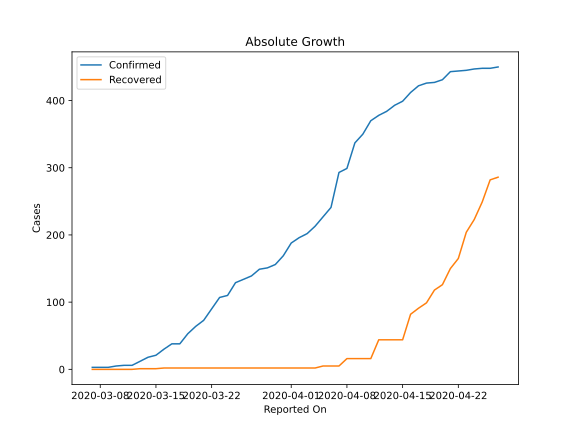
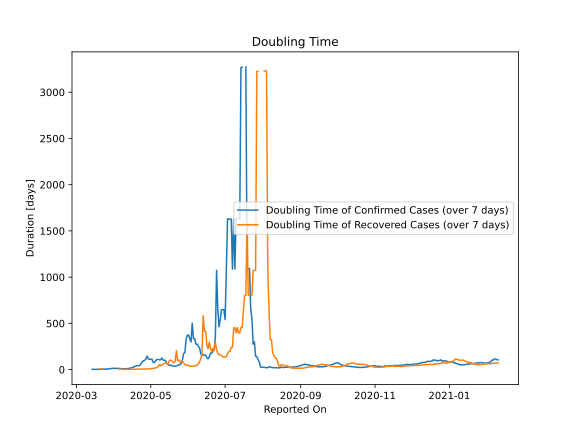

# Country Figures: Doubling Time of Infections for Malta 

The doubling time below are calculated based on
* an exponential growth assumption
* for time difference of past seven (7) days.
The doubling time's unit is "days".

The first doubling time indicates the increase of confirmed (infected)
cases. There, the *higher* the number is, the better is to take control
of the disease.

The second doubling time indicates the increase of recovered (healed)
cases. There, the *lower* the number is, the better it is to take
control of the disease.

| Reported On | Confirmed | Doubling Time (Confirmed) | Recovered | Doubling Time (Recovered) |
|-------------|-----------|---------------------------|-----------|---------------------------|
| 2020-04-16 | 412 |  24.5 days  | 82 |  3.3 days  | 
| 2020-04-15 | 399 |  17.2 days  | 44 |  5.1 days  | 
| 2020-04-14 | 393 |  16.9 days  | 44 |  2.6 days  | 
| 2020-04-13 | 384 |  10.8 days  | 44 |  2.6 days  | 
| 2020-04-12 | 378 |  9.9 days  | 44 |  2.6 days  | 
| 2020-04-11 | 370 |  9.1 days  | 16 |  2.7 days  | 
| 2020-04-10 | 350 |  9.2 days  | 16 |  2.7 days  | 
| 2020-04-09 | 337 |  9.3 days  | 16 |  2.7 days  | 
| 2020-04-08 | 299 |  10.8 days  | 16 |  2.7 days  | 
| 2020-04-07 | 293 |  9.2 days  | 5 |  5.6 days  | 
| 2020-04-06 | 241 |  11.5 days  | 5 |  5.6 days  | 
| 2020-04-05 | 227 |  12.2 days  | 5 |  5.6 days  | 
| 2020-04-04 | 213 |  13.9 days  | 2 |  None  | 
| 2020-04-03 | 202 |  13.3 days  | 2 |  None  | 
| 2020-04-02 | 196 |  13.1 days  | 2 |  None  | 
| 2020-04-01 | 188 |  13.2 days  | 2 |  None  | 
| 2020-03-31 | 169 |  11.6 days  | 2 |  None  | 
| 2020-03-30 | 156 |  13.2 days  | 2 |  None  | 
| 2020-03-29 | 151 |  9.7 days  | 2 |  None  | 
| 2020-03-28 | 149 |  7.1 days  | 2 |  None  | 
| 2020-03-27 | 139 |  6.6 days  | 2 |  None  | 
| 2020-03-26 | 134 |  5.6 days  | 2 |  None  | 
| 2020-03-25 | 129 |  4.3 days  | 2 |  None  | 
| 2020-03-24 | 110 |  4.9 days  | 2 |  None  | 
| 2020-03-23 | 107 |  4.2 days  | 2 |  None  | 
| 2020-03-22 | 90 |  3.7 days  | 2 |  7.3 days  | 
| 2020-03-21 | 73 |  3.8 days  | 2 |  7.3 days  | 
| 2020-03-20 | 64 |  3.2 days  | 2 |  7.3 days  | 
| 2020-03-19 | 53 |  2.6 days  | 2 |  None  | 
| 2020-03-18 | 38 |  3.0 days  | 2 |  None  | 
| 2020-03-17 | 38 |  2.7 days  | 2 |  None  | 
| 2020-03-16 | 30 |  2.4 days  | 2 |  None  | 
| 2020-03-15 | 21 |  2.8 days  | 1 |  None  | 
| 2020-03-14 | 18 |  3.0 days  | 1 |  None  | 
| 2020-03-13 | 12 |  None  | 1 |  None  | 
| 2020-03-12 | 6 |  None  | 0 |  None  | 
| 2020-03-11 | 6 |  None  | 0 |  None  | 
| 2020-03-10 | 5 |  None  | 0 |  None  | 
| 2020-03-09 | 3 |  None  | 0 |  None  | 
| 2020-03-08 | 3 |  None  | 0 |  None  | 
| 2020-03-07 | 3 |  None  | 0 |  None  | 

