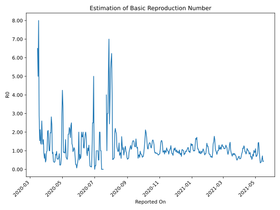

# Country Figures: Time Series for Basic Reproduction Number of Malta 

| Reported On | &Delta; Confirmed | Total &Delta; Confirmed First Interval | Total &Delta; Confirmed Second Interval | Estimated Basic Reproduction Number R0 | 
|-------------|-------------------|----------------------------------------|-----------------------------------------|---------------------------------------------------|
| 2020-04-27 | 2 |  4  |  18  |  0.22  | 
| 2020-04-26 | 0 |  5  |  21  |  0.24  | 
| 2020-04-25 | 1 |  16  |  19  |  0.84  | 
| 2020-04-24 | 2 |  18  |  28  |  0.64  | 
| 2020-04-23 | 1 |  18  |  33  |  0.55  | 
| 2020-04-22 | 1 |  21  |  38  |  0.55  | 
| 2020-04-21 | 12 |  19  |  34  |  0.56  | 
| 2020-04-20 | 4 |  28  |  29  |  0.97  | 
| 2020-04-19 | 1 |  33  |  43  |  0.77  | 
| 2020-04-18 | 4 |  38  |  47  |  0.81  | 
| 2020-04-17 | 10 |  34  |  79  |  0.43  | 
| 2020-04-16 | 13 |  29  |  77  |  0.38  | 
| 2020-04-15 | 6 |  43  |  109  |  0.39  | 
| 2020-04-14 | 9 |  47  |  110  |  0.43  | 
| 2020-04-13 | 6 |  79  |  86  |  0.92  | 
| 2020-04-12 | 8 |  77  |  91  |  0.85  | 
| 2020-04-11 | 20 |  109  |  45  |  2.42  | 
| 2020-04-10 | 13 |  110  |  39  |  2.82  | 
| 2020-04-09 | 38 |  86  |  44  |  1.95  | 
| 2020-04-08 | 6 |  91  |  46  |  1.98  | 
| 2020-04-07 | 52 |  45  |  45  |  1.00  | 
| 2020-04-06 | 14 |  39  |  39  |  1.00  | 
| 2020-04-05 | 14 |  44  |  30  |  1.47  | 
| 2020-04-04 | 11 |  46  |  22  |  2.09  | 
| 2020-04-03 | 6 |  45  |  22  |  2.05  | 
| 2020-04-02 | 8 |  39  |  39  |  1.00  | 
| 2020-04-01 | 19 |  30  |  32  |  0.94  | 
| 2020-03-31 | 13 |  22  |  44  |  0.50  | 
| 2020-03-30 | 5 |  22  |  56  |  0.39  | 
| 2020-03-29 | 2 |  39  |  46  |  0.85  | 
| 2020-03-28 | 10 |  32  |  54  |  0.59  | 
| 2020-03-27 | 5 |  44  |  52  |  0.85  | 
| 2020-03-26 | 5 |  56  |  35  |  1.60  | 
| 2020-03-25 | 19 |  46  |  34  |  1.35  | 
| 2020-03-24 | 3 |  54  |  32  |  1.69  | 
| 2020-03-23 | 17 |  52  |  20  |  2.60  | 
| 2020-03-22 | 17 |  35  |  26  |  1.35  | 
| 2020-03-21 | 9 |  34  |  24  |  1.42  | 
| 2020-03-20 | 11 |  32  |  15  |  2.13  | 
| 2020-03-19 | 15 |  20  |  13  |  1.54  | 
| 2020-03-18 | 0 |  26  |  9  |  2.89  | 
| 2020-03-17 | 8 |  24  |  3  |  8.00  | 
| 2020-03-16 | 9 |  15  |  3  |  5.00  | 
| 2020-03-15 | 3 |  13  |  2  |  6.50  | 
| 2020-03-14 | 6 |  9  |  None  |  None  | 
| 2020-03-13 | 6 |  3  |  None  |  None  | 
| 2020-03-12 | 0 |  3  |  None  |  None  | 
| 2020-03-11 | 1 |  2  |  None  |  None  | 
| 2020-03-10 | 2 |  None  |  None  |  None  | 
| 2020-03-09 | 0 |  None  |  None  |  None  | 
| 2020-03-08 | 0 |  None  |  None  |  None  | 
| 2020-03-07 | None |  None  |  None  |  None  | 

