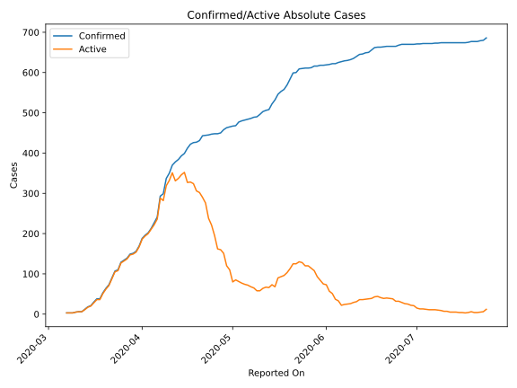
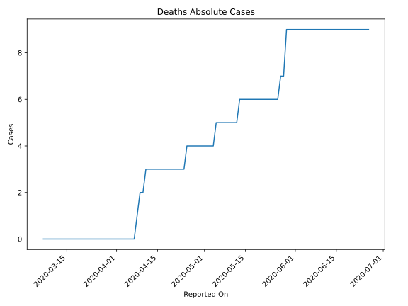
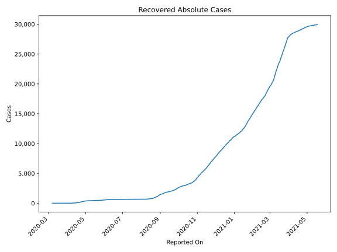
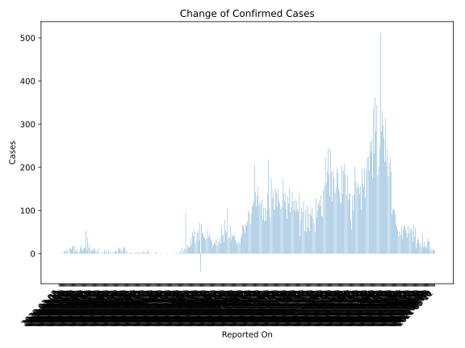
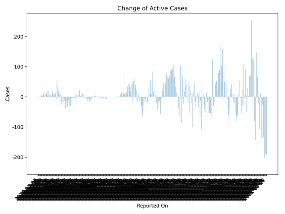
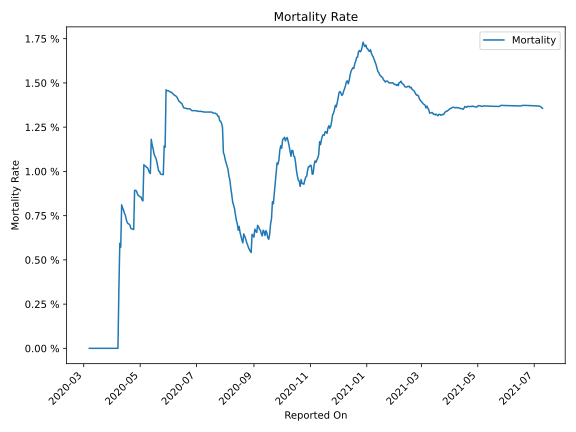

# Country Figures: Time Series for Malta 

| Reported On | Confirmed | Deaths | Recovered | Active | Mortality | &Delta; Confirmed | &Delta; Deaths | &Delta; Active | % Active of Population |
|-------------|-----------|--------|-----------|--------|-----------|-------------------|----------------|----------------|------------------------|
| 2020-04-07 | 293 | 0 | 5 | 288 |  None  | 52 | 0 | 52 |  0.060 %  | 
| 2020-04-06 | 241 | 0 | 5 | 236 |  None  | 14 | 0 | 14 |  0.049 %  | 
| 2020-04-05 | 227 | 0 | 5 | 222 |  None  | 14 | 0 | 11 |  0.046 %  | 
| 2020-04-04 | 213 | 0 | 2 | 211 |  None  | 11 | 0 | 11 |  0.044 %  | 
| 2020-04-03 | 202 | 0 | 2 | 200 |  None  | 6 | 0 | 6 |  0.041 %  | 
| 2020-04-02 | 196 | 0 | 2 | 194 |  None  | 8 | 0 | 8 |  0.040 %  | 
| 2020-04-01 | 188 | 0 | 2 | 186 |  None  | 19 | 0 | 19 |  0.038 %  | 
| 2020-03-31 | 169 | 0 | 2 | 167 |  None  | 13 | 0 | 13 |  0.035 %  | 
| 2020-03-30 | 156 | 0 | 2 | 154 |  None  | 5 | 0 | 5 |  0.032 %  | 
| 2020-03-29 | 151 | 0 | 2 | 149 |  None  | 2 | 0 | 2 |  0.031 %  | 
| 2020-03-28 | 149 | 0 | 2 | 147 |  None  | 10 | 0 | 10 |  0.030 %  | 
| 2020-03-27 | 139 | 0 | 2 | 137 |  None  | 5 | 0 | 5 |  0.028 %  | 
| 2020-03-26 | 134 | 0 | 2 | 132 |  None  | 5 | 0 | 5 |  0.027 %  | 
| 2020-03-25 | 129 | 0 | 2 | 127 |  None  | 19 | 0 | 19 |  0.026 %  | 
| 2020-03-24 | 110 | 0 | 2 | 108 |  None  | 3 | 0 | 3 |  0.022 %  | 
| 2020-03-23 | 107 | 0 | 2 | 105 |  None  | 17 | 0 | 17 |  0.022 %  | 
| 2020-03-22 | 90 | 0 | 2 | 88 |  None  | 17 | 0 | 17 |  0.018 %  | 
| 2020-03-21 | 73 | 0 | 2 | 71 |  None  | 9 | 0 | 9 |  0.015 %  | 
| 2020-03-20 | 64 | 0 | 2 | 62 |  None  | 11 | 0 | 11 |  0.013 %  | 
| 2020-03-19 | 53 | 0 | 2 | 51 |  None  | 15 | 0 | 15 |  0.011 %  | 
| 2020-03-18 | 38 | 0 | 2 | 36 |  None  | 0 | 0 | 0 |  0.007 %  | 
| 2020-03-17 | 38 | 0 | 2 | 36 |  None  | 8 | 0 | 8 |  0.007 %  | 
| 2020-03-16 | 30 | 0 | 2 | 28 |  None  | 9 | 0 | 8 |  0.006 %  | 
| 2020-03-15 | 21 | 0 | 1 | 20 |  None  | 3 | 0 | 3 |  0.004 %  | 
| 2020-03-14 | 18 | 0 | 1 | 17 |  None  | 6 | 0 | 6 |  0.004 %  | 
| 2020-03-13 | 12 | 0 | 1 | 11 |  None  | 6 | 0 | 5 |  0.002 %  | 
| 2020-03-12 | 6 | 0 | 0 | 6 |  None  | 0 | 0 | 0 |  0.001 %  | 
| 2020-03-11 | 6 | 0 | 0 | 6 |  None  | 1 | 0 | 1 |  0.001 %  | 
| 2020-03-10 | 5 | 0 | 0 | 5 |  None  | 2 | 0 | 2 |  0.001 %  | 
| 2020-03-09 | 3 | 0 | 0 | 3 |  None  | 0 | 0 | 0 |  0.001 %  | 
| 2020-03-08 | 3 | 0 | 0 | 3 |  None  | 0 | 0 | 0 |  0.001 %  | 
| 2020-03-07 | 3 | 0 | 0 | 3 |  None  | None | None | None |  0.001 %  | 

