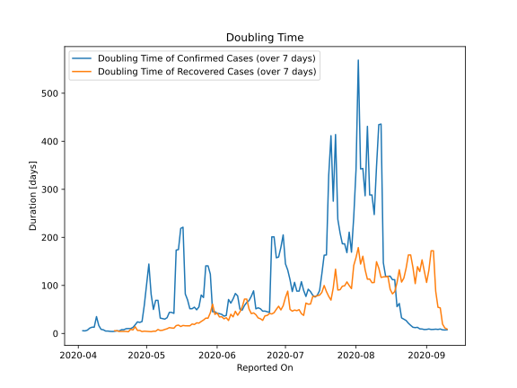

# Country Figures: New Infections in Previous 7 Days per 100,000 Population for Burma 

<!--  --> 

| Reported On | &Delta; Confirmed (on the day) | &Delta; Confirmed (last 7 days) | New Cases in Previous 7 Days per 100,000 Population |
|-------------|--------------------------------|---------------------------------|-----------------------------------------------------|
| 2020-05-09 |  1  |  27  |  0.050  |
| 2020-05-08 |  1  |  26  |  0.048  |
| 2020-05-07 |  15  |  25  |  0.047  |
| 2020-05-06 |  None  |  11  |  0.020  |
| 2020-05-05 |  None  |  11  |  0.020  |
| 2020-05-04 |  6  |  15  |  0.028  |
| 2020-05-03 |  4  |  9  |  0.017  |
| 2020-05-02 |  None  |  5  |  0.009  |
| 2020-05-01 |  None  |  7  |  0.013  |
| 2020-04-30 |  1  |  12  |  0.022  |
| 2020-04-29 |  None  |  27  |  0.050  |
| 2020-04-28 |  4  |  29  |  0.054  |
| 2020-04-27 |  None  |  27  |  0.050  |
| 2020-04-26 |  None  |  35  |  0.065  |
| 2020-04-25 |  2  |  48  |  0.089  |
| 2020-04-24 |  5  |  56  |  0.104  |
| 2020-04-23 |  16  |  54  |  0.101  |
| 2020-04-22 |  2  |  49  |  0.091  |
| 2020-04-21 |  2  |  58  |  0.108  |
| 2020-04-20 |  8  |  57  |  0.106  |
| 2020-04-19 |  13  |  70  |  0.130  |
| 2020-04-18 |  10  |  60  |  0.112  |
| 2020-04-17 |  3  |  61  |  0.114  |
| 2020-04-16 |  11  |  62  |  0.115  |
| 2020-04-15 |  11  |  52  |  0.097  |
| 2020-04-14 |  1  |  41  |  0.076  |
| 2020-04-13 |  21  |  40  |  0.074  |
| 2020-04-12 |  3  |  20  |  0.037  |
| 2020-04-11 |  11  |  17  |  0.032  |
| 2020-04-10 |  4  |  7  |  0.013  |
| 2020-04-09 |  1  |  3  |  0.006  |
| 2020-04-08 |  None  |  7  |  0.013  |
| 2020-04-07 |  None  |  7  |  0.013  |
| 2020-04-06 |  1  |  8  |  0.015  |
| 2020-04-05 |  None  |  11  |  0.020  |
| 2020-04-04 |  1  |  13  |  0.024  |
| 2020-04-03 |  None  |  12  |  0.022  |
| 2020-04-02 |  5  |  12  |  0.022  |
| 2020-04-01 |  None  |  7  |  0.013  |
| 2020-03-31 |  1  |  7  |  0.013  |
| 2020-03-30 |  4  |  6  |  0.011  |
| 2020-03-29 |  2  |  2  |  0.004  |
| 2020-03-28 |  None  |  None  |  None  |
| 2020-03-27 |  None  |  None  |  None  |

