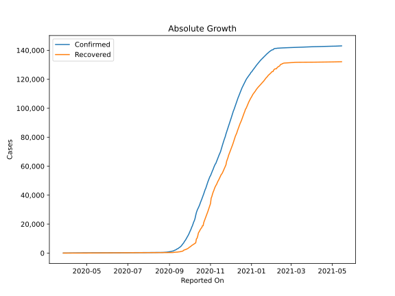

# Country Figures: Doubling Time of Infections for Burma 

The doubling time below are calculated based on
* an exponential growth assumption
* for time difference of past seven (7) days.
The doubling time's unit is "days".

The first doubling time indicates the increase of confirmed (infected)
cases. There, the *higher* the number is, the better is to take control
of the disease.

The second doubling time indicates the increase of recovered (healed)
cases. There, the *lower* the number is, the better it is to take
control of the disease.

| Reported On | Confirmed | Doubling Time (Confirmed) | Recovered | Doubling Time (Recovered) |
|-------------|-----------|---------------------------|-----------|---------------------------|
| 2020-04-30 | 151 |  58.9 days  | 27 |  4.8 days  | 
| 2020-04-29 | 150 |  24.8 days  | 27 |  3.9 days  | 
| 2020-04-28 | 150 |  22.9 days  | 16 |  6.2 days  | 
| 2020-04-27 | 146 |  24.1 days  | 16 |  6.2 days  | 
| 2020-04-26 | 146 |  18.0 days  | 10 |  13.9 days  | 
| 2020-04-25 | 146 |  12.5 days  | 10 |  7.3 days  | 
| 2020-04-24 | 144 |  10.2 days  | 9 |  8.6 days  | 
| 2020-04-23 | 139 |  10.2 days  | 9 |  3.6 days  | 
| 2020-04-22 | 123 |  9.9 days  | 7 |  4.2 days  | 
| 2020-04-21 | 121 |  7.8 days  | 7 |  4.2 days  | 
| 2020-04-20 | 119 |  7.8 days  | 7 |  4.2 days  | 
| 2020-04-19 | 111 |  5.2 days  | 7 |  4.2 days  | 
| 2020-04-18 | 98 |  5.5 days  | 5 |  5.6 days  | 
| 2020-04-17 | 88 |  4.4 days  | 5 |  5.6 days  | 
| 2020-04-16 | 85 |  4.0 days  | 2 |  None  | 
| 2020-04-15 | 74 |  4.3 days  | 2 |  None  | 
| 2020-04-14 | 63 |  5.0 days  | 2 |  None  | 
| 2020-04-13 | 62 |  5.0 days  | 2 |  None  | 
| 2020-04-12 | 41 |  7.6 days  | 2 |  None  | 
| 2020-04-11 | 38 |  8.5 days  | 2 |  None  | 
| 2020-04-10 | 27 |  16.5 days  | 2 |  None  | 
| 2020-04-09 | 23 |  35.1 days  | 2 |  None  | 
| 2020-04-08 | 22 |  13.0 days  | 0 |  None  | 
| 2020-04-07 | 22 |  13.0 days  | 0 |  None  | 
| 2020-04-06 | 22 |  11.1 days  | 0 |  None  | 
| 2020-04-05 | 21 |  6.9 days  | 0 |  None  | 
| 2020-04-04 | 21 |  5.4 days  | 0 |  None  | 
| 2020-04-03 | 20 |  5.6 days  | 0 |  None  | 
| 2020-04-02 | 20 |  None  | 0 |  None  | 
| 2020-04-01 | 15 |  None  | 0 |  None  | 
| 2020-03-31 | 15 |  None  | 0 |  None  | 
| 2020-03-30 | 14 |  None  | 0 |  None  | 
| 2020-03-29 | 10 |  None  | 0 |  None  | 
| 2020-03-28 | 8 |  None  | 0 |  None  | 
| 2020-03-27 | 8 |  None  | 0 |  None  | 

