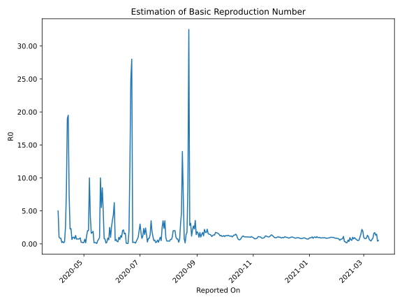

# Country Figures: Time Series for Basic Reproduction Number of Burma 

| Reported On | &Delta; Confirmed | Total &Delta; Confirmed First Interval | Total &Delta; Confirmed Second Interval | Estimated Basic Reproduction Number R0 | 
|-------------|-------------------|----------------------------------------|-----------------------------------------|---------------------------------------------------|
| 2020-05-01 | 0 |  5  |  23  |  0.22  | 
| 2020-04-30 | 1 |  4  |  25  |  0.16  | 
| 2020-04-29 | 0 |  6  |  25  |  0.24  | 
| 2020-04-28 | 4 |  7  |  28  |  0.25  | 
| 2020-04-27 | 0 |  23  |  25  |  0.92  | 
| 2020-04-26 | 0 |  25  |  33  |  0.76  | 
| 2020-04-25 | 2 |  25  |  34  |  0.74  | 
| 2020-04-24 | 5 |  28  |  37  |  0.76  | 
| 2020-04-23 | 16 |  25  |  35  |  0.71  | 
| 2020-04-22 | 2 |  33  |  26  |  1.27  | 
| 2020-04-21 | 2 |  34  |  44  |  0.77  | 
| 2020-04-20 | 8 |  37  |  36  |  1.03  | 
| 2020-04-19 | 13 |  35  |  36  |  0.97  | 
| 2020-04-18 | 10 |  26  |  39  |  0.67  | 
| 2020-04-17 | 3 |  44  |  19  |  2.32  | 
| 2020-04-16 | 11 |  36  |  16  |  2.25  | 
| 2020-04-15 | 11 |  36  |  5  |  7.20  | 
| 2020-04-14 | 1 |  39  |  2  |  19.50  | 
| 2020-04-13 | 21 |  19  |  1  |  19.00  | 
| 2020-04-12 | 3 |  16  |  2  |  8.00  | 
| 2020-04-11 | 11 |  5  |  2  |  2.50  | 
| 2020-04-10 | 4 |  2  |  6  |  0.33  | 
| 2020-04-09 | 1 |  1  |  6  |  0.17  | 
| 2020-04-08 | 0 |  2  |  6  |  0.33  | 
| 2020-04-07 | 0 |  2  |  10  |  0.20  | 
| 2020-04-06 | 1 |  6  |  7  |  0.86  | 
| 2020-04-05 | 0 |  6  |  7  |  0.86  | 
| 2020-04-04 | 1 |  6  |  6  |  1.00  | 
| 2020-04-03 | 0 |  10  |  2  |  5.00  | 
| 2020-04-02 | 5 |  7  |  None  |  None  | 
| 2020-04-01 | 0 |  7  |  None  |  None  | 
| 2020-03-31 | 1 |  6  |  None  |  None  | 
| 2020-03-30 | 4 |  2  |  None  |  None  | 
| 2020-03-29 | 2 |  None  |  None  |  None  | 
| 2020-03-28 | 0 |  None  |  None  |  None  | 
| 2020-03-27 | None |  None  |  None  |  None  | 

