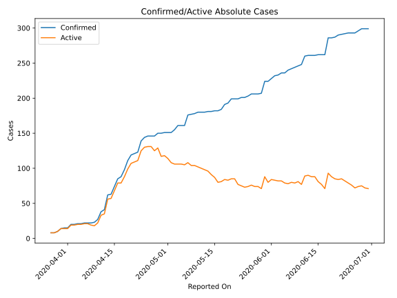
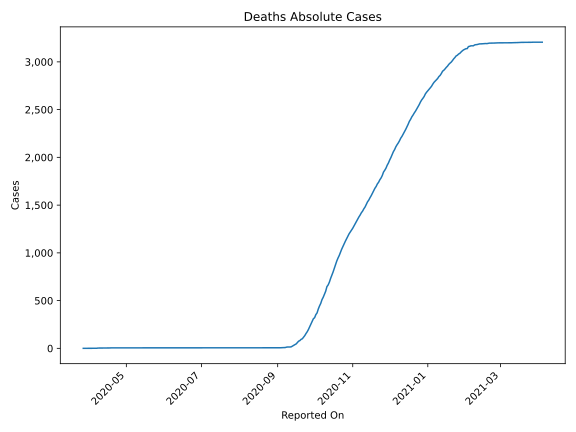
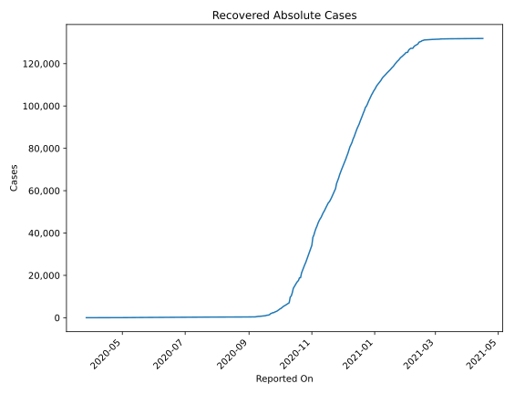
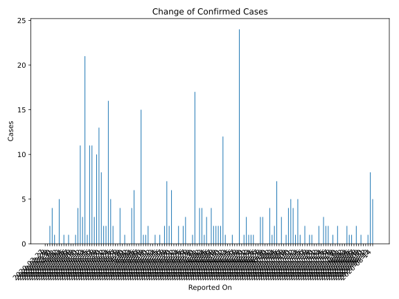
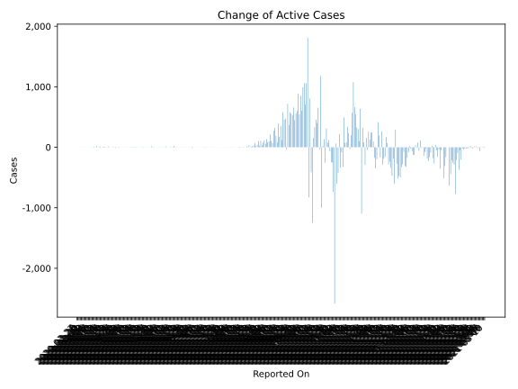
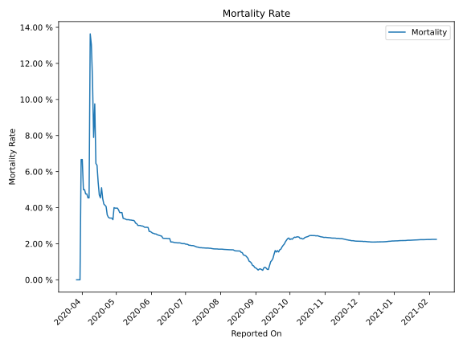

# Country Figures: Time Series for Burma 

| Reported On | Confirmed | Deaths | Recovered | Active | Mortality | &Delta; Confirmed | &Delta; Deaths | &Delta; Recovered | &Delta; Active | % Active of Population |
|-------------|-----------|--------|-----------|--------|-----------|-------------------|----------------|-------------------|----------------|------------------------|
| 2020-05-02 | 151 | 6 | 37 | 108 |  3.97 %  | 0 | 0 | 6 | -6 |  0.000 %  | 
| 2020-05-01 | 151 | 6 | 31 | 114 |  3.97 %  | 0 | 0 | 4 | -4 |  0.000 %  | 
| 2020-04-30 | 151 | 6 | 27 | 118 |  3.97 %  | 1 | 0 | 0 | 1 |  0.000 %  | 
| 2020-04-29 | 150 | 6 | 27 | 117 |  4.00 %  | 0 | 1 | 11 | -12 |  0.000 %  | 
| 2020-04-28 | 150 | 5 | 16 | 129 |  3.33 %  | 4 | 0 | 0 | 4 |  0.000 %  | 
| 2020-04-27 | 146 | 5 | 16 | 125 |  3.42 %  | 0 | 0 | 6 | -6 |  0.000 %  | 
| 2020-04-26 | 146 | 5 | 10 | 131 |  3.42 %  | 0 | 0 | 0 | 0 |  0.000 %  | 
| 2020-04-25 | 146 | 5 | 10 | 131 |  3.42 %  | 2 | 0 | 1 | 1 |  0.000 %  | 
| 2020-04-24 | 144 | 5 | 9 | 130 |  3.47 %  | 5 | 0 | 0 | 5 |  0.000 %  | 
| 2020-04-23 | 139 | 5 | 9 | 125 |  3.60 %  | 16 | 0 | 2 | 14 |  0.000 %  | 
| 2020-04-22 | 123 | 5 | 7 | 111 |  4.07 %  | 2 | 0 | 0 | 2 |  0.000 %  | 
| 2020-04-21 | 121 | 5 | 7 | 109 |  4.13 %  | 2 | 0 | 0 | 2 |  0.000 %  | 
| 2020-04-20 | 119 | 5 | 7 | 107 |  4.20 %  | 8 | 0 | 0 | 8 |  0.000 %  | 
| 2020-04-19 | 111 | 5 | 7 | 99 |  4.50 %  | 13 | 0 | 2 | 11 |  0.000 %  | 
| 2020-04-18 | 98 | 5 | 5 | 88 |  5.10 %  | 10 | 1 | 0 | 9 |  0.000 %  | 
| 2020-04-17 | 88 | 4 | 5 | 79 |  4.55 %  | 3 | 0 | 3 | 0 |  0.000 %  | 
| 2020-04-16 | 85 | 4 | 2 | 79 |  4.71 %  | 11 | 0 | 0 | 11 |  0.000 %  | 
| 2020-04-15 | 74 | 4 | 2 | 68 |  5.41 %  | 11 | 0 | 0 | 11 |  0.000 %  | 
| 2020-04-14 | 63 | 4 | 2 | 57 |  6.35 %  | 1 | 0 | 0 | 1 |  0.000 %  | 
| 2020-04-13 | 62 | 4 | 2 | 56 |  6.45 %  | 21 | 0 | 0 | 21 |  0.000 %  | 
| 2020-04-12 | 41 | 4 | 2 | 35 |  9.76 %  | 3 | 1 | 0 | 2 |  0.000 %  | 
| 2020-04-11 | 38 | 3 | 2 | 33 |  7.89 %  | 11 | 0 | 0 | 11 |  0.000 %  | 
| 2020-04-10 | 27 | 3 | 2 | 22 |  11.11 %  | 4 | 0 | 0 | 4 |  0.000 %  | 
| 2020-04-09 | 23 | 3 | 2 | 18 |  13.04 %  | 1 | 0 | 2 | -1 |  0.000 %  | 
| 2020-04-08 | 22 | 3 | 0 | 19 |  13.64 %  | 0 | 2 | 0 | -2 |  0.000 %  | 
| 2020-04-07 | 22 | 1 | 0 | 21 |  4.55 %  | 0 | 0 | 0 | 0 |  0.000 %  | 
| 2020-04-06 | 22 | 1 | 0 | 21 |  4.55 %  | 1 | 0 | 0 | 1 |  0.000 %  | 
| 2020-04-05 | 21 | 1 | 0 | 20 |  4.76 %  | 0 | 0 | 0 | 0 |  0.000 %  | 
| 2020-04-04 | 21 | 1 | 0 | 20 |  4.76 %  | 1 | 0 | 0 | 1 |  0.000 %  | 
| 2020-04-03 | 20 | 1 | 0 | 19 |  5.00 %  | 0 | 0 | 0 | 0 |  0.000 %  | 
| 2020-04-02 | 20 | 1 | 0 | 19 |  5.00 %  | 5 | 0 | 0 | 5 |  0.000 %  | 
| 2020-04-01 | 15 | 1 | 0 | 14 |  6.67 %  | 0 | 0 | 0 | 0 |  0.000 %  | 
| 2020-03-31 | 15 | 1 | 0 | 14 |  6.67 %  | 1 | 1 | 0 | 0 |  0.000 %  | 
| 2020-03-30 | 14 | 0 | 0 | 14 |  None  | 4 | 0 | 0 | 4 |  0.000 %  | 
| 2020-03-29 | 10 | 0 | 0 | 10 |  None  | 2 | 0 | 0 | 2 |  0.000 %  | 
| 2020-03-28 | 8 | 0 | 0 | 8 |  None  | 0 | 0 | 0 | 0 |  0.000 %  | 
| 2020-03-27 | 8 | 0 | 0 | 8 |  None  | None | None | None | None |  0.000 %  | 

