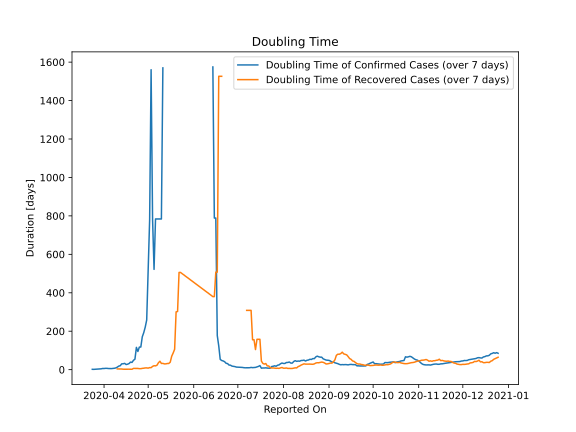

# Country Figures: New Infections in Previous 7 Days per 100,000 Population for Montenegro 

<!--  --> 

| Reported On | &Delta; Confirmed (on the day) | &Delta; Confirmed (last 7 days) | New Cases in Previous 7 Days per 100,000 Population |
|-------------|--------------------------------|---------------------------------|-----------------------------------------------------|
| 2020-05-09 |  None  |  2  |  0.321  |
| 2020-05-08 |  None  |  2  |  0.321  |
| 2020-05-07 |  None  |  2  |  0.321  |
| 2020-05-06 |  None  |  2  |  0.321  |
| 2020-05-05 |  1  |  3  |  0.482  |
| 2020-05-04 |  1  |  2  |  0.321  |
| 2020-05-03 |  None  |  1  |  0.161  |
| 2020-05-02 |  None  |  2  |  0.321  |
| 2020-05-01 |  None  |  3  |  0.482  |
| 2020-04-30 |  None  |  6  |  0.964  |
| 2020-04-29 |  1  |  7  |  1.125  |
| 2020-04-28 |  None  |  8  |  1.285  |
| 2020-04-27 |  None  |  9  |  1.446  |
| 2020-04-26 |  1  |  13  |  2.089  |
| 2020-04-25 |  1  |  13  |  2.089  |
| 2020-04-24 |  3  |  16  |  2.571  |
| 2020-04-23 |  1  |  13  |  2.089  |
| 2020-04-22 |  2  |  27  |  4.338  |
| 2020-04-21 |  1  |  30  |  4.820  |
| 2020-04-20 |  4  |  38  |  6.106  |
| 2020-04-19 |  1  |  36  |  5.785  |
| 2020-04-18 |  4  |  44  |  7.070  |
| 2020-04-17 |  None  |  48  |  7.713  |
| 2020-04-16 |  15  |  51  |  8.195  |
| 2020-04-15 |  5  |  40  |  6.427  |
| 2020-04-14 |  9  |  42  |  6.749  |
| 2020-04-13 |  2  |  41  |  6.588  |
| 2020-04-12 |  9  |  58  |  9.320  |
| 2020-04-11 |  8  |  62  |  9.962  |
| 2020-04-10 |  3  |  81  |  13.015  |
| 2020-04-09 |  4  |  108  |  17.354  |
| 2020-04-08 |  7  |  125  |  20.085  |
| 2020-04-07 |  8  |  132  |  21.210  |
| 2020-04-06 |  19  |  142  |  22.817  |
| 2020-04-05 |  13  |  129  |  20.728  |
| 2020-04-04 |  27  |  117  |  18.800  |
| 2020-04-03 |  30  |  92  |  14.783  |
| 2020-04-02 |  21  |  75  |  12.051  |
| 2020-04-01 |  14  |  71  |  11.408  |
| 2020-03-31 |  18  |  62  |  9.962  |
| 2020-03-30 |  6  |  64  |  10.284  |
| 2020-03-29 |  1  |  64  |  10.284  |
| 2020-03-28 |  2  |  70  |  11.248  |
| 2020-03-27 |  13  |  68  |  10.926  |
| 2020-03-26 |  17  |  66  |  10.605  |
| 2020-03-25 |  5  |  51  |  8.195  |
| 2020-03-24 |  20  |  45  |  7.231  |
| 2020-03-23 |  6  |  25  |  4.017  |
| 2020-03-22 |  7  |  19  |  3.053  |
| 2020-03-21 |  None  |  12  |  1.928  |
| 2020-03-20 |  11  |  12  |  1.928  |
| 2020-03-19 |  2  |  1  |  0.161  |
| 2020-03-18 |  -1  |  -1  |  -0.161  |
| 2020-03-17 |  None  |  None  |  None  |

