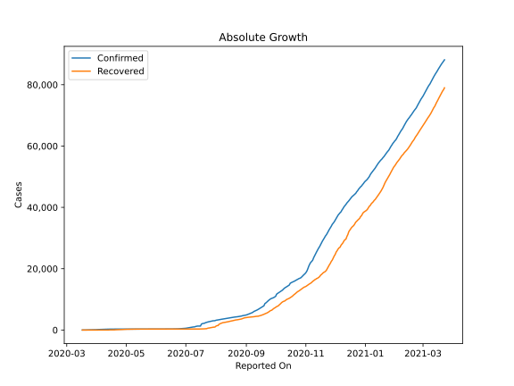

# Country Figures: Doubling Time of Infections for Montenegro 

The doubling time below are calculated based on
* an exponential growth assumption
* for time difference of past seven (7) days.
The doubling time's unit is "days".

The first doubling time indicates the increase of confirmed (infected)
cases. There, the *higher* the number is, the better is to take control
of the disease.

The second doubling time indicates the increase of recovered (healed)
cases. There, the *lower* the number is, the better it is to take
control of the disease.

| Reported On | Confirmed | Doubling Time (Confirmed) | Recovered | Doubling Time (Recovered) |
|-------------|-----------|---------------------------|-----------|---------------------------|
| 2020-05-04 | 323 |  781.5 days  | 253 |  17.0 days  | 
| 2020-05-03 | 322 |  1560.3 days  | 249 |  10.3 days  | 
| 2020-05-02 | 322 |  779.1 days  | 245 |  10.6 days  | 
| 2020-05-01 | 322 |  518.7 days  | 233 |  7.9 days  | 
| 2020-04-30 | 322 |  258.3 days  | 214 |  9.1 days  | 
| 2020-04-29 | 322 |  221.1 days  | 203 |  9.0 days  | 
| 2020-04-28 | 321 |  192.6 days  | 199 |  7.5 days  | 
| 2020-04-27 | 321 |  171.0 days  | 189 |  6.7 days  | 
| 2020-04-26 | 321 |  117.7 days  | 153 |  5.1 days  | 
| 2020-04-25 | 320 |  117.3 days  | 153 |  5.1 days  | 
| 2020-04-24 | 319 |  94.6 days  | 123 |  6.4 days  | 
| 2020-04-23 | 316 |  115.8 days  | 123 |  6.4 days  | 
| 2020-04-22 | 315 |  54.5 days  | 116 |  6.8 days  | 
| 2020-04-21 | 313 |  48.5 days  | 101 |  6.5 days  | 
| 2020-04-20 | 312 |  37.7 days  | 88 |  2.0 days  | 
| 2020-04-19 | 308 |  39.4 days  | 55 |  2.4 days  | 
| 2020-04-18 | 307 |  31.7 days  | 55 |  2.4 days  | 
| 2020-04-17 | 303 |  28.5 days  | 55 |  2.2 days  | 
| 2020-04-16 | 303 |  26.7 days  | 55 |  2.2 days  | 
| 2020-04-15 | 288 |  32.8 days  | 55 |  2.2 days  | 
| 2020-04-14 | 283 |  30.5 days  | 46 |  2.3 days  | 
| 2020-04-13 | 274 |  30.3 days  | 5 |  3.3 days  | 
| 2020-04-12 | 272 |  20.6 days  | 5 |  3.3 days  | 
| 2020-04-11 | 263 |  18.4 days  | 5 |  3.3 days  | 
| 2020-04-10 | 255 |  13.0 days  | 4 |  3.8 days  | 
| 2020-04-09 | 252 |  9.0 days  | 4 |  None  | 
| 2020-04-08 | 248 |  7.3 days  | 4 |  None  | 
| 2020-04-07 | 241 |  6.5 days  | 4 |  None  | 
| 2020-04-06 | 233 |  5.5 days  | 1 |  None  | 
| 2020-04-05 | 214 |  5.6 days  | 1 |  None  | 
| 2020-04-04 | 201 |  5.9 days  | 1 |  None  | 
| 2020-04-03 | 174 |  6.8 days  | 1 |  None  | 
| 2020-04-02 | 144 |  6.9 days  | 0 |  None  | 
| 2020-04-01 | 123 |  6.0 days  | 0 |  None  | 
| 2020-03-31 | 109 |  6.1 days  | 0 |  None  | 
| 2020-03-30 | 91 |  4.3 days  | 0 |  None  | 
| 2020-03-29 | 85 |  3.8 days  | 0 |  None  | 
| 2020-03-28 | 84 |  3.0 days  | 0 |  None  | 
| 2020-03-27 | 82 |  3.1 days  | 0 |  None  | 
| 2020-03-26 | 69 |  1.9 days  | 0 |  None  | 
| 2020-03-25 | 52 |  1.5 days  | 0 |  None  | 
| 2020-03-24 | 47 |  1.9 days  | 0 |  None  | 
| 2020-03-23 | 27 |  None  | 0 |  None  | 
| 2020-03-22 | 21 |  None  | 0 |  None  | 
| 2020-03-21 | 14 |  None  | 0 |  None  | 
| 2020-03-20 | 14 |  None  | 0 |  None  | 
| 2020-03-19 | 3 |  None  | 0 |  None  | 
| 2020-03-18 | 1 |  None  | 0 |  None  | 
| 2020-03-17 | 2 |  None  | 0 |  None  | 

