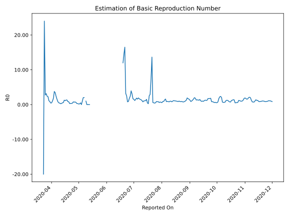

# Country Figures: Time Series for Basic Reproduction Number of Montenegro 

| Reported On | &Delta; Confirmed | Total &Delta; Confirmed First Interval | Total &Delta; Confirmed Second Interval | Estimated Basic Reproduction Number R0 | 
|-------------|-------------------|----------------------------------------|-----------------------------------------|---------------------------------------------------|
| 2020-05-05 | 1 |  1  |  1  |  1.00  | 
| 2020-05-04 | 1 |  None  |  2  |  None  | 
| 2020-05-03 | 0 |  1  |  2  |  0.50  | 
| 2020-05-02 | 0 |  1  |  5  |  0.20  | 
| 2020-05-01 | 0 |  1  |  6  |  0.17  | 
| 2020-04-30 | 0 |  2  |  7  |  0.29  | 
| 2020-04-29 | 1 |  2  |  7  |  0.29  | 
| 2020-04-28 | 0 |  5  |  8  |  0.62  | 
| 2020-04-27 | 0 |  6  |  8  |  0.75  | 
| 2020-04-26 | 1 |  7  |  10  |  0.70  | 
| 2020-04-25 | 1 |  7  |  9  |  0.78  | 
| 2020-04-24 | 3 |  8  |  20  |  0.40  | 
| 2020-04-23 | 1 |  8  |  24  |  0.33  | 
| 2020-04-22 | 2 |  10  |  29  |  0.34  | 
| 2020-04-21 | 1 |  9  |  31  |  0.29  | 
| 2020-04-20 | 4 |  20  |  25  |  0.80  | 
| 2020-04-19 | 1 |  24  |  28  |  0.86  | 
| 2020-04-18 | 4 |  29  |  22  |  1.32  | 
| 2020-04-17 | 0 |  31  |  24  |  1.29  | 
| 2020-04-16 | 15 |  25  |  22  |  1.14  | 
| 2020-04-15 | 5 |  28  |  22  |  1.27  | 
| 2020-04-14 | 9 |  22  |  38  |  0.58  | 
| 2020-04-13 | 2 |  24  |  47  |  0.51  | 
| 2020-04-12 | 9 |  22  |  67  |  0.33  | 
| 2020-04-11 | 8 |  22  |  89  |  0.25  | 
| 2020-04-10 | 3 |  38  |  91  |  0.42  | 
| 2020-04-09 | 4 |  47  |  92  |  0.51  | 
| 2020-04-08 | 7 |  67  |  83  |  0.81  | 
| 2020-04-07 | 8 |  89  |  59  |  1.51  | 
| 2020-04-06 | 19 |  91  |  39  |  2.33  | 
| 2020-04-05 | 13 |  92  |  27  |  3.41  | 
| 2020-04-04 | 27 |  83  |  22  |  3.77  | 
| 2020-04-03 | 30 |  59  |  33  |  1.79  | 
| 2020-04-02 | 21 |  39  |  37  |  1.05  | 
| 2020-04-01 | 14 |  27  |  55  |  0.49  | 
| 2020-03-31 | 18 |  22  |  48  |  0.46  | 
| 2020-03-30 | 6 |  33  |  38  |  0.87  | 
| 2020-03-29 | 1 |  37  |  33  |  1.12  | 
| 2020-03-28 | 2 |  55  |  24  |  2.29  | 
| 2020-03-27 | 13 |  48  |  20  |  2.40  | 
| 2020-03-26 | 17 |  38  |  12  |  3.17  | 
| 2020-03-25 | 5 |  33  |  12  |  2.75  | 
| 2020-03-24 | 20 |  24  |  1  |  24.00  | 
| 2020-03-23 | 6 |  20  |  -1  |  -20.00  | 
| 2020-03-22 | 7 |  12  |  None  |  None  | 
| 2020-03-21 | 0 |  12  |  None  |  None  | 
| 2020-03-20 | 11 |  1  |  None  |  None  | 
| 2020-03-19 | 2 |  -1  |  None  |  None  | 
| 2020-03-18 | -1 |  None  |  None  |  None  | 
| 2020-03-17 | None |  None  |  None  |  None  | 

