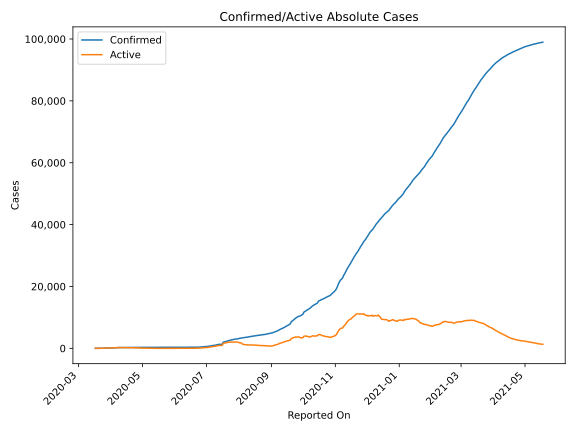
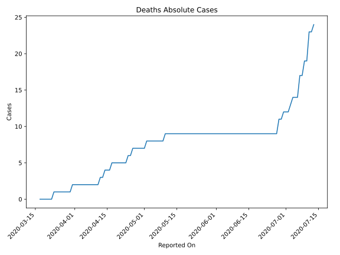
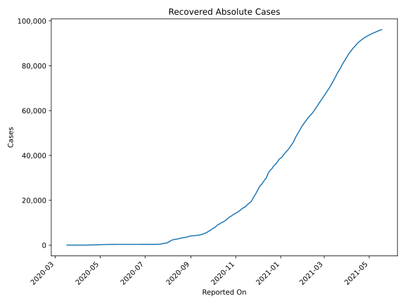
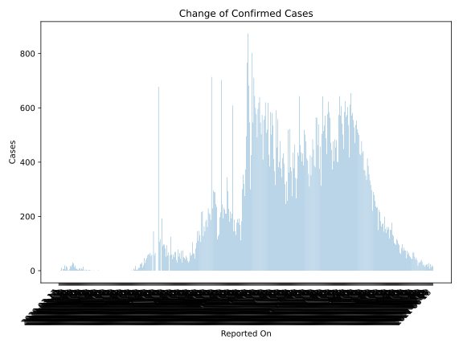
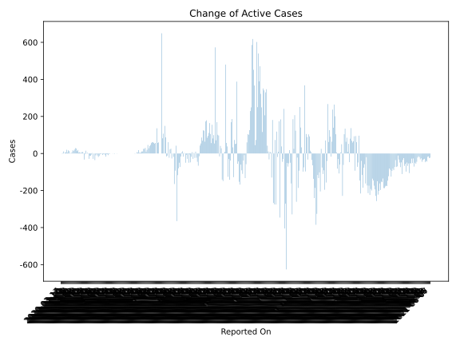
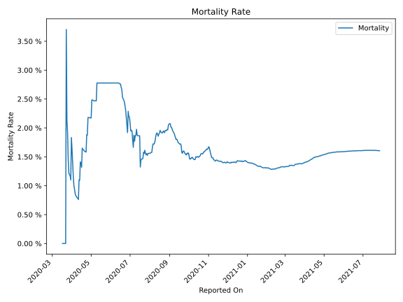

# Country Figures: Time Series for Montenegro 

| Reported On | Confirmed | Deaths | Recovered | Active | Mortality | &Delta; Confirmed | &Delta; Deaths | &Delta; Recovered | &Delta; Active | % Active of Population |
|-------------|-----------|--------|-----------|--------|-----------|-------------------|----------------|-------------------|----------------|------------------------|
| 2020-05-03 | 322 | 8 | 249 | 65 |  2.48 %  | 0 | 0 | 4 | -4 |  0.010 %  | 
| 2020-05-02 | 322 | 8 | 245 | 69 |  2.48 %  | 0 | 1 | 12 | -13 |  0.011 %  | 
| 2020-05-01 | 322 | 7 | 233 | 82 |  2.17 %  | 0 | 0 | 19 | -19 |  0.013 %  | 
| 2020-04-30 | 322 | 7 | 214 | 101 |  2.17 %  | 0 | 0 | 11 | -11 |  0.016 %  | 
| 2020-04-29 | 322 | 7 | 203 | 112 |  2.17 %  | 1 | 0 | 4 | -3 |  0.018 %  | 
| 2020-04-28 | 321 | 7 | 199 | 115 |  2.18 %  | 0 | 0 | 10 | -10 |  0.018 %  | 
| 2020-04-27 | 321 | 7 | 189 | 125 |  2.18 %  | 0 | 0 | 36 | -36 |  0.020 %  | 
| 2020-04-26 | 321 | 7 | 153 | 161 |  2.18 %  | 1 | 1 | 0 | 0 |  0.026 %  | 
| 2020-04-25 | 320 | 6 | 153 | 161 |  1.88 %  | 1 | 0 | 30 | -29 |  0.026 %  | 
| 2020-04-24 | 319 | 6 | 123 | 190 |  1.88 %  | 3 | 1 | 0 | 2 |  0.031 %  | 
| 2020-04-23 | 316 | 5 | 123 | 188 |  1.58 %  | 1 | 0 | 7 | -6 |  0.030 %  | 
| 2020-04-22 | 315 | 5 | 116 | 194 |  1.59 %  | 2 | 0 | 15 | -13 |  0.031 %  | 
| 2020-04-21 | 313 | 5 | 101 | 207 |  1.60 %  | 1 | 0 | 13 | -12 |  0.033 %  | 
| 2020-04-20 | 312 | 5 | 88 | 219 |  1.60 %  | 4 | 0 | 33 | -29 |  0.035 %  | 
| 2020-04-19 | 308 | 5 | 55 | 248 |  1.62 %  | 1 | 0 | 0 | 1 |  0.040 %  | 
| 2020-04-18 | 307 | 5 | 55 | 247 |  1.63 %  | 4 | 0 | 0 | 4 |  0.040 %  | 
| 2020-04-17 | 303 | 5 | 55 | 243 |  1.65 %  | 0 | 1 | 0 | -1 |  0.039 %  | 
| 2020-04-16 | 303 | 4 | 55 | 244 |  1.32 %  | 15 | 0 | 0 | 15 |  0.039 %  | 
| 2020-04-15 | 288 | 4 | 55 | 229 |  1.39 %  | 5 | 0 | 9 | -4 |  0.037 %  | 
| 2020-04-14 | 283 | 4 | 46 | 233 |  1.41 %  | 9 | 1 | 41 | -33 |  0.037 %  | 
| 2020-04-13 | 274 | 3 | 5 | 266 |  1.09 %  | 2 | 0 | 0 | 2 |  0.043 %  | 
| 2020-04-12 | 272 | 3 | 5 | 264 |  1.10 %  | 9 | 1 | 0 | 8 |  0.042 %  | 
| 2020-04-11 | 263 | 2 | 5 | 256 |  0.76 %  | 8 | 0 | 1 | 7 |  0.041 %  | 
| 2020-04-10 | 255 | 2 | 4 | 249 |  0.78 %  | 3 | 0 | 0 | 3 |  0.040 %  | 
| 2020-04-09 | 252 | 2 | 4 | 246 |  0.79 %  | 4 | 0 | 0 | 4 |  0.040 %  | 
| 2020-04-08 | 248 | 2 | 4 | 242 |  0.81 %  | 7 | 0 | 0 | 7 |  0.039 %  | 
| 2020-04-07 | 241 | 2 | 4 | 235 |  0.83 %  | 8 | 0 | 3 | 5 |  0.038 %  | 
| 2020-04-06 | 233 | 2 | 1 | 230 |  0.86 %  | 19 | 0 | 0 | 19 |  0.037 %  | 
| 2020-04-05 | 214 | 2 | 1 | 211 |  0.93 %  | 13 | 0 | 0 | 13 |  0.034 %  | 
| 2020-04-04 | 201 | 2 | 1 | 198 |  1.00 %  | 27 | 0 | 0 | 27 |  0.032 %  | 
| 2020-04-03 | 174 | 2 | 1 | 171 |  1.15 %  | 30 | 0 | 1 | 29 |  0.027 %  | 
| 2020-04-02 | 144 | 2 | 0 | 142 |  1.39 %  | 21 | 0 | 0 | 21 |  0.023 %  | 
| 2020-04-01 | 123 | 2 | 0 | 121 |  1.63 %  | 14 | 0 | 0 | 14 |  0.019 %  | 
| 2020-03-31 | 109 | 2 | 0 | 107 |  1.83 %  | 18 | 1 | 0 | 17 |  0.017 %  | 
| 2020-03-30 | 91 | 1 | 0 | 90 |  1.10 %  | 6 | 0 | 0 | 6 |  0.014 %  | 
| 2020-03-29 | 85 | 1 | 0 | 84 |  1.18 %  | 1 | 0 | 0 | 1 |  0.013 %  | 
| 2020-03-28 | 84 | 1 | 0 | 83 |  1.19 %  | 2 | 0 | 0 | 2 |  0.013 %  | 
| 2020-03-27 | 82 | 1 | 0 | 81 |  1.22 %  | 13 | 0 | 0 | 13 |  0.013 %  | 
| 2020-03-26 | 69 | 1 | 0 | 68 |  1.45 %  | 17 | 0 | 0 | 17 |  0.011 %  | 
| 2020-03-25 | 52 | 1 | 0 | 51 |  1.92 %  | 5 | 0 | 0 | 5 |  0.008 %  | 
| 2020-03-24 | 47 | 1 | 0 | 46 |  2.13 %  | 20 | 0 | 0 | 20 |  0.007 %  | 
| 2020-03-23 | 27 | 1 | 0 | 26 |  3.70 %  | 6 | 1 | 0 | 5 |  0.004 %  | 
| 2020-03-22 | 21 | 0 | 0 | 21 |  None  | 7 | 0 | 0 | 7 |  0.003 %  | 
| 2020-03-21 | 14 | 0 | 0 | 14 |  None  | 0 | 0 | 0 | 0 |  0.002 %  | 
| 2020-03-20 | 14 | 0 | 0 | 14 |  None  | 11 | 0 | 0 | 11 |  0.002 %  | 
| 2020-03-19 | 3 | 0 | 0 | 3 |  None  | 2 | 0 | 0 | 2 |  0.000 %  | 
| 2020-03-18 | 1 | 0 | 0 | 1 |  None  | -1 | 0 | 0 | -1 |  0.000 %  | 
| 2020-03-17 | 2 | 0 | 0 | 2 |  None  | None | None | None | None |  0.000 %  | 

