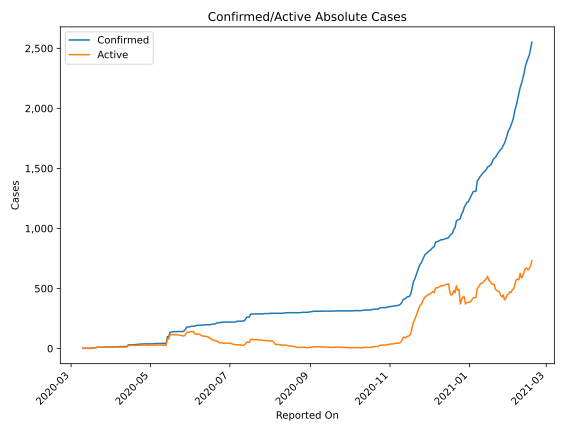
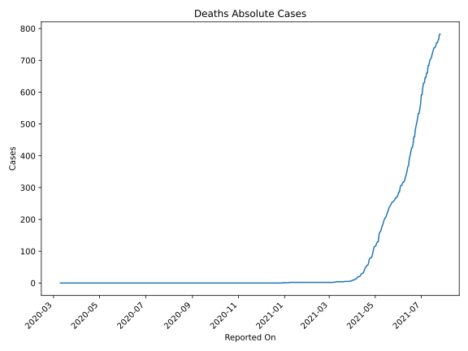
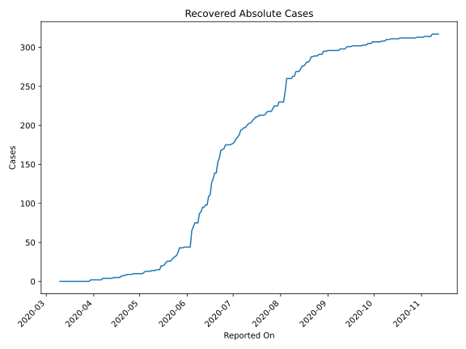
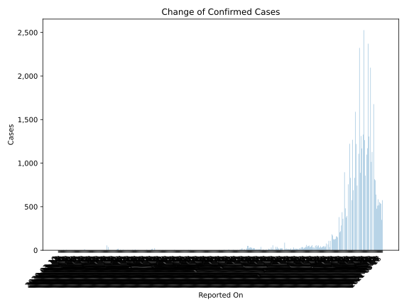
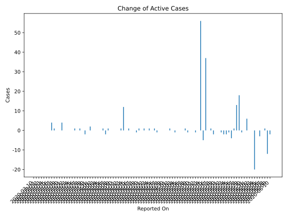
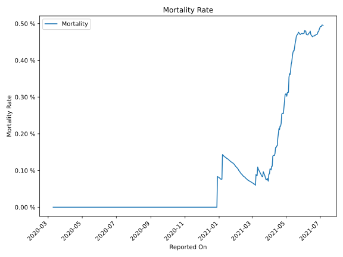

# Country Figures: Time Series for Mongolia 

| Reported On | Confirmed | Deaths | Recovered | Active | Mortality | &Delta; Confirmed | &Delta; Deaths | &Delta; Recovered | &Delta; Active | % Active of Population |
|-------------|-----------|--------|-----------|--------|-----------|-------------------|----------------|-------------------|----------------|------------------------|
| 2020-05-09 | 42 | 0 | 14 | 28 |  None  | 0 | 0 | 1 | -1 |  0.001 %  | 
| 2020-05-08 | 42 | 0 | 13 | 29 |  None  | 1 | 0 | 0 | 1 |  0.001 %  | 
| 2020-05-07 | 41 | 0 | 13 | 28 |  None  | 0 | 0 | 0 | 0 |  0.001 %  | 
| 2020-05-06 | 41 | 0 | 13 | 28 |  None  | 0 | 0 | 0 | 0 |  0.001 %  | 
| 2020-05-05 | 41 | 0 | 13 | 28 |  None  | 1 | 0 | 1 | 0 |  0.001 %  | 
| 2020-05-04 | 40 | 0 | 12 | 28 |  None  | 1 | 0 | 2 | -1 |  0.001 %  | 
| 2020-05-03 | 39 | 0 | 10 | 29 |  None  | 0 | 0 | 0 | 0 |  0.001 %  | 
| 2020-05-02 | 39 | 0 | 10 | 29 |  None  | 1 | 0 | 0 | 1 |  0.001 %  | 
| 2020-05-01 | 38 | 0 | 10 | 28 |  None  | 0 | 0 | 0 | 0 |  0.001 %  | 
| 2020-04-30 | 38 | 0 | 10 | 28 |  None  | 0 | 0 | 0 | 0 |  0.001 %  | 
| 2020-04-29 | 38 | 0 | 10 | 28 |  None  | 0 | 0 | 0 | 0 |  0.001 %  | 
| 2020-04-28 | 38 | 0 | 10 | 28 |  None  | 0 | 0 | 0 | 0 |  0.001 %  | 
| 2020-04-27 | 38 | 0 | 10 | 28 |  None  | 0 | 0 | 1 | -1 |  0.001 %  | 
| 2020-04-26 | 38 | 0 | 9 | 29 |  None  | 1 | 0 | 0 | 1 |  0.001 %  | 
| 2020-04-25 | 37 | 0 | 9 | 28 |  None  | 0 | 0 | 0 | 0 |  0.001 %  | 
| 2020-04-24 | 37 | 0 | 9 | 28 |  None  | 1 | 0 | 0 | 1 |  0.001 %  | 
| 2020-04-23 | 36 | 0 | 9 | 27 |  None  | 1 | 0 | 1 | 0 |  0.001 %  | 
| 2020-04-22 | 35 | 0 | 8 | 27 |  None  | 1 | 0 | 0 | 1 |  0.001 %  | 
| 2020-04-21 | 34 | 0 | 8 | 26 |  None  | 1 | 0 | 1 | 0 |  0.001 %  | 
| 2020-04-20 | 33 | 0 | 7 | 26 |  None  | 1 | 0 | 0 | 1 |  0.001 %  | 
| 2020-04-19 | 32 | 0 | 7 | 25 |  None  | 1 | 0 | 2 | -1 |  0.001 %  | 
| 2020-04-18 | 31 | 0 | 5 | 26 |  None  | 0 | 0 | 0 | 0 |  0.001 %  | 
| 2020-04-17 | 31 | 0 | 5 | 26 |  None  | 0 | 0 | 0 | 0 |  0.001 %  | 
| 2020-04-16 | 31 | 0 | 5 | 26 |  None  | 1 | 0 | 0 | 1 |  0.001 %  | 
| 2020-04-15 | 30 | 0 | 5 | 25 |  None  | 0 | 0 | 0 | 0 |  0.001 %  | 
| 2020-04-14 | 30 | 0 | 5 | 25 |  None  | 13 | 0 | 1 | 12 |  0.001 %  | 
| 2020-04-13 | 17 | 0 | 4 | 13 |  None  | 1 | 0 | 0 | 1 |  0.000 %  | 
| 2020-04-12 | 16 | 0 | 4 | 12 |  None  | 0 | 0 | 0 | 0 |  0.000 %  | 
| 2020-04-11 | 16 | 0 | 4 | 12 |  None  | 0 | 0 | 0 | 0 |  0.000 %  | 
| 2020-04-10 | 16 | 0 | 4 | 12 |  None  | 0 | 0 | 0 | 0 |  0.000 %  | 
| 2020-04-09 | 16 | 0 | 4 | 12 |  None  | 0 | 0 | 0 | 0 |  0.000 %  | 
| 2020-04-08 | 16 | 0 | 4 | 12 |  None  | 1 | 0 | 0 | 1 |  0.000 %  | 
| 2020-04-07 | 15 | 0 | 4 | 11 |  None  | 0 | 0 | 2 | -2 |  0.000 %  | 
| 2020-04-06 | 15 | 0 | 2 | 13 |  None  | 1 | 0 | 0 | 1 |  0.000 %  | 
| 2020-04-05 | 14 | 0 | 2 | 12 |  None  | 0 | 0 | 0 | 0 |  0.000 %  | 
| 2020-04-04 | 14 | 0 | 2 | 12 |  None  | 0 | 0 | 0 | 0 |  0.000 %  | 
| 2020-04-03 | 14 | 0 | 2 | 12 |  None  | 0 | 0 | 0 | 0 |  0.000 %  | 
| 2020-04-02 | 14 | 0 | 2 | 12 |  None  | 0 | 0 | 0 | 0 |  0.000 %  | 
| 2020-04-01 | 14 | 0 | 2 | 12 |  None  | 2 | 0 | 0 | 2 |  0.000 %  | 
| 2020-03-31 | 12 | 0 | 2 | 10 |  None  | 0 | 0 | 0 | 0 |  0.000 %  | 
| 2020-03-30 | 12 | 0 | 2 | 10 |  None  | 0 | 0 | 2 | -2 |  0.000 %  | 
| 2020-03-29 | 12 | 0 | 0 | 12 |  None  | 0 | 0 | 0 | 0 |  0.000 %  | 
| 2020-03-28 | 12 | 0 | 0 | 12 |  None  | 1 | 0 | 0 | 1 |  0.000 %  | 
| 2020-03-27 | 11 | 0 | 0 | 11 |  None  | 0 | 0 | 0 | 0 |  0.000 %  | 
| 2020-03-26 | 11 | 0 | 0 | 11 |  None  | 1 | 0 | 0 | 1 |  0.000 %  | 
| 2020-03-25 | 10 | 0 | 0 | 10 |  None  | 0 | 0 | 0 | 0 |  0.000 %  | 
| 2020-03-24 | 10 | 0 | 0 | 10 |  None  | 0 | 0 | 0 | 0 |  0.000 %  | 
| 2020-03-23 | 10 | 0 | 0 | 10 |  None  | 0 | 0 | 0 | 0 |  0.000 %  | 
| 2020-03-22 | 10 | 0 | 0 | 10 |  None  | 0 | 0 | 0 | 0 |  0.000 %  | 
| 2020-03-21 | 10 | 0 | 0 | 10 |  None  | 4 | 0 | 0 | 4 |  0.000 %  | 
| 2020-03-20 | 6 | 0 | 0 | 6 |  None  | 0 | 0 | 0 | 0 |  0.000 %  | 
| 2020-03-19 | 6 | 0 | 0 | 6 |  None  | 0 | 0 | 0 | 0 |  0.000 %  | 
| 2020-03-18 | 6 | 0 | 0 | 6 |  None  | 1 | 0 | 0 | 1 |  0.000 %  | 
| 2020-03-17 | 5 | 0 | 0 | 5 |  None  | 4 | 0 | 0 | 4 |  0.000 %  | 
| 2020-03-16 | 1 | 0 | 0 | 1 |  None  | 0 | 0 | 0 | 0 |  0.000 %  | 
| 2020-03-15 | 1 | 0 | 0 | 1 |  None  | 0 | 0 | 0 | 0 |  0.000 %  | 
| 2020-03-14 | 1 | 0 | 0 | 1 |  None  | 0 | 0 | 0 | 0 |  0.000 %  | 
| 2020-03-13 | 1 | 0 | 0 | 1 |  None  | 0 | 0 | 0 | 0 |  0.000 %  | 
| 2020-03-12 | 1 | 0 | 0 | 1 |  None  | 0 | 0 | 0 | 0 |  0.000 %  | 
| 2020-03-11 | 1 | 0 | 0 | 1 |  None  | 0 | 0 | 0 | 0 |  0.000 %  | 
| 2020-03-10 | 1 | 0 | 0 | 1 |  None  | None | None | None | None |  0.000 %  | 

