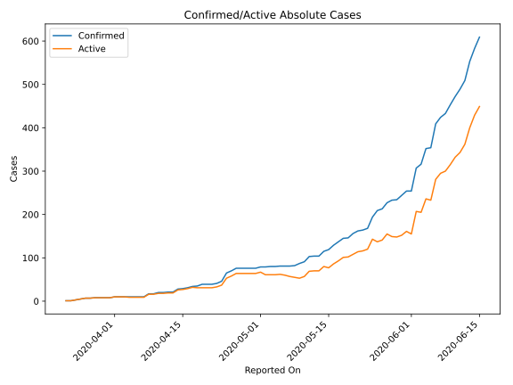
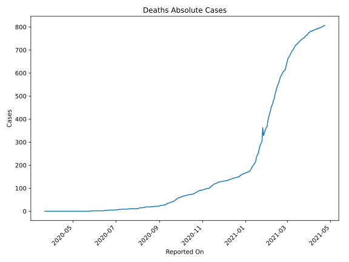
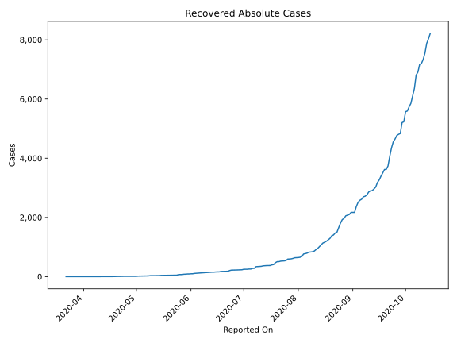
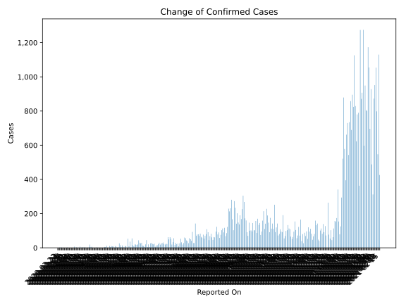
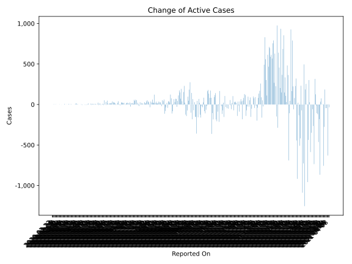
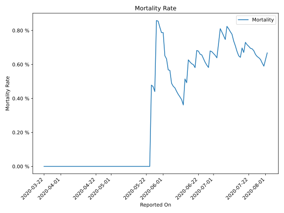

# Country Figures: Time Series for Mozambique 

| Reported On | Confirmed | Deaths | Recovered | Active | Mortality | &Delta; Confirmed | &Delta; Deaths | &Delta; Recovered | &Delta; Active | % Active of Population |
|-------------|-----------|--------|-----------|--------|-----------|-------------------|----------------|-------------------|----------------|------------------------|
| 2020-04-26 | 76 | 0 | 12 | 64 |  None  | 6 | 0 | 0 | 6 |  0.000 %  | 
| 2020-04-25 | 70 | 0 | 12 | 58 |  None  | 5 | 0 | 0 | 5 |  0.000 %  | 
| 2020-04-24 | 65 | 0 | 12 | 53 |  None  | 19 | 0 | 3 | 16 |  0.000 %  | 
| 2020-04-23 | 46 | 0 | 9 | 37 |  None  | 5 | 0 | 1 | 4 |  0.000 %  | 
| 2020-04-22 | 41 | 0 | 8 | 33 |  None  | 2 | 0 | 0 | 2 |  0.000 %  | 
| 2020-04-21 | 39 | 0 | 8 | 31 |  None  | 0 | 0 | 0 | 0 |  0.000 %  | 
| 2020-04-20 | 39 | 0 | 8 | 31 |  None  | 0 | 0 | 0 | 0 |  0.000 %  | 
| 2020-04-19 | 39 | 0 | 8 | 31 |  None  | 4 | 0 | 4 | 0 |  0.000 %  | 
| 2020-04-18 | 35 | 0 | 4 | 31 |  None  | 1 | 0 | 2 | -1 |  0.000 %  | 
| 2020-04-17 | 34 | 0 | 2 | 32 |  None  | 3 | 0 | 0 | 3 |  0.000 %  | 
| 2020-04-16 | 31 | 0 | 2 | 29 |  None  | 2 | 0 | 0 | 2 |  0.000 %  | 
| 2020-04-15 | 29 | 0 | 2 | 27 |  None  | 1 | 0 | 0 | 1 |  0.000 %  | 
| 2020-04-14 | 28 | 0 | 2 | 26 |  None  | 7 | 0 | 0 | 7 |  0.000 %  | 
| 2020-04-13 | 21 | 0 | 2 | 19 |  None  | 0 | 0 | 0 | 0 |  0.000 %  | 
| 2020-04-12 | 21 | 0 | 2 | 19 |  None  | 1 | 0 | 0 | 1 |  0.000 %  | 
| 2020-04-11 | 20 | 0 | 2 | 18 |  None  | 0 | 0 | 0 | 0 |  0.000 %  | 
| 2020-04-10 | 20 | 0 | 2 | 18 |  None  | 3 | 0 | 1 | 2 |  0.000 %  | 
| 2020-04-09 | 17 | 0 | 1 | 16 |  None  | 0 | 0 | 0 | 0 |  0.000 %  | 
| 2020-04-08 | 17 | 0 | 1 | 16 |  None  | 7 | 0 | 0 | 7 |  0.000 %  | 
| 2020-04-07 | 10 | 0 | 1 | 9 |  None  | 0 | 0 | 0 | 0 |  0.000 %  | 
| 2020-04-06 | 10 | 0 | 1 | 9 |  None  | 0 | 0 | 0 | 0 |  0.000 %  | 
| 2020-04-05 | 10 | 0 | 1 | 9 |  None  | 0 | 0 | 0 | 0 |  0.000 %  | 
| 2020-04-04 | 10 | 0 | 1 | 9 |  None  | 0 | 0 | 1 | -1 |  0.000 %  | 
| 2020-04-03 | 10 | 0 | 0 | 10 |  None  | 0 | 0 | 0 | 0 |  0.000 %  | 
| 2020-04-02 | 10 | 0 | 0 | 10 |  None  | 0 | 0 | 0 | 0 |  0.000 %  | 
| 2020-04-01 | 10 | 0 | 0 | 10 |  None  | 2 | 0 | 0 | 2 |  0.000 %  | 
| 2020-03-31 | 8 | 0 | 0 | 8 |  None  | 0 | 0 | 0 | 0 |  0.000 %  | 
| 2020-03-30 | 8 | 0 | 0 | 8 |  None  | 0 | 0 | 0 | 0 |  0.000 %  | 
| 2020-03-29 | 8 | 0 | 0 | 8 |  None  | 0 | 0 | 0 | 0 |  0.000 %  | 
| 2020-03-28 | 8 | 0 | 0 | 8 |  None  | 1 | 0 | 0 | 1 |  0.000 %  | 
| 2020-03-27 | 7 | 0 | 0 | 7 |  None  | 0 | 0 | 0 | 0 |  0.000 %  | 
| 2020-03-26 | 7 | 0 | 0 | 7 |  None  | 2 | 0 | 0 | 2 |  0.000 %  | 
| 2020-03-25 | 5 | 0 | 0 | 5 |  None  | 2 | 0 | 0 | 2 |  0.000 %  | 
| 2020-03-24 | 3 | 0 | 0 | 3 |  None  | 2 | 0 | 0 | 2 |  0.000 %  | 
| 2020-03-23 | 1 | 0 | 0 | 1 |  None  | 0 | 0 | 0 | 0 |  0.000 %  | 
| 2020-03-22 | 1 | 0 | 0 | 1 |  None  | None | None | None | None |  0.000 %  | 

