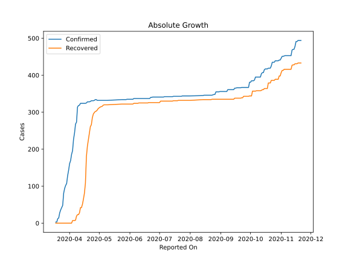
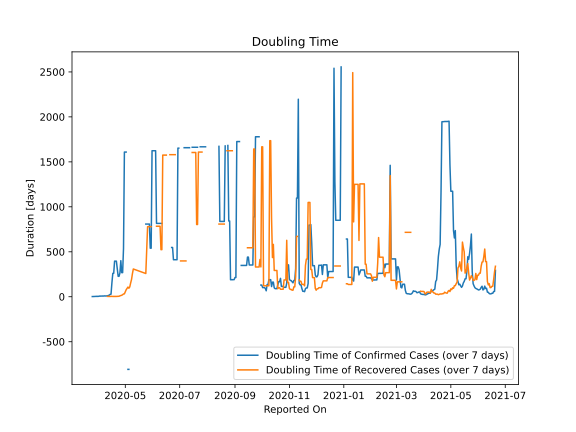

# Country Figures: Doubling Time of Infections for Mauritius 

The doubling time below are calculated based on
* an exponential growth assumption
* for time difference of past seven (7) days.
The doubling time's unit is "days".

The first doubling time indicates the increase of confirmed (infected)
cases. There, the *higher* the number is, the better is to take control
of the disease.

The second doubling time indicates the increase of recovered (healed)
cases. There, the *lower* the number is, the better it is to take
control of the disease.

| Reported On | Confirmed | Doubling Time (Confirmed) | Recovered | Doubling Time (Recovered) |
|-------------|-----------|---------------------------|-----------|---------------------------|
| 2020-04-28 | 334 |  268.0 days  | 303 |  22.3 days  | 
| 2020-04-27 | 334 |  268.0 days  | 302 |  16.6 days  | 
| 2020-04-26 | 332 |  400.6 days  | 299 |  13.7 days  | 
| 2020-04-25 | 331 |  265.6 days  | 295 |  10.2 days  | 
| 2020-04-24 | 331 |  227.3 days  | 285 |  5.3 days  | 
| 2020-04-23 | 331 |  227.3 days  | 266 |  4.4 days  | 
| 2020-04-22 | 329 |  317.2 days  | 261 |  3.8 days  | 
| 2020-04-21 | 328 |  395.8 days  | 243 |  3.4 days  | 
| 2020-04-20 | 328 |  395.8 days  | 224 |  3.2 days  | 
| 2020-04-19 | 328 |  395.8 days  | 208 |  3.4 days  | 
| 2020-04-18 | 325 |  260.7 days  | 180 |  2.9 days  | 
| 2020-04-17 | 324 |  259.9 days  | 108 |  3.5 days  | 
| 2020-04-16 | 324 |  155.1 days  | 81 |  4.2 days  | 
| 2020-04-15 | 324 |  28.7 days  | 65 |  4.3 days  | 
| 2020-04-14 | 324 |  25.9 days  | 51 |  3.0 days  | 
| 2020-04-13 | 324 |  17.5 days  | 42 |  3.0 days  | 
| 2020-04-12 | 324 |  14.0 days  | 42 |  3.0 days  | 
| 2020-04-11 | 319 |  10.3 days  | 28 |  3.8 days  | 
| 2020-04-10 | 318 |  9.4 days  | 23 |  None  | 
| 2020-04-09 | 314 |  8.2 days  | 23 |  None  | 
| 2020-04-08 | 273 |  9.5 days  | 19 |  None  | 
| 2020-04-07 | 268 |  8.1 days  | 8 |  None  | 
| 2020-04-06 | 244 |  7.9 days  | 7 |  None  | 
| 2020-04-05 | 227 |  6.8 days  | 7 |  None  | 
| 2020-04-04 | 196 |  7.8 days  | 7 |  None  | 
| 2020-04-03 | 186 |  7.5 days  | 0 |  None  | 
| 2020-04-02 | 169 |  6.9 days  | 0 |  None  | 
| 2020-04-01 | 161 |  4.3 days  | 0 |  None  | 
| 2020-03-31 | 143 |  4.3 days  | 0 |  None  | 
| 2020-03-30 | 128 |  4.2 days  | 0 |  None  | 
| 2020-03-29 | 107 |  4.0 days  | 0 |  None  | 
| 2020-03-28 | 102 |  2.8 days  | 0 |  None  | 
| 2020-03-27 | 94 |  2.7 days  | 0 |  None  | 
| 2020-03-26 | 81 |  1.8 days  | 0 |  None  | 
| 2020-03-25 | 48 |  2.1 days  | 0 |  None  | 
| 2020-03-24 | 42 |  None  | 0 |  None  | 
| 2020-03-23 | 36 |  None  | 0 |  None  | 
| 2020-03-22 | 28 |  None  | 0 |  None  | 
| 2020-03-21 | 14 |  None  | 0 |  None  | 
| 2020-03-20 | 12 |  None  | 0 |  None  | 
| 2020-03-19 | 3 |  None  | 0 |  None  | 
| 2020-03-18 | 3 |  None  | 0 |  None  | 

