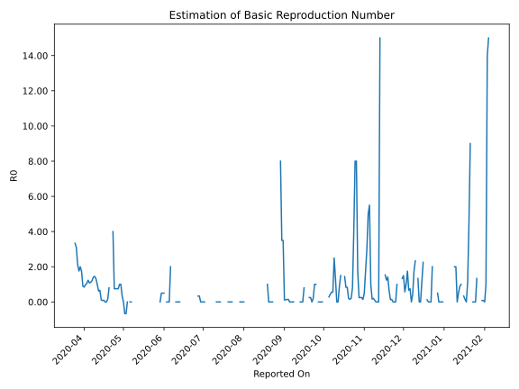

# Country Figures: Time Series for Basic Reproduction Number of Mauritius 

| Reported On | &Delta; Confirmed | Total &Delta; Confirmed First Interval | Total &Delta; Confirmed Second Interval | Estimated Basic Reproduction Number R0 | 
|-------------|-------------------|----------------------------------------|-----------------------------------------|---------------------------------------------------|
| 2020-05-08 | 0 |  None  |  None  |  None  | 
| 2020-05-07 | 0 |  None  |  -2  |  None  | 
| 2020-05-06 | 0 |  None  |  -2  |  None  | 
| 2020-05-05 | 0 |  None  |  None  |  None  | 
| 2020-05-04 | 0 |  None  |  1  |  None  | 
| 2020-05-03 | 0 |  -2  |  3  |  -0.67  | 
| 2020-05-02 | 0 |  -2  |  3  |  -0.67  | 
| 2020-05-01 | 0 |  None  |  3  |  None  | 
| 2020-04-30 | 0 |  1  |  3  |  0.33  | 
| 2020-04-29 | -2 |  3  |  3  |  1.00  | 
| 2020-04-28 | 0 |  3  |  3  |  1.00  | 
| 2020-04-27 | 2 |  3  |  4  |  0.75  | 
| 2020-04-26 | 1 |  3  |  4  |  0.75  | 
| 2020-04-25 | 0 |  3  |  4  |  0.75  | 
| 2020-04-24 | 0 |  3  |  4  |  0.75  | 
| 2020-04-23 | 2 |  4  |  1  |  4.00  | 
| 2020-04-22 | 1 |  4  |  None  |  None  | 
| 2020-04-21 | 0 |  4  |  None  |  None  | 
| 2020-04-20 | 0 |  4  |  5  |  0.80  | 
| 2020-04-19 | 3 |  1  |  6  |  0.17  | 
| 2020-04-18 | 1 |  None  |  10  |  None  | 
| 2020-04-17 | 0 |  None  |  51  |  None  | 
| 2020-04-16 | 0 |  5  |  51  |  0.10  | 
| 2020-04-15 | 0 |  6  |  74  |  0.08  | 
| 2020-04-14 | 0 |  10  |  87  |  0.11  | 
| 2020-04-13 | 0 |  51  |  77  |  0.66  | 
| 2020-04-12 | 5 |  51  |  82  |  0.62  | 
| 2020-04-11 | 1 |  74  |  75  |  0.99  | 
| 2020-04-10 | 4 |  87  |  66  |  1.32  | 
| 2020-04-09 | 41 |  77  |  53  |  1.45  | 
| 2020-04-08 | 5 |  82  |  58  |  1.41  | 
| 2020-04-07 | 24 |  75  |  62  |  1.21  | 
| 2020-04-06 | 17 |  66  |  59  |  1.12  | 
| 2020-04-05 | 31 |  53  |  49  |  1.08  | 
| 2020-04-04 | 10 |  58  |  47  |  1.23  | 
| 2020-04-03 | 17 |  62  |  59  |  1.05  | 
| 2020-04-02 | 8 |  59  |  60  |  0.98  | 
| 2020-04-01 | 18 |  49  |  58  |  0.84  | 
| 2020-03-31 | 15 |  47  |  53  |  0.89  | 
| 2020-03-30 | 21 |  59  |  34  |  1.74  | 
| 2020-03-29 | 5 |  60  |  30  |  2.00  | 
| 2020-03-28 | 8 |  58  |  33  |  1.76  | 
| 2020-03-27 | 13 |  53  |  25  |  2.12  | 
| 2020-03-26 | 33 |  34  |  11  |  3.09  | 
| 2020-03-25 | 6 |  30  |  9  |  3.33  | 
| 2020-03-24 | 6 |  33  |  None  |  None  | 
| 2020-03-23 | 8 |  25  |  None  |  None  | 
| 2020-03-22 | 14 |  11  |  None  |  None  | 
| 2020-03-21 | 2 |  9  |  None  |  None  | 
| 2020-03-20 | 9 |  None  |  None  |  None  | 
| 2020-03-19 | 0 |  None  |  None  |  None  | 
| 2020-03-18 | None |  None  |  None  |  None  | 

