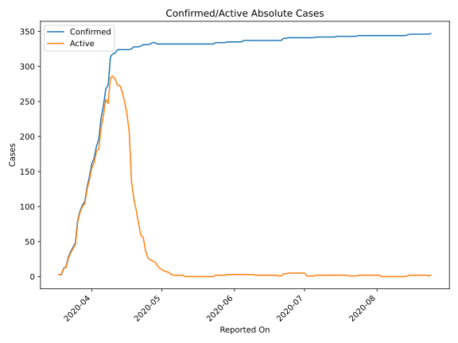
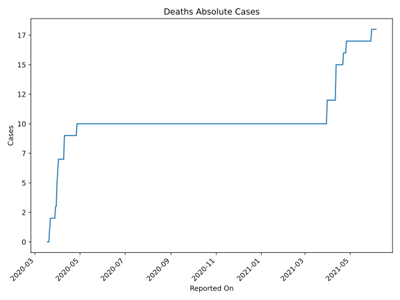
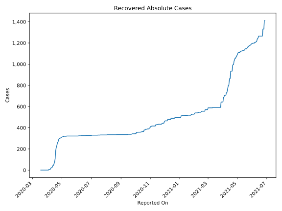
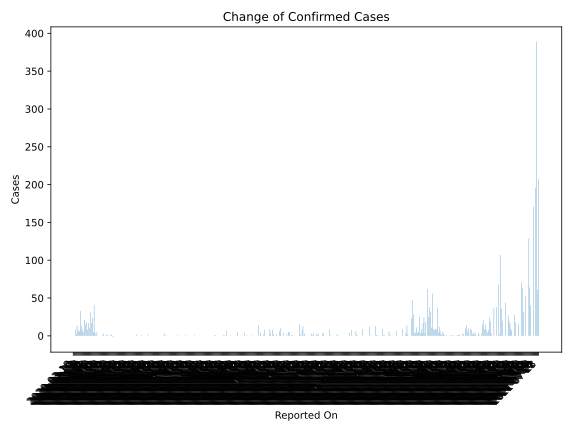
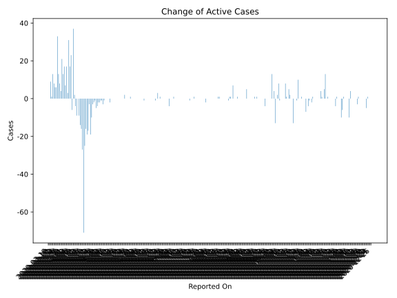
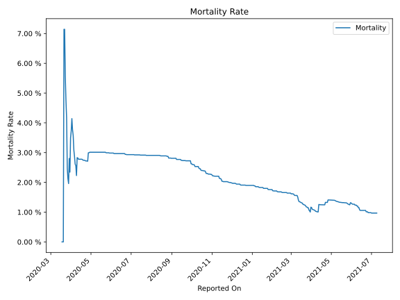

# Country Figures: Time Series for Mauritius 

| Reported On | Confirmed | Deaths | Recovered | Active | Mortality | &Delta; Confirmed | &Delta; Deaths | &Delta; Recovered | &Delta; Active | % Active of Population |
|-------------|-----------|--------|-----------|--------|-----------|-------------------|----------------|-------------------|----------------|------------------------|
| 2020-04-26 | 332 | 9 | 299 | 24 |  2.71 %  | 1 | 0 | 4 | -3 |  0.002 %  | 
| 2020-04-25 | 331 | 9 | 295 | 27 |  2.72 %  | 0 | 0 | 10 | -10 |  0.002 %  | 
| 2020-04-24 | 331 | 9 | 285 | 37 |  2.72 %  | 0 | 0 | 19 | -19 |  0.003 %  | 
| 2020-04-23 | 331 | 9 | 266 | 56 |  2.72 %  | 2 | 0 | 5 | -3 |  0.004 %  | 
| 2020-04-22 | 329 | 9 | 261 | 59 |  2.74 %  | 1 | 0 | 18 | -17 |  0.005 %  | 
| 2020-04-21 | 328 | 9 | 243 | 76 |  2.74 %  | 0 | 0 | 19 | -19 |  0.006 %  | 
| 2020-04-20 | 328 | 9 | 224 | 95 |  2.74 %  | 0 | 0 | 16 | -16 |  0.008 %  | 
| 2020-04-19 | 328 | 9 | 208 | 111 |  2.74 %  | 3 | 0 | 28 | -25 |  0.009 %  | 
| 2020-04-18 | 325 | 9 | 180 | 136 |  2.77 %  | 1 | 0 | 72 | -71 |  0.011 %  | 
| 2020-04-17 | 324 | 9 | 108 | 207 |  2.78 %  | 0 | 0 | 27 | -27 |  0.016 %  | 
| 2020-04-16 | 324 | 9 | 81 | 234 |  2.78 %  | 0 | 0 | 16 | -16 |  0.018 %  | 
| 2020-04-15 | 324 | 9 | 65 | 250 |  2.78 %  | 0 | 0 | 14 | -14 |  0.020 %  | 
| 2020-04-14 | 324 | 9 | 51 | 264 |  2.78 %  | 0 | 0 | 9 | -9 |  0.021 %  | 
| 2020-04-13 | 324 | 9 | 42 | 273 |  2.78 %  | 0 | 0 | 0 | 0 |  0.022 %  | 
| 2020-04-12 | 324 | 9 | 42 | 273 |  2.78 %  | 5 | 0 | 14 | -9 |  0.022 %  | 
| 2020-04-11 | 319 | 9 | 28 | 282 |  2.82 %  | 1 | 0 | 5 | -4 |  0.022 %  | 
| 2020-04-10 | 318 | 9 | 23 | 286 |  2.83 %  | 4 | 2 | 0 | 2 |  0.023 %  | 
| 2020-04-09 | 314 | 7 | 23 | 284 |  2.23 %  | 41 | 0 | 4 | 37 |  0.022 %  | 
| 2020-04-08 | 273 | 7 | 19 | 247 |  2.56 %  | 5 | 0 | 11 | -6 |  0.020 %  | 
| 2020-04-07 | 268 | 7 | 8 | 253 |  2.61 %  | 24 | 0 | 1 | 23 |  0.020 %  | 
| 2020-04-06 | 244 | 7 | 7 | 230 |  2.87 %  | 17 | 0 | 0 | 17 |  0.018 %  | 
| 2020-04-05 | 227 | 7 | 7 | 213 |  3.08 %  | 31 | 0 | 0 | 31 |  0.017 %  | 
| 2020-04-04 | 196 | 7 | 7 | 182 |  3.57 %  | 10 | 0 | 7 | 3 |  0.014 %  | 
| 2020-04-03 | 186 | 7 | 0 | 179 |  3.76 %  | 17 | 0 | 0 | 17 |  0.014 %  | 
| 2020-04-02 | 169 | 7 | 0 | 162 |  4.14 %  | 8 | 1 | 0 | 7 |  0.013 %  | 
| 2020-04-01 | 161 | 6 | 0 | 155 |  3.73 %  | 18 | 1 | 0 | 17 |  0.012 %  | 
| 2020-03-31 | 143 | 5 | 0 | 138 |  3.50 %  | 15 | 2 | 0 | 13 |  0.011 %  | 
| 2020-03-30 | 128 | 3 | 0 | 125 |  2.34 %  | 21 | 0 | 0 | 21 |  0.010 %  | 
| 2020-03-29 | 107 | 3 | 0 | 104 |  2.80 %  | 5 | 1 | 0 | 4 |  0.008 %  | 
| 2020-03-28 | 102 | 2 | 0 | 100 |  1.96 %  | 8 | 0 | 0 | 8 |  0.008 %  | 
| 2020-03-27 | 94 | 2 | 0 | 92 |  2.13 %  | 13 | 0 | 0 | 13 |  0.007 %  | 
| 2020-03-26 | 81 | 2 | 0 | 79 |  2.47 %  | 33 | 0 | 0 | 33 |  0.006 %  | 
| 2020-03-25 | 48 | 2 | 0 | 46 |  4.17 %  | 6 | 0 | 0 | 6 |  0.004 %  | 
| 2020-03-24 | 42 | 2 | 0 | 40 |  4.76 %  | 6 | 0 | 0 | 6 |  0.003 %  | 
| 2020-03-23 | 36 | 2 | 0 | 34 |  5.56 %  | 8 | 0 | 0 | 8 |  0.003 %  | 
| 2020-03-22 | 28 | 2 | 0 | 26 |  7.14 %  | 14 | 1 | 0 | 13 |  0.002 %  | 
| 2020-03-21 | 14 | 1 | 0 | 13 |  7.14 %  | 2 | 1 | 0 | 1 |  0.001 %  | 
| 2020-03-20 | 12 | 0 | 0 | 12 |  None  | 9 | 0 | 0 | 9 |  0.001 %  | 
| 2020-03-19 | 3 | 0 | 0 | 3 |  None  | 0 | 0 | 0 | 0 |  0.000 %  | 
| 2020-03-18 | 3 | 0 | 0 | 3 |  None  | None | None | None | None |  0.000 %  | 

