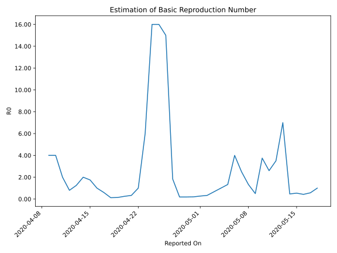

# Country Figures: Time Series for Basic Reproduction Number of Malawi 

| Reported On | &Delta; Confirmed | Total &Delta; Confirmed First Interval | Total &Delta; Confirmed Second Interval | Estimated Basic Reproduction Number R0 | 
|-------------|-------------------|----------------------------------------|-----------------------------------------|---------------------------------------------------|
| 2020-05-04 | 2 |  3  |  3  |  1.00  | 
| 2020-05-03 | 1 |  2  |  3  |  0.67  | 
| 2020-05-02 | 1 |  1  |  3  |  0.33  | 
| 2020-05-01 | 0 |  3  |  11  |  0.27  | 
| 2020-04-30 | 1 |  3  |  15  |  0.20  | 
| 2020-04-29 | 0 |  3  |  16  |  0.19  | 
| 2020-04-28 | 0 |  3  |  16  |  0.19  | 
| 2020-04-27 | 2 |  11  |  6  |  1.83  | 
| 2020-04-26 | 1 |  15  |  1  |  15.00  | 
| 2020-04-25 | 0 |  16  |  1  |  16.00  | 
| 2020-04-24 | 0 |  16  |  1  |  16.00  | 
| 2020-04-23 | 10 |  6  |  1  |  6.00  | 
| 2020-04-22 | 5 |  1  |  1  |  1.00  | 
| 2020-04-21 | 1 |  1  |  3  |  0.33  | 
| 2020-04-20 | 0 |  1  |  4  |  0.25  | 
| 2020-04-19 | 0 |  1  |  7  |  0.14  | 
| 2020-04-18 | 0 |  1  |  8  |  0.12  | 
| 2020-04-17 | 1 |  3  |  5  |  0.60  | 
| 2020-04-16 | 0 |  4  |  4  |  1.00  | 
| 2020-04-15 | 0 |  7  |  4  |  1.75  | 
| 2020-04-14 | 0 |  8  |  4  |  2.00  | 
| 2020-04-13 | 3 |  5  |  4  |  1.25  | 
| 2020-04-12 | 1 |  4  |  5  |  0.80  | 
| 2020-04-11 | 3 |  4  |  2  |  2.00  | 
| 2020-04-10 | 1 |  4  |  1  |  4.00  | 
| 2020-04-09 | 0 |  4  |  1  |  4.00  | 
| 2020-04-08 | 0 |  5  |  None  |  None  | 
| 2020-04-07 | 3 |  2  |  None  |  None  | 
| 2020-04-06 | 1 |  1  |  None  |  None  | 
| 2020-04-05 | 0 |  1  |  None  |  None  | 
| 2020-04-04 | 1 |  None  |  None  |  None  | 
| 2020-04-03 | 0 |  None  |  None  |  None  | 
| 2020-04-02 | None |  None  |  None  |  None  | 

