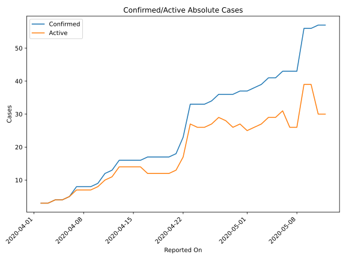
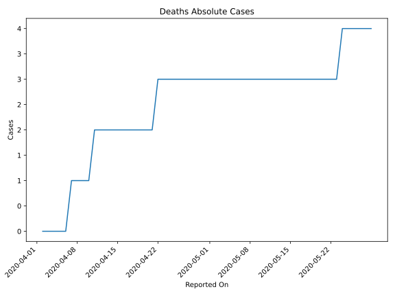
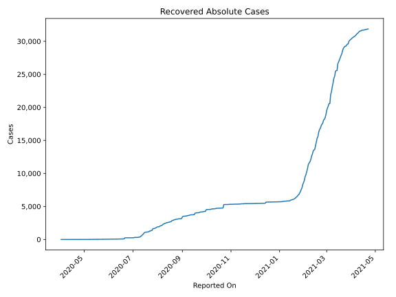
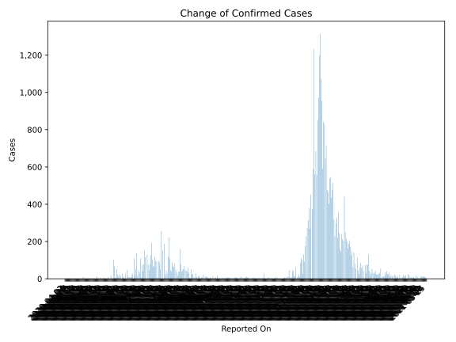
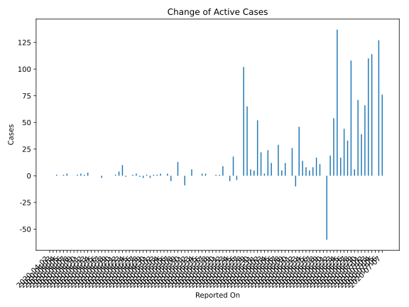
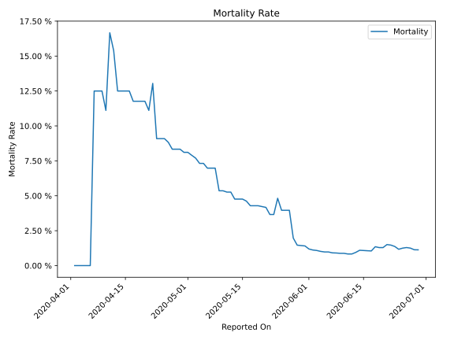

# Country Figures: Time Series for Malawi 

| Reported On | Confirmed | Deaths | Recovered | Active | Mortality | &Delta; Confirmed | &Delta; Deaths | &Delta; Recovered | &Delta; Active | % Active of Population |
|-------------|-----------|--------|-----------|--------|-----------|-------------------|----------------|-------------------|----------------|------------------------|
| 2020-05-05 | 41 | 3 | 9 | 29 |  7.32 %  | 0 | 0 | 0 | 0 |  0.000 %  | 
| 2020-05-04 | 41 | 3 | 9 | 29 |  7.32 %  | 2 | 0 | 0 | 2 |  0.000 %  | 
| 2020-05-03 | 39 | 3 | 9 | 27 |  7.69 %  | 1 | 0 | 0 | 1 |  0.000 %  | 
| 2020-05-02 | 38 | 3 | 9 | 26 |  7.89 %  | 1 | 0 | 0 | 1 |  0.000 %  | 
| 2020-05-01 | 37 | 3 | 9 | 25 |  8.11 %  | 0 | 0 | 2 | -2 |  0.000 %  | 
| 2020-04-30 | 37 | 3 | 7 | 27 |  8.11 %  | 1 | 0 | 0 | 1 |  0.000 %  | 
| 2020-04-29 | 36 | 3 | 7 | 26 |  8.33 %  | 0 | 0 | 2 | -2 |  0.000 %  | 
| 2020-04-28 | 36 | 3 | 5 | 28 |  8.33 %  | 0 | 0 | 1 | -1 |  0.000 %  | 
| 2020-04-27 | 36 | 3 | 4 | 29 |  8.33 %  | 2 | 0 | 0 | 2 |  0.000 %  | 
| 2020-04-26 | 34 | 3 | 4 | 27 |  8.82 %  | 1 | 0 | 0 | 1 |  0.000 %  | 
| 2020-04-25 | 33 | 3 | 4 | 26 |  9.09 %  | 0 | 0 | 0 | 0 |  0.000 %  | 
| 2020-04-24 | 33 | 3 | 4 | 26 |  9.09 %  | 0 | 0 | 1 | -1 |  0.000 %  | 
| 2020-04-23 | 33 | 3 | 3 | 27 |  9.09 %  | 10 | 0 | 0 | 10 |  0.000 %  | 
| 2020-04-22 | 23 | 3 | 3 | 17 |  13.04 %  | 5 | 1 | 0 | 4 |  0.000 %  | 
| 2020-04-21 | 18 | 2 | 3 | 13 |  11.11 %  | 1 | 0 | 0 | 1 |  0.000 %  | 
| 2020-04-20 | 17 | 2 | 3 | 12 |  11.76 %  | 0 | 0 | 0 | 0 |  0.000 %  | 
| 2020-04-19 | 17 | 2 | 3 | 12 |  11.76 %  | 0 | 0 | 0 | 0 |  0.000 %  | 
| 2020-04-18 | 17 | 2 | 3 | 12 |  11.76 %  | 0 | 0 | 0 | 0 |  0.000 %  | 
| 2020-04-17 | 17 | 2 | 3 | 12 |  11.76 %  | 1 | 0 | 3 | -2 |  0.000 %  | 
| 2020-04-16 | 16 | 2 | 0 | 14 |  12.50 %  | 0 | 0 | 0 | 0 |  0.000 %  | 
| 2020-04-15 | 16 | 2 | 0 | 14 |  12.50 %  | 0 | 0 | 0 | 0 |  0.000 %  | 
| 2020-04-14 | 16 | 2 | 0 | 14 |  12.50 %  | 0 | 0 | 0 | 0 |  0.000 %  | 
| 2020-04-13 | 16 | 2 | 0 | 14 |  12.50 %  | 3 | 0 | 0 | 3 |  0.000 %  | 
| 2020-04-12 | 13 | 2 | 0 | 11 |  15.38 %  | 1 | 0 | 0 | 1 |  0.000 %  | 
| 2020-04-11 | 12 | 2 | 0 | 10 |  16.67 %  | 3 | 1 | 0 | 2 |  0.000 %  | 
| 2020-04-10 | 9 | 1 | 0 | 8 |  11.11 %  | 1 | 0 | 0 | 1 |  0.000 %  | 
| 2020-04-09 | 8 | 1 | 0 | 7 |  12.50 %  | 0 | 0 | 0 | 0 |  0.000 %  | 
| 2020-04-08 | 8 | 1 | 0 | 7 |  12.50 %  | 0 | 0 | 0 | 0 |  0.000 %  | 
| 2020-04-07 | 8 | 1 | 0 | 7 |  12.50 %  | 3 | 1 | 0 | 2 |  0.000 %  | 
| 2020-04-06 | 5 | 0 | 0 | 5 |  None  | 1 | 0 | 0 | 1 |  0.000 %  | 
| 2020-04-05 | 4 | 0 | 0 | 4 |  None  | 0 | 0 | 0 | 0 |  0.000 %  | 
| 2020-04-04 | 4 | 0 | 0 | 4 |  None  | 1 | 0 | 0 | 1 |  0.000 %  | 
| 2020-04-03 | 3 | 0 | 0 | 3 |  None  | 0 | 0 | 0 | 0 |  0.000 %  | 
| 2020-04-02 | 3 | 0 | 0 | 3 |  None  | None | None | None | None |  0.000 %  | 

