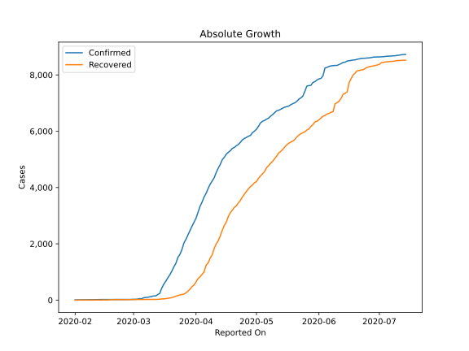
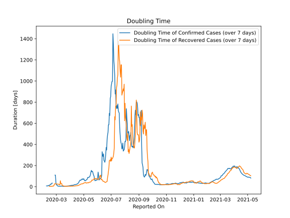

# Country Figures: Doubling Time of Infections for Malaysia 

The doubling time below are calculated based on
* an exponential growth assumption
* for time difference of past seven (7) days.
The doubling time's unit is "days".

The first doubling time indicates the increase of confirmed (infected)
cases. There, the *higher* the number is, the better is to take control
of the disease.

The second doubling time indicates the increase of recovered (healed)
cases. There, the *lower* the number is, the better it is to take
control of the disease.

| Reported On | Confirmed | Doubling Time (Confirmed) | Recovered | Doubling Time (Recovered) |
|-------------|-----------|---------------------------|-----------|---------------------------|
| 2020-04-04 | 3483 |  12.3 days  | 915 |  5.0 days  | 
| 2020-04-03 | 3333 |  11.5 days  | 827 |  4.5 days  | 
| 2020-04-02 | 3116 |  11.7 days  | 767 |  4.2 days  | 
| 2020-04-01 | 2908 |  10.4 days  | 645 |  4.5 days  | 
| 2020-03-31 | 2766 |  9.5 days  | 537 |  4.8 days  | 
| 2020-03-30 | 2626 |  9.2 days  | 479 |  4.7 days  | 
| 2020-03-29 | 2470 |  8.0 days  | 388 |  5.1 days  | 
| 2020-03-28 | 2320 |  7.5 days  | 320 |  5.0 days  | 
| 2020-03-27 | 2161 |  6.9 days  | 259 |  4.8 days  | 
| 2020-03-26 | 2031 |  6.3 days  | 215 |  4.9 days  | 
| 2020-03-25 | 1796 |  6.2 days  | 199 |  4.4 days  | 
| 2020-03-24 | 1624 |  5.8 days  | 183 |  4.0 days  | 
| 2020-03-23 | 1518 |  5.3 days  | 159 |  4.0 days  | 
| 2020-03-22 | 1306 |  4.7 days  | 139 |  4.4 days  | 
| 2020-03-21 | 1183 |  3.4 days  | 114 |  4.4 days  | 
| 2020-03-20 | 1030 |  3.3 days  | 87 |  4.4 days  | 
| 2020-03-19 | 900 |  3.0 days  | 75 |  4.9 days  | 
| 2020-03-18 | 790 |  3.2 days  | 60 |  6.1 days  | 
| 2020-03-17 | 673 |  3.3 days  | 49 |  7.1 days  | 
| 2020-03-16 | 566 |  3.4 days  | 42 |  9.0 days  | 
| 2020-03-15 | 428 |  3.6 days  | 42 |  9.0 days  | 
| 2020-03-14 | 238 |  5.5 days  | 35 |  11.9 days  | 
| 2020-03-13 | 197 |  6.0 days  | 26 |  29.4 days  | 
| 2020-03-12 | 149 |  4.8 days  | 26 |  29.4 days  | 
| 2020-03-11 | 149 |  4.8 days  | 26 |  29.4 days  | 
| 2020-03-10 | 129 |  4.1 days  | 24 |  56.1 days  | 
| 2020-03-09 | 117 |  3.8 days  | 24 |  17.2 days  | 
| 2020-03-08 | 99 |  4.3 days  | 24 |  17.2 days  | 
| 2020-03-07 | 93 |  4.0 days  | 23 |  20.1 days  | 
| 2020-03-06 | 83 |  4.1 days  | 22 |  24.5 days  | 
| 2020-03-05 | 50 |  6.6 days  | 22 |  24.5 days  | 
| 2020-03-04 | 50 |  6.3 days  | 22 |  24.5 days  | 
| 2020-03-03 | 36 |  10.2 days  | 22 |  24.5 days  | 
| 2020-03-02 | 29 |  17.9 days  | 18 |  None  | 
| 2020-03-01 | 29 |  17.9 days  | 18 |  27.0 days  | 
| 2020-02-29 | 25 |  38.3 days  | 18 |  27.0 days  | 
| 2020-02-28 | 23 |  109.5 days  | 18 |  27.0 days  | 
| 2020-02-27 | 23 |  109.5 days  | 18 |  27.0 days  | 
| 2020-02-26 | 22 |  None  | 18 |  27.0 days  | 
| 2020-02-25 | 22 |  None  | 18 |  15.3 days  | 
| 2020-02-24 | 22 |  None  | 18 |  5.5 days  | 
| 2020-02-23 | 22 |  None  | 15 |  6.7 days  | 
| 2020-02-22 | 22 |  None  | 15 |  6.7 days  | 
| 2020-02-21 | 22 |  33.4 days  | 15 |  3.3 days  | 
| 2020-02-20 | 22 |  33.4 days  | 15 |  3.3 days  | 
| 2020-02-19 | 22 |  24.5 days  | 15 |  3.3 days  | 
| 2020-02-18 | 22 |  24.5 days  | 13 |  3.6 days  | 
| 2020-02-17 | 22 |  24.5 days  | 7 |  2.8 days  | 
| 2020-02-16 | 22 |  15.6 days  | 7 |  2.8 days  | 
| 2020-02-15 | 22 |  15.6 days  | 7 |  2.8 days  | 
| 2020-02-14 | 19 |  10.9 days  | 3 |  4.8 days  | 
| 2020-02-13 | 19 |  10.9 days  | 3 |  None  | 
| 2020-02-12 | 18 |  12.3 days  | 3 |  None  | 
| 2020-02-11 | 18 |  8.6 days  | 3 |  None  | 
| 2020-02-10 | 18 |  6.3 days  | 1 |  None  | 
| 2020-02-09 | 16 |  7.3 days  | 1 |  None  | 
| 2020-02-08 | 16 |  7.3 days  | 1 |  None  | 
| 2020-02-07 | 12 |  None  | 1 |  None  | 
| 2020-02-06 | 12 |  None  | 0 |  None  | 
| 2020-02-05 | 12 |  None  | 0 |  None  | 
| 2020-02-04 | 10 |  None  | 0 |  None  | 
| 2020-02-03 | 8 |  None  | 0 |  None  | 
| 2020-02-02 | 8 |  None  | 0 |  None  | 
| 2020-02-01 | 8 |  None  | 0 |  None  | 

